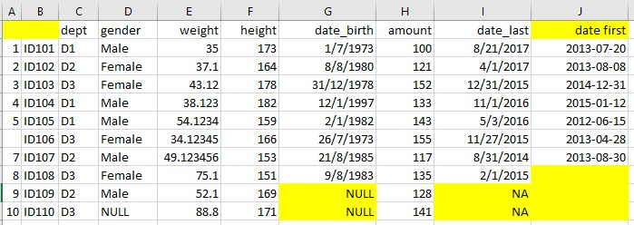

# R Fundamentals {#fundamentals}


## Package Management

### Package Storage

Here is where all the libraries are stored.  
Can you guess which are the **baseR and third party libraries** stored ?  
```{r}
.libPaths()
```

### Package Listing

Use **`installed.packages()`** to return a data frame that list all installed packages.  
```{r}
head( installed.packages() )
```

**TOO MANY COLUMNS !!**  
Below are the column names and its numbering for filtering purpose.  
```{r}
colnames( installed.packages() )
```

**Perform column filter** based on column names as necessary.  
Set parameter **priority = 'NA' to exclude base R** packages.  

```{r}
head( installed.packages( priority='NA' ) [,c(1,3)] )
```

Set parameter **priority = 'high'** will include **ONLY base R** packages  
```{r}
head( installed.packages( priority='high' ) [,c(3,2)] )
```

### Package Install / Removal

```{r eval=FALSE}
install.packages( c('ggplot', 'ggExtra') )
remove.packages ( c('ggplot', 'ggExtra') )
```

### Package Update

```{r eval=FALSE}
old.packages()      ## list all old packages, their old version and available new version
update.packages()             ## need to input y/n/c for each old package to update
update.packages( ask=FALSE )  ## automatically update all packages without asking
```


### Package Corruption

Sometimes a corrupted R package can give below issues:  

- Error loading a library  
- Error installing a library  
- Error removing a library  

The solution is to:  

- Remove the problematic package folder (see where they are stored using **.libPaths()** )  
- Reinstall the package  

## Data Types

### String

#### String Comparison

#### String Manipulations

**Splitting**  
**Combining**  
**Extracting**  


### Dates Manipulation

#### Formatting

#### Dates Comparison

#### Dates Manipulation

**Days Between**  

**First Day of the Month**  

**Last Day of the Month**  

**Days/Months/Years After**  


## Conditioinal Decision

## Looping

### Using apply

### Using lapply


## Data Import

### Working Directory

To display the current working directory.  

```{r, collapse=TRUE}
getwd()
```

To set the working directory, use below:  

```{r eval=FALSE}
setwd("...new path...)
```

### Importing CSV

**read.csv** is a similar to **read.table** but with some defaults value set as below for convenience of CSV import.  

In the resulting data.frame, row.names attribute are automatically assigned with sequence number starting from 1.  

> **read.csv** ( file,   
> $\quad$ header = TRUE  - contain header row  
> $\quad$ sep = ","  - column seperator marked as ','  
> $\quad$ dec = "."  - decimals marked as '.'  
> $\quad$ na.strings = "NA"  - vectors that define missing data marking <NA>  
> $\quad$ check.names = TRUE - col names with white space replaced with '.'   
> $\quad$ stringsAsFactors = TRUE - convert string to factor  

Examine the below example of data import process (Excel-->csv-->R data.frame):  

#### Original Excel Data Source



#### Exported CSV File from Excel

```
,,dept,gender,weight,height,date_birth,amount,date_last,date first
1,ID101,D1,Male,35,173,1/7/1973,100,2/29/2016,2013-07-31
2,ID102,D2,Female,37.1,164,28/2/1980,121,4/1/2017,2013-08-31
3,ID103,D3,Female,43.12,178,31/12/1978,152,10/31/2015,2014-12-31
4,ID104,D1,Male,38.123,182,12/1/1997,133,11/1/2016,2015-02-28
5,ID105,D1,Male,54.1234,159,2/1/1982,143,9/30/2016,2012-06-15
,ID106,D3,Female,34.12345,166,26/7/1973,155,11/27/2015,2013-04-28
7,ID107,D2,Male,49.123456,153,21/8/1985,117,3/31/2017,2014-03-01
8,ID108,D3,Female,75.1,151,9/8/1983,135,2/1/2015,
9,ID109,D2,Male,52.1,169,NULL,128,NA,
10,ID110,D3,NULL,88.8,171,NULL,141,NA,
```
#### Import Into R Data Frame

Example below specify multiple string elements that represents  **missing data** in the CSV file.  Also turn FALSE for stirngsAsFactors so all string columns are not converted to factor automatically.  

**./** is a relative path represents  current R working directory. It can be replaced with complete non-relative path.  

```{r}
sample.df <- read.csv ( file="./datasets/import_sample.csv", 
    stringsAsFactors = FALSE,
    na.strings=c('NA','NULL',''),
    encoding="UTF-8")
sample.df
```

Parameter **check.names=TRUE** automatically named 'unnamed' column, as well as replacing white spaces for column names with '.'.  

All non-numeric data are imported as **chr** due to stringsAsFactor=FALSE.  

```{r, collapse=TRUE}
str(sample.df)
```
