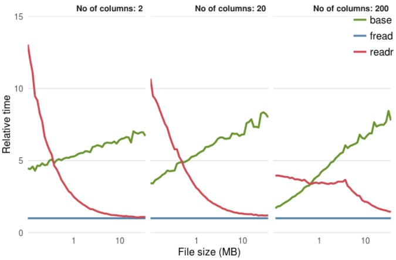

```{r fundamental, echo=FALSE}
library(knitr)
## global chunk option ##
knitr::opts_chunk$set(echo=TRUE, message=FALSE, fig.width=2.6736, fig.height=2.5, fig.show='hold', results='markup') 
```

# R Fundamentals {#fundamentals}


## Package Management

### Package Storage

Here is where all the libraries are stored.  
Can you guess which are the **baseR and third party libraries** stored ?  
```{r}
.libPaths()
```

### Package Listing

Use **`installed.packages()`** to return a data frame that list all installed packages.  
```{r}
head( installed.packages() )
```

**TOO MANY COLUMNS !!**  
Below are the column names and its numbering for filtering purpose.  
```{r}
colnames( installed.packages() )
```

**Perform column filter** based on column names as necessary.  
Set parameter **priority = 'NA' to exclude base R** packages.  

```{r}
head( installed.packages( priority='NA' ) [,c(1,3)] )
```

Set parameter **priority = 'high'** will include **ONLY base R** packages  
```{r}
head( installed.packages( priority='high' ) [,c(3,2)] )
```

### Package Install / Removal

```{r eval=FALSE}
install.packages( c('ggplot', 'ggExtra') )
remove.packages ( c('ggplot', 'ggExtra') )
```

### Package Update

```{r eval=FALSE}
old.packages()      ## list all old packages, their old version and available new version
update.packages()             ## need to input y/n/c for each old package to update
update.packages( ask=FALSE )  ## automatically update all packages without asking
```


### Package Corruption

Sometimes a corrupted R package can give below issues:  

- Error loading a library  
- Error installing a library  
- Error removing a library  

The solution is to:  

- Remove the problematic package folder (see where they are stored using **.libPaths()** )  
- Reinstall the package  

## String

### Library

```{r}
library(stringr)
```

|   | Package     | Function    | Purpose              |
|---|-------------|-------------|----------------------|
| 1 | base        | nchar       | Number of characters |
|   |             | strsplit    | Parse a string to vector                    |
|   |             | cat         | Concatenate and output to screen/file only, no storage  |
|   |             | format      | formatting text/number to pretty text format|
| 2 | string_r    | str_length  | Number of characters, similar to nchar()    |
|   |             | str_sub     | Extract substrings, similar to substring()  |
|   |             | str_c       | String concatenation, similar to paste()    |
|   |             | str_trim    | Removes leading and trailing whitespace     |
|   |             | str_pad     | Pads a string                               |

### Concatenating
#### Sample Data
```{r, collapse=TRUE}
a = c('a', 'b', 'c')
b = c('a', 'b', 'c','e')
n = c(10,   20, 30 )
c = c(T,    T,  F)
```

#### Element-wise Concatenation
- So far the example concatenantes single multiple vectors (each with single element)  
- Let's look at **multiple elements vectors**, and notice how the vectorization works  

**`paste`** is a vectorized funciton:  

- Iterates through each element of the vectors in parallel  
- In each iteraction, combine string from the all the vectors' element  
- Default seperator is ' '  
- **`collapse`** return the output as single vector  
- coerce NA to string !!! Not an usual behavior  
```{r, collapse=TRUE}
paste(a,n,c)

paste(a,n,c, sep='.', collapse='/')

paste("May", NA, "The", "Force", NULL, "Be", "With", character(0), "You")
```

**`string_r::str_c`** is almost similar to `paste`, with additional **cool** features below:  

- `str_c` has no default seperator  
- `str_c` **silently removed** NULL and character(0)  
- `str_c` display **warning message** if vector **length not equal**  
- `str_c` **return NA** if NA is found on the input; a **more consistant** behavior  
```{r, collapse=TRUE}
str_c(a,n,c, sep='.', collapse='/')

str_c(b,n,c, sep='.', collapse='/') ## FAIL, because vector b is longer than others

str_c("May", NA, "The", "Force", NULL, "Be", "With", character(0), "You")
```

#### Vector Merging (Back To Back)
`c()` **join multiple vectors** together into one big vector
```{r, collapse=TRUE}
c(a,n,c)
```

#### Output to Screen/File
Use `cat` for sole purpose of output to screen or file, **NO STORING TO VARIABLE**.

> cat(... , file = "", sep = " ", fill = FALSE, labels = NULL, append = FALSE)

**Default Seperator**
```{r, collapse=TRUE}
n = 1:3
t = c('Text1', 'Text2', 'Text3')
cat('Number n=',n,', Text t=', t)

cat('Number n=',n,', Text t=', t, sep=':')
```

**Breaking Lines**
```{r, collapse=TRUE}
cat('Number n=',n,', Text t=', t, fill=10)  # line break after 10 chars

cat('Number n=',n,', Text t=', t, fill=1)   # line break after 1 chars
```

### Parsing

```{r, collapse=TRUE}
strsplit(' I Love   You', split = '')  # split every character

strsplit(' I Love   You', split = ' ') # split with ' ' as seperator
```

### Formating

**`format()`** allow us to format R object for pretty printing, especially numeric data.  

> `format(x, trim = FALSE, digits = NULL, nsmall = 0L,`  
> `      justify = c("left", "right", "centre", "none"),`  
> `      width = NULL, na.encode = TRUE, scientific = NA,`  
> `      big.mark   = "",   big.interval = 3L,`  
> `      small.mark = "", small.interval = 5L,`  
> `      decimal.mark = getOption("OutDec"),`  
> `      zero.print = NULL, drop0trailing = FALSE, ...)`  

#### Number Formating : R-Style

```{r, collapse=TRUE}
format(c(13.7, 13.123456789))
```

**`nsmall`** : **minimum** number of digits to the right of the decimal point.
```{r, collapse=TRUE}
format(c(13.7, 13.123),       nsmall=6) # zero padded on the right 

format(c(13.7, 13.123456789), nsmall=6) # decimals were truncated
```
**`digits`** : how many **significant digits** are to be used for numeric. Default uses getOption("digits").
```{r, collapse=TRUE}
format(c(13.7, 13.123),       digits=6) # zero not padded

format(c(13.7, 13.123456789), digits=6) # digits being truncated
```

**`bigmark`** : decimals will be **ignored**  
```{r, collapse=TRUE}
format(1234567.34, big.mark=',')
```

#### Numer Formating : C-Style
```{r, collapse=TRUE}
sprintf("%f", pi)    # '%f' indicates 'fixed point' decimal notation

sprintf("%.3f", pi)  # decimal notation with 3 decimal digits

sprintf("%1.0f", pi) # 1 integer and 0 decimal digits

sprintf("%8.3f", pi) # total width 8 (including demical point), 3 decimals 

sprintf("%+f", pi)   # print with sign (positive)

sprintf("% f", pi)   # prefix a space

sprintf("%-10f.3", pi) # left justified

sprintf("%e", pi)    # exponential 'e' notation

sprintf("%E", pi)    # exponential 'E' notation

sprintf("%g", pi)    # number of significant digits (6 by default)
```

#### Text Formating

- By default, format() **pads the strings with spaces** so that they are **all the same length**  
- default justify is 'left'  
```{r, collapse=TRUE}
format(c("A", "BB", "CCC","DDDD"))
```

**`width`** : **minimum** width of the text
```{r, collapse=TRUE}
format(c("A", "BB", "CCC","DDDDD"), width = 7, justify = "right")
```


### Statistics

#### Length of String

Both functions below are equivalent.    

**base::nchar**  

> **`base::nchar( x )`**  
> $\quad$ `x = char vector`  

```{r, collapse=TRUE}
nchar(c('a', 'abc', 'abcde', NA))
nchar(c(133, 5143.34, NA)) # coerce input to '133','514.34', NA
nchar(c(T,TRUE,F,FALSE))   # coerce input to 'TRUE','TRUE','FALSE','FALSE'
```

**stringr::str_length**  

```{r, collapse=TRUE}
str_length(c('a', 'abc', 'abcde', NA))

str_length(c(133, 5143.34, NA)) # coerce input to '133','514.34', NA

str_length(c(T,TRUE,F,FALSE))   # coerce input to 'TRUE','TRUE','FALSE','FALSE'
```

## Set Operation

### Library
|   | Package     | Function    | Purpose              |
|---|-------------|-------------|----------------------|
| 1 | base        | union       | Set union            |
|   |             | intersect   | Intersection        |
|   |             | setdiff     | Set difference|
|   |             | setequal    | Equal sets |
|   |             | identical   | Exact equality (including sequene) |
|   |             | is.element  | String concatenation    |
|   |             | %in%        | Contains |
|   |             | sort        | Sorting  |

### Set Equality
We want to know if two vectors contain **similar elements**. Order of the elements are not important.  
```{r, collapse=TRUE}
set1 = c('a','b','123.33')
set2 = c('a','b',123.33)   # number coerce to character
set3 = c('a',123.33,'b')   # number coerce to character
setequal(set1,set2)  

setequal(set2,set3)        # order doesn't matters
```

### Exact Equality
```{r, collapse=TRUE}
set1 = c('a','b','123.33')
set2 = c('a','b',123.33)   # number coerce to character
set3 = c('a',123.33,'b')   # number coerce to character
identical(set1,set2)  

identical(set2,set3)       # order matters
```

### Element Contained
We can check if element(s) is contained in a vector using set operation `is.element` or shortcut %in%.
```{r,collapse=TRUE}
set1 = c('a','b',123.33, NA)    # number coerce to character
is.element(c(123.33,'b'),set1)  # number coerce to character

c(123.33,NA) %in% set1          # number coerce to character

NA %in% set1
```

## Loops

### Sample Data
```{r,echo=FALSE}
set.seed(1234)
n=5
my.df = data.frame(
  com  = paste('C',sample(1:2, n, replace = T),sep=''),
  dept = paste('D',sample(1:3, n, replace = T),sep=''),
  grp  = paste('G',sample(1:2, n, replace = T),sep=''),
  team = paste('T',sample(1:2, n, replace = T),sep=''),
  value1 = rnorm(1:n, mean = 50, sd = 5),
  value2 = rnorm(1:n, mean = 20, sd = 3),
  value3 = rnorm(1:n, mean = 10, sd = 1),
  stringsAsFactors = F
)
```

```{r}
my.df
```


### Loop Through A Vector

### Loop Through Multiple Columns/Rows

**`apply`** loops through all rows or columns, take each column/row as a vector and supply them as input to a function. The function will compute the vector supplied, and return output in one of the form below base on the function used:    

- Return **single value** per row/column, eg. `sum()`  
- Return **multiple value** per row/column, eg. `function(x) x^2`  

At the end of the 'loop', all results from each iteration are combined into one vector or matrix as final output.  

> **`apply (X, MARGIN, FUN, ...)`**  
> $\quad$ `X : matrix (anything else will be converted to matrix`  
> $\quad$ `MARGIN: 1 - row-wise, 2-column-wise`  
> $\quad$ `FUN: function to apply, can be a custom function`  
> $\quad$ `... : optional parameters for FUN`  

#### Row-Wise Function

Iterate through each row with parameter `MARGIN=1`.  
**Each output column represent a data ROW**.  

```{r, collapse = TRUE}
# single value returned per row
apply( my.df[,5:7], 1, sum )

# multiple values returned per row
apply( my.df[,5:7], 1, function (x,y) x^y, y=3 )  
```

#### Column-Wise Function

Iterate through each column with paramneter `MARGIN=2`.  
**Each output column represent a data COLUMN**.  

```{r, collapse = TRUE}
# single value returned per column
apply( my.df[,5:7], 2, sum)   

# multiple values returned per column
apply( my.df[,5:7], 2, function (x,y) x^y, y=3 )
```


## Data Import

### Data Import Performance

There are multiple ways to import data into R, most common ones are discussed here:  

- Base **read.table**  
- **data.table::fread**  
- **readr::read_csv**  

#### Comparison

Below comparison charts shows **reading performance relative to data.table::fread**:  

- Base **read.table** is more than 5x slower on large files  
- **readr** performance is acceptable, and improving **closer to fread** at larger data file  

  
[Source](https://csgillespie.github.io/efficientR/5-3-importing-data.html#fast-data-reading)

### What To Choose

Few criterias must be considered when choosing the right import:  

**Performance**  

- **fread** is very high speed, follow by **readr**  
- **read.table** is slow, and not suitable for large datasets  

**Parsing Detection**  

- **fread** autmatically detect header  
- **fread** autmatically detect column delimeter and decimal  
- **readr** auto parse date/time format if data in format "yyyy-mm-dd"  

**Factor Conversion**  

- **fread** and **read.table** both has **stringAsFactor=TRUE** option for auto conver string to factor  
- In **readr**, need to manually specify which column to convert to factor, and all the factor levels values required definition upfront (downside)  

**Progress Bar**  

- **fread** and **readr** provides progress info when the loading is going to take a while  

**Other Features**  

- **readr** is part of tidyverse ecosystem, readr returns tibble and datafrma eobject  
- **fread** has advance data manipulation functions at high speed, fread return data.table and data.frame object  

### Working Directory

Before importing data into R, we must first check the **current working directory**, so that we can specify the **relative path** for the files we want to import.  

To display the current working directory.  

```{r, collapse=TRUE}
getwd()
```

To set the working directory, use below:  

```{r eval=FALSE}
setwd("...new path...)
```

### Sample Data File

We use sample data from excel, exported to CSV.  
Following importing method shows the process of Excel-->csv-->R data.frame.    

#### Original Excel Data Source


#### Exported CSV File from Excel

```
,,dept,gender,weight,height,date_birth,amount,date_last,date first
1,ID101,D1,Male,35,173,1/7/1973,100,2/29/2016,2013-07-31
2,ID102,D2,Female,37.1,164,28/2/1980,121,4/1/2017,2013-08-31
3,ID103,D3,Female,43.12,178,31/12/1978,152,10/31/2015,2014-12-31
4,ID104,D1,Male,38.123,182,12/1/1997,133,11/1/2016,2015-02-28
5,ID105,D1,Male,54.1234,159,2/1/1982,143,9/30/2016,2012-06-15
6,ID106,D3,Female,34.12345,166,26/7/1973,155,11/27/2015,2013-04-28
7,ID107,D2,Male,49.123456,153,21/8/1985,117,3/31/2017,2014-03-01
8,ID108,D1,Male,50.2,159,2/1/1982,143,9/30/2016,2011-06-15
9,ID109,D3,Female,59.1,166,13/7/1975,155,11/1/2017,2012-04-02
10,ID110,D2,Male,63.2,163,24/8/1982,117,3/12/2016,2013-03-12
11,ID111,D3,Female,75.1,170,9/8/1979,135,2/1/2015,
12,ID112,D2,Male,52.1,169,NULL,128,NA,
13,ID113,D3,NULL,88.8,171,NULL,141,NA,
### Importing CSV
```

### Base::read.csv

**read.csv** is a similar to **read.table** but with some defaults value set as below for convenience of CSV import.  

In the resulting data.frame, row.names attribute are automatically assigned with sequence number starting from 1.  

> **read.csv** ( file,   
> $\quad$ header = TRUE  - contain header row  
> $\quad$ sep = ","  - column seperator marked as ','  
> $\quad$ dec = "."  - decimals marked as '.'  
> $\quad$ na.strings = "NA"  - vectors that define missing data marking <NA>  
> $\quad$ check.names = TRUE - col names with white space replaced with '.'   
> $\quad$ stringsAsFactors = TRUE - convert string to factor  

As an exmple, the import below:  

- Specified multiple string elements that represents  **missing data** in the CSV file  
- Set **stirngsAsFactors=FALSE** so that all string columns are not converted to factor automatically, on other words, they are imported as character  
- **./** is a relative path represents  current R working directory. It can be replaced with complete non-relative path  
- Default parameter **check.names=TRUE** automatically named 'unnamed' column, as well as replacing white spaces for column names with '.'  

```{r}
sample.df <- read.csv ("./datasets/import_sample.csv", 
    stringsAsFactors = FALSE,
    na.strings=c('NA','NULL',''),
    encoding="UTF-8")

sample.df [,-10]
```

```{r, collapse=TRUE}
str(sample.df)
```


### data.table::fread

> **fread** ( input,   
> $\quad$ header = 'auto'  - auto detect header (if all non empty cells in first row character)  
> $\quad$ sep = "auto"  - auto detect column  seperator  
> $\quad$ dec = if (sep!=".") "." else ",", in a way automatic selected  
> $\quad$ na.strings = "NA"  - vectors that define missing data marking <NA>  
> $\quad$ check.names = FALSE - do not replace col names with white space  with '.'   
> $\quad$ stringsAsFactors = FALSE - do not convert string to factor  
> $\quad$ nrows = -1 - how many rows to read, default -1 means read all rows  
> $\quad$ data.table = TRUE - return data.table object, FALSE - return data.frame object  

```{r}
library(data.table)

my.dt = fread("./datasets/import_sample.csv",
    stringsAsFactors = TRUE,
    na.strings=c('NA','NULL',''),
    check.names = TRUE,
    data.table = FALSE)
my.dt[,-10]

str(my.dt)
```

### readr::read_csv

- read_csv returns object type: **‘tbl_df’, ‘tbl’ and 'data.frame'**  

> **read_csv** ( file,   
> $\quad$ col_names = TRUE - first row is header, if FALSE or char vector to specify column names  
> $\quad$ col_types = NULL - all columns type will be imputed based on first 100 rows, alternatively specify:  
> $\quad$ $\quad$ list( Sepal.Length = col_double(), ...) 
> $\quad$ na = c("", "NA") - characters used for detecting missing data <NA>  
> $\quad$ skip = 0 - no skipping for first number of rows  
> $\quad$ n_max = Inf - how many rows to read, default read all  

```{r}
library(readr)

my.rd = read_csv("./datasets/import_sample.csv", 
          na = c('NA','NULL',''),
          col_types = list (
            gender=col_factor(c('Male','Female'))
          ))

my.rd[,-10]

str(my.rd)
```
