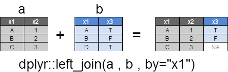
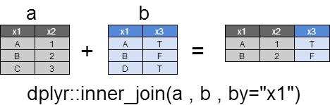
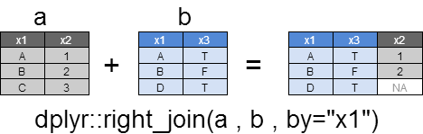
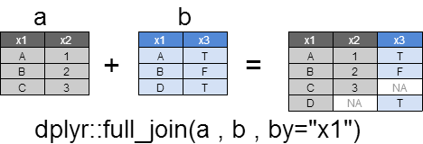
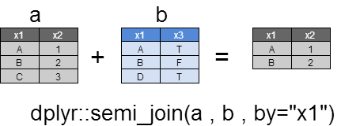
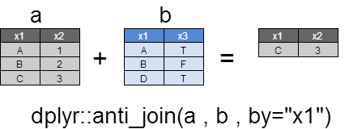
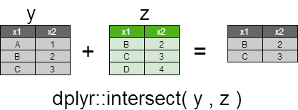
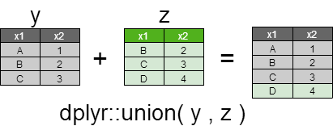
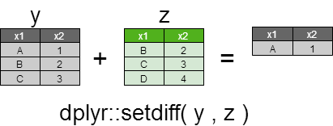

# Data Preprocessing

## Library

```{r}
library(lubridate)
library(caTools)
library(dplyr)
```

Below summarizes all packages, their functions and purposes used in this **Data Preprocessing** chapter.  

|   | Package              | Function      | Purpose                                                                                                 |
|---|----------------------|---------------|---------------------------------------------------------------------------------------------------------|
| 1 | Base R (factor)      | as.factor     | Convert a vector to a new factor                                                                        |
|   |                      | droplevels    | Return a new factor with unused levels removed                                                          |
|   |                      | relevel       | Return a new factor with new reference level                                                            |
| 2 | Base R (missing data)| is.na         | Return TRUE if <NA> is found in vector                                                                  |
|   |                      | na.omit       | Return a new vector/dataframe with ALL <NA> removed, with attribute containing info ro rows removed     |
|   |                      | complete.cases| Return TRUE if vector/data.frame row does not contain any <NA>                                          |
| 3 | Base R (numeric)     | scale         | Centre numeric data (-mean), and optionally normalize it (/sd)                                          |
|   |                      | cut           | Cut numeric vector into breakpoints, and return grouping factor                                         |
| 4 | Base R (date)        | as.Date       | Parse a factor / string to date                                                                         |
|   | lubridate            | ymd,mdy,dmy   | Parse a string to date                                                                                  |
|   |                      | interval      | Return interval object betwen two given dates. Can be further used for deriving days/months in between  |
|   |                      | ceiling.date  | Return next nearest date according to unit (day / month / year)                                         |
| 5 | Base R (dataset)     | subset        | Return a new data based on input logical vector                                                         |
|   |                      | merge         | Merge two data.frame together based on common key                                                       |
|   |                      | nrow, ncol    | How many columns / rows in the dataset ?                                                                |
|   |                      | length        | How many elements in a vector ?                                                                         |
| 6 | caTools              | sample.split  | Split vector into two with a ratio, whiel maintain data value ratio, return result in logical vector    |
| 7 | dplyr                | select        | extract columns from existing data.frame                                                                |
|   |                      | mutate        | Add new columns, from existing data.frame                                                                |


## Sample Data

```{r results='markup'}
my.df <- read.csv ( file="./datasets/import_sample.csv", 
    na.strings=c('NA','NULL',''))
#    stringsAsFactors = FALSE )
my.df
str(my.df)
```

## Column Manipulation

### Duplicating Columns

Duplicate single column using `$` selector  

```{r}
my.df$Z1 = my.df$X
my.df$Z2 = my.df$X
glimpse(my.df)
```

### Delete Columns

#### Delete One Column

Use `$` column selector, setting to NULL.  

```{r}
my.df$Z1 = NULL
```

#### Delete Multiple Columns

Use multiple columns selector `[,vector]`, with vector containing column numbers or names, setting to NULL.  

```{r}
my.df[,c('X','Z2')] = NULL
glimpse(my.df)
```

### Renaming Columns

#### What Are The Column Names

**colnames** returns vector of names attribute of data.frame.  

```{r, results='hold'}
colnames(my.df)
```

#### Set the Column Name(s)

Use **colnames** to rename single or multiple columns. Use `[]` to select the specific column(s).  

```{r}
colnames(my.df)[c(1,9)] = c('id','date_first')
colnames(my.df)
```

### Columns Selection

#### base R

Use `[,]` notation to select columns

```{r}
head( my.df[,c('dept','gender','weight','height','amount','date_birth')] )
```

#### dplyr

As you can see, **dplyr::select** is more intuitive as compared to base **[,]** notation  

```{r, results='hold'}
select(my.df, dept, gender, weight, height, amount, date_birth)   %>%
  head
```

### Create New Columns

#### base '$' notation
**$ and [,]** are common useful notation in base R for data manipulation  
```{r}
my.df$birth_month = month(my.df$date_birth)
my.df$birth_year = year(my.df$date_birth)
head( my.df[,c('date_birth', 'birth_year','birth_month')] )
```

#### dplyr::mutate

- Using **dplyr** family, we avoids repeating the data.frame name in the parameters  
- See how elegantly we combined the statements using **%>%** to improve readability by intuitive syntax construct and avoid repetition
```{r}
  mutate(my.df, birth_month = month(date_birth), 
                birth_year = year(date_birth))   %>%
  select(date_birth, birth_year, birth_month)    %>% 
  head
```

## Missing Data

### Detecting Complete/Incomplete Vector/Row

**complete.cases** returns logical vector for elements that **doesn't** contain <NA>, with TRUE. It can be applied to both vector or data.frame.  

```{r results='hold'}
complete.cases(my.df$date_birth)   # vector example
complete.cases(my.df)              # data.frame example
```

**Negate** complete.cases resulting TRUE for rows containing <NA>.  

```{r results='hold'}
!complete.cases(my.df$date_birth)  # vector example
!complete.cases(my.df)             # data.frame example
```

Result from complete.cases is useful to **retrieve incomplete** rows for further investigation.  

```{r}
my.df[!complete.cases(my.df),]
```


### Removing Missing Data <NA>

**`na.omit`** returns data with <NA> removed.  The advantage of this method compare to **complete.cases** are:  
- **simpler syntax**, filtering using [rows,]  not require  
- **additonal attribute**, accessible through `na.action()`, providing information on element number removed  

#### Remove Elements with Missing Data In Vector

```{r collapse=TRUE}
na.omit(my.df$date_birth) # vector example
str(na.omit(my.df$date_birth))
```

#### Remove Rows with Missing Data In Data Frame

```{r results='markup'}
# my.df[complete.cases(my.df),]   # longer method which is less elegant
my.df = na.omit(my.df)            # data.frame example
na.action(my.df)                  # number of rows removed
```

## Merging Data

### Joining Columns

##### Left (Outer) Join
- Return all rows of x, and rows that match y are also returned with y columns  
- The column of y in rows that do not match y is NA  
- If multiple matches occur between x and y, all combinations are returned  

 

**dplyr Method**  
```{r}
a <- dplyr :: data_frame ( 
  x1 = c ( "A" , "B" , "C" )  , 
  x2 = c (  1 ,   2 ,   3 ) )

b <- dplyr :: data_frame ( 
  x1 = c ( "A" , "B" , "D" )  , 
  x3 = c ( TRUE  ,  FALSE  ,  TRUE ) )

dplyr::left_join ( a , b , by = "x1" )
```

#### Inner Join

- Returns only the rows matching the columns specified in x and y  
- If there are multiple matches between x and y, all combinations will be returned  

  

**dplyr Method**  
```{r}
a <- dplyr :: data_frame ( 
  x1 = c ( "A" , "B" , "C" )  , 
  x2 = c (  1  ,  2 ,   3  ))

b <- dplyr :: data_frame ( 
  x1 = c ( "A" , "B" , "D" )  , 
  x3 = c ( TRUE  ,  FALSE  ,  TRUE ) )

dplyr::inner_join ( a , b , by = "x1" )
```

#### Right Join
- This is a reverse where x and y of left_join are reversed  
- Return all rows of y, and columns that match x are also returned with columns of x  
- The column of x of a row not matching x is NA  
- If multiple matches occur between x and y, all combinations are returned  

  

**dplyr Method**  
```{r}
a <- dplyr :: data_frame ( 
  x1 = c ( "A" , "B" , "C" )  , 
  x2 = c ( 1 , 2 , 3 ) )

b <- dplyr :: data_frame ( 
  x1 = c ( "A" , "B" , "D" )  , 
  x3 = c ( TRUE  ,  FALSE  ,  TRUE ) )

dplyr :: right_join ( a , b , by = "x1" )
```

#### Full Join
- Return all rows and columns of x and y  
- Where there is no match, it becomes NA  

  

**dplyr Method**  
```{r}
a <- dplyr :: data_frame ( 
  x1 = c ( "A" , "B" , "C" )  , 
  x2 = c ( 1 , 2 , 3 ) )

b <- dplyr :: data_frame ( 
  x1 = c ( "A" , "B" , "D" )  , 
  x3 = c ( TRUE  ,  FALSE  ,  TRUE ) )

dplyr :: full_join ( a , b , by = "x1" )
```

#### Semi Join
- Return all x rows that matched y  
- Columns returned are all columns of x  
- Columns of y are not returned; this is **different from inner_join**  

  

**dplyr Method**  
```{r}
a <- dplyr :: data_frame ( 
  x1 = c ( "A" , "B" , "C" )  , 
  x2 = c ( 1 , 2 , 3 ) )

b <- dplyr :: data_frame ( 
  x1 = c ( "A" , "B" , "D" )  , 
  x3 = c ( TRUE  ,  FALSE  ,  TRUE ) )

dplyr::semi_join ( a , b , by = "x1" )
```


#### Anti Join
- We return all x rows that did not match y  
- All columns returned are x columns only and y columns are not returned  

  

**dplyr Method**  
```{r}
a <- dplyr :: data_frame ( 
  x1 = c ( "A" , "B" , "C" )  , 
  x2 = c ( 1 , 2 , 3 ) )

b <- dplyr :: data_frame ( 
  x1 = c ( "A" , "B" , "D" )  , 
  x3 = c ( TRUE  ,  FALSE  ,  TRUE ) )

dplyr::anti_join ( a , b , by = "x1" )
```

### Joining Rows: Set Operation

#### Intersect
The columns at both x and y are returned  

  

**dplyr Method**  
```{r}
y <- dplyr :: data_frame ( 
  x1 = c ( "A" , "B" , "C" )  , 
  x2 = c (  1  ,  2  ,  3  ) )

z <- dplyr :: data_frame ( 
  x1 = c ( "B" , "C" , "D" ), 
  x2 = c (  2  ,  3  ,  4 ) )

dplyr :: intersect ( y , z )
```

#### Union
A unique row with no duplication of x and y will be returned.

  

**dplyr Method**  
```{r}
y <- dplyr :: data_frame ( 
   x1 = c ( "A" , "B" , "C" )  , 
   x2 = c (  1  ,  2  ,  3  ) )

z <- dplyr :: data_frame ( 
   x1 = c ( "B" , "C" , "D" ), 
   x2 = c (  2  ,  3  ,  4 ) )

dplyr :: union ( y , z )
```

#### Setdiff
A row of x, not in y, is returned.

  

**dplyr Method**  
```{r}
y <- dplyr :: data_frame ( 
  x1 = c ( "A" , "B" , "C" )  , 
  x2 = c (  1  ,  2  ,  3  ) )

z <- dplyr :: data_frame ( 
  x1 = c ( "B" , "C" , "D" ), 
  x2 = c (  2  ,  3  ,  4 ) )

dplyr :: setdiff ( y , z )
```

## Categorical Data

### Converting to Factor

`as.factor` converts string, discrete integer and logical data to factor. Each unique value will make up the levels for the factor, (sorted alphabatically during creation time).  

Convert below string to factor, and the first element of the **sorted unique value** - `D1` is the **reference level**.  

```{r, results = 'markup'}
x = as.factor( c('D2', 'D1', 'D3', 'D3', 'D2', 'D1', 'D3') )
x
```

### Releveling Factor

**`relevel`** return a new factor with base reference changed.  

Notice current factor **x** has 'D1` as the reference.  

```{r, results = 'markup'}
levels(x)
```

**Change the reference** to 'D3', return a new factor

```{r, results = 'markup'}
y = relevel(x, 'D3')
levels(y)
```


### Dropping Levels

**Levels can be 'squeezed'** if it contain levels that no longer have data in it.  

Original data below contain three levels, D1 D2 D3.  After removing all 'D2' value from the factor, all three original levels **still exist !**

```{r, results = 'markup'}
z = x[x!='D2']
str(z)
```

Use **`droplevels`** to remove all unused levels. All value will be **renumbered**.  

```{r, results = 'markup'}
z = droplevels(z)
str(z)
```


## String Manipulation

### Extration

### Removal

### Concatenation


## Date Manipulation

### Parsing Date

When import date date from text file using `read()`, often date column are imported as string or factor.  Note that `lubridate::dmy,ymd` can convert from string only, whereas `as.Date` can convert from both string and  factor.  

**Before Conversion**, verify that all dates column are actually `chr`.  

```{r}
str(my.df)
```

Two ways to convert string to date:  

- **as.Date** - convert vector into `date` data type. A format parameter has to be specified to match the source format. Otherwise `as.Date` will try default format of "%Y-%m-%d" then "%Y/%m/%d"  
- **lubridate::dmy, mdy, ymd** - this is more elegant because manual format is not required. However, it converts only string data. If the data source is factor, **convert it to string** first  

In both methods, unmatched rows with unrecognized format will throw an error.  

```{r results='markup'}
my.df$date_birth = as.Date( my.df$date_birth, format = "%d/%m/%Y" )  # base R
my.df$date_last  = mdy( my.df$date_last  )    # lubridate 
my.df$date_first = ymd( my.df$date_first )    # lubridate
str(my.df)
```

### What Day/Month/Year

**`lubridate`** has useful functions to return numeric day, month, year from date object.  

#### What Day
```{r}
d1 = as.Date('2017-03-31')
lubridate::day(d1)
```

#### What Month
```{r}
lubridate::month(d1)
```

#### What Year
```{r}
lubridate::year(d1)
```

### Days/Months/Year Difference

#### Days Difference

```{r results='hold'}
my.df$date_last
my.df$date_first
my.df$date_last - my.df$date_first
```

#### Months Difference

Combination of `lubridate::interval` and `lubridate operator` provides a integer vector of months elapsed between two date:  
- The result can be negative if first date parameter > second date parameter  
- lubridate 'intelligently' knows interval is from end of month to end of month interval  

```{r, results='hold'}
interval( ymd('2016-03-30'), ymd('2016-04-29') ) %/% months(1) # end day no. < begining day no.
interval( ymd('2016-03-30'), ymd('2016-04-30') ) %/% months(1) # end day no. == beginning day no.
interval( ymd('2016-03-31'), ymd('2016-04-30') ) %/% months(1) # end of month to end of month
```

Apply this to data frame / vector.  

```{r, results='hold'}
my.df$date_first
my.df$date_last
interval( my.df$date_first, my.df$date_last ) %/% months(1) 
```

#### Years Difference

Use **`lubridate::year` function to find the year (integer) of a given date**. Difference of the year() results from the birthdate and current date is the **Age**.  

```{r}
year(now()) - year(my.df$date_birth)
```

However in **insurance** industry, only a **full year** is considred for age.  

```{r results='hold'}
interval( ymd('2016-02-29'), ymd('2017-02-27') ) %/% years(1) # a day short for a year
interval( ymd('2016-02-29'), ymd('2017-02-28') ) %/% years(1) # EoM to EoM
```

Apply this to data frame / vector.  

```{r, results='hold'}
my.df$date_first
my.df$date_last
interval( my.df$date_first, my.df$date_last ) %/% years(1) 
```

### Days/Monhts/Years Later
Adding days to a date is simple. Just + days(123) for 123 days later.  
However, adding months and years is tricky, because certain months are shorter. Good solution is to use **`lubridate::%m+%`** operator.  

#### Days Later

**Adding days** is as simple as  **add number of days** to the date variables.  

```{r}
my.df$date_last
```

#### Months Later

Adding month(s) is tricky on the **last day of month**.  Use **`lubridate operator` for correct solution**, because it takes cares of last day of month including February of leap years.  

```{r, results='hold'}
my.df$date_last
my.df$date_last   +  months(1)   # 1 month later, bad solution, can result in <NA>
my.df$date_last %m+% months(1)   # 1 month later, good solution
```

#### Years Later

Adding year(s) is similar to adding month(s) above.  

```{r, results='hold'}
my.df$date_last
my.df$date_last   +  years(1)   # 1 year later, bad solution
my.df$date_last %m+% years(1)   # 1 year later, good solution
```

### Last Day of Month

**`lubridate::ceiling_date`** rounds up the date to the nearest unit. 

When rounding up a date to the **next nearest month*, it results the **first day of next month**. 

```{r, results='hold'}
my.df$date_last
ceiling_date(my.df$date_last, "month")
```

**Substracting this date by one** will return last day of the month.  

```{r}
ceiling_date(my.df$date_last, "month") - days(1)
```


## Number Manipulation

### Sample Data

Scaling section will use sample data generated as below:  

```{r}
set.seed(1234)
num.df = data.frame(
  id = paste('ID_', 1:5, sep = ''),
  value1 = sample(50:100, 5),
  value2 = sample(10:50, 5),
  stringsAsFactors = F
)
num.df
```

### Z-Score Scaling

`scale` apply transformation **column-wise**, for  columns within matrix or dataframe  
`scale` return a **matrix**  

>`scale (x, center=T, scale=T)`  # default S-Score transformation  
>$\quad$ `center = T (default) means value minus with mean`  
>$\quad$ `scale  = T (default) means value divide by sd`  
>$\quad$ $\quad$ `output scaled:center --> mean`  
>$\quad$ $\quad$ `output scaled:scale  --> sd`  

```{r results='markdown'}
scale( num.df[,2:3] )
scale( num.df[,2:3], scale=F )
```

### Min Max Scaling

Min-Max scaling will transform all numbers between 0 and 1.  
Easiest way to perform this transformation is to write a function then `apply`.  

```{r}
min_max = function(x){(x-min(x))/(max(x)-min(x))}
apply( num.df[,2:3], MARGIN = 2, FUN = min_max )  ## 2 means column-wise
```


## Artificial Grouping

Artificial group can be created based on existing numeric data.  Such as age_group based on age.  

### Grouping with Numeric Breakpoints

Simulate data with x,y,z variables. p simulates priority scoring.  

```{r}
x = rnorm(10, mean = 10)
y = rnorm(10, mean = 10)
p = x * y
```

Articial groups is created first by identifying the **number of groups**, generate the break points vector, then **cut** the data base on **break points** and return **factor** as output.  

Automatically calculate breakpoints by distributing numbers into the min-max range, in low to high order:  

```{r, results='markup'}
num_groups = 4
breakPoints = seq(min(p), max(p), length.out = num_groups + 1)
breakPoints
```

> `cut ( x, breaks, right = TRUE, include.lowest = FALSE)`  
> $\quad$ `x: numeric vector to be cutted`   
> $\quad$ `breaks: numeric vector ranging from low to high (in order)`  
> $\quad$ `include.lowest: FALSE - ommit element matching lowest number in breaks`  
> $\quad$ `right: TRUE - close end on right;open end on left`  

The result from **cut** is factor based on order from breakPoints. Therefore, once convert into numeric, the group number is in order of low to high accoriding to breakPoints.  

Verify that group (g) has been assigned for each priority (p).    

```{r}
g = as.numeric( cut( p, breakPoints, include.lowest=TRUE))
data.frame(p,g)
```

### Grouping based on Custom Criteria

creates a logical vector, indicating. Ratio specified in SplitRatio will be have value 'TRUE'


## Radom Dataset Splitting

When we have only ONE dataset, we can split them into training and testing, example 0.7/0.3 split. 

### Simple Random Split

#### Verify Dataset

Verify the total number of rows before splitting.  

```{r}
nrow(my.df)
```

#### Create Randomized Row Numbers Vector

- Randomly pick 60% of elements from a bag of all row numbers, with no replacement.  
- Verify that 60% of full observations are picked.  

```{r}
set.seed(8034)
train.rows = sample( 1:nrow(my.df), 0.6 * nrow(my.df) )
length(train.rows)
train.rows
```

```{r, echo=FALSE}
my.df = my.df[,-1]
```

#### Split Data Into Two Sets

Subseting for the **training data**, using **`[,]`** row selection method.  

```{r}
my.df [train.rows, ]          # Training Data (0.6)
```

Subsetting the test data by **negating** the splitting row numbers.  

```{r }
my.df [-train.rows, ]         # Training Data (0.4)
```

### Random Split (Maintaining Data Value Ratio)

Sometimes we want to maintain the original data value ratio. For example, if original factor variable contains 40%A, 30%B and 30%C, and we want the splitted sample to maintain 40-30-30 ratio.  

- For prediction on **classification/clustering**, usually the **dependent variable** (categorical/binary) is used as spliting parameter  
- For regression prediction of continuous data, it **doesn't make sense to use dependent variable for spliting**, as the ratio cannot be determined with continuous data  
- Maintaining the ratio is **key difference** to **`sample`** approach which does not care about the original balance  

#### Verify Data Value Ratio

We are going to split the data frame, **while maintaining the ratio** of `dept` variable. Here is distribution dept variable.

```{r}
table(my.df[,c('dept')])
```

#### Create The Spliting Logical Vector

**`caTools::sample.split`** is the right tool for this job:  

- It takes a **vector (or a column from a data.frame)**, randomly assign TRUE (training data) and FALSE (test data) according to a specified ratio  
- While doing so, it  automatically maintaining the data value ratio within the split  
- It returns a **logical vector for data subsetting** purpose  

> **`sample.split (Y, SplitRatio = 2/3, group = NULL)`**  
> $\quad$ `Y = vector, of which ratio of value to be maintained`  
> $\quad$ `SplitRatio = ratio of split`  

```{r}
set.seed(8034)
spl = sample.split(my.df$dept, 0.6)  # randomly 0.6 set to TRUE, remaining FALSE
spl
```

#### Split Data Into Two Sets

Subseting for the **training data**, using **`subset`** or **`[,]`** row selection method

```{r }
# my.df[split.data,]        # alternative
s1 = subset( my.df, spl )   # Training Data (0.6)
table(s1[,'dept'])
```

Subsetting the test data by **negating** the splitting logical vector.  

```{r}
# my.df[!spl,]              # alternative
s2 = subset( my.df, !spl )  # Testing Data (0.4)
table(s2[,'dept'])
```

