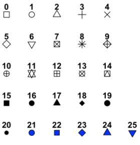
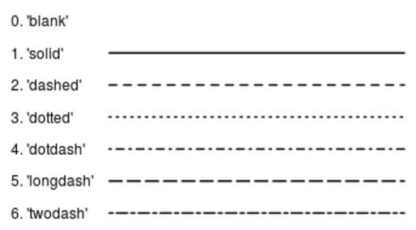

```{r init, echo=FALSE}
## global chunk option ##
knitr::opts_chunk$set(echo=TRUE, message=FALSE, fig.width=2.6736, fig.height=2.5, fig.show='hold') 
```

# Data Visualization

This chapter compares various method to plotting using base-R and ggplot.

## Library used

- Loading necessary library as below:
- Base R library already included functions: ** hist, plot, barplot, boxplot**

```{r}
library(ggplot2)    ## ggplot, qplot
library(dplyr)
```


## Sample Data
This chapter uses the sample data generate with below code. The idea is to simulate two categorical-alike feature, and two numeric value feature:  

- **dept** is random character between 'D1', 'D2', 'D3', 'D4' and 'D5'  
- **grp** is random character with randomly generated 'G1', 'G2'  
- **value1** represents numeric value, normally distributed at mean 50  
- **value2** is numeric value, normally distributed at mean 25  

```{r}
set.seed(1234)
my.df = data.frame(
  dept = paste('D',sample(1:5, 100, replace = T),sep=''),
  grp  = paste('G',sample(1:2, 100, replace = T),sep=''),
  value1 = rnorm(1:100, mean = 50, sd = 5),
  value2 = rnorm(1:100, mean = 20, sd = 3),
  stringsAsFactors = F
)
head(my.df)
```

## Histogram

### Single Dimension Data
- Require **x** as numerical data

#### Base Graphic
- In **hist**, **binwidth** setting is not available, only breaks (number of bins) can be specified
```{r, fig.width=9}
par(mfrow=c(1,2))
hist  (my.df$value1) # default breaks = 30
hist  (my.df$value1, breaks=3)
```

#### ggplot2
- Default hist/ggplot/qplot number of bins is **30**
- In **qplot**, single x numerical variable **default to histogram**
- You can't specify both **bins/breaks** and **bindwidth** together, as it implies each other
```{r}
qplot (data = my.df, x=value1)
qplot (data = my.df, x=value1, geom='histogram')
qplot (data = my.df, x=value1, bins=15)
ggplot(data = my.df, aes(x=value1)) + geom_histogram() # default bins = 30
ggplot(data = my.df, aes(x=value1)) + geom_histogram(bins = 15)
ggplot(data = my.df, aes(x=value1)) + geom_histogram(binwidth = 10)
```

### Two Dimension Data
- x = numerical data  
- fill = categorica-alike data
```{r, fig.width=4}
qplot (data = my.df, x=value1,  fill=grp, geom='histogram')
ggplot(data = my.df, aes(x=value1, fill=grp)) + geom_histogram()
```


## Scatter Plot
### Two Dimension Data
- Use scatter plot to represent **correlation** between two numeric variables
- x = number, y = number  

#### Base Graphic
```{r, fig.height=3.5, fig.width=8}
plot  (my.df$value1, my.df$value2)
```

#### ggplot2
- qplot default to **geom_point** when two numerical value is supplied for x and y
```{r}
qplot (data = my.df, x = value1, y = value2)
qplot (data = my.df, x = value1, y = value2, geom='point')
ggplot(data = my.df, aes(x=value1, y=value2)) + geom_point()
```


### Two + One Dimension Data

#### Base Graphic
- Base-R uses **col** parameter to represent third dimension
- **col** accept vector of number, color name or factor
- Use **factor** to **automatically** assign colors (ensure it is factor type, otherwise, R will complain invalid color name)

```{r, fig.width=9}
par(mfrow=c(1,2))
plot  (my.df$value1, my.df$value2, col=c('green','blue','red'))
plot  (my.df$value1, my.df$value2, col=as.factor(my.df$grp))
# plot  (my.df$value1, my.df$value2, col=my.df$grp)  ... error due to not recognized color name
par(mfrow=c(1,1))
```

#### ggplot2
- In **qplot/ggplot**, the third dimension of data can be represented by assigning **color** parameter to the third variable
- Note that **fill has not effect** on scatter plot. **fill** should only be used for bar like chart eg. **geom_hist** or **gem_bar**

```{r}
qplot (data = my.df, x = value1, y = value2, color = grp, geom='point')
ggplot(data = my.df, aes(x=value1, y=value2, color = grp)) + geom_point()
ggplot(data = my.df, aes(x=value1, y=value2, fill = grp)) + geom_point()
```

### Overlay Smooth Line

#### Base Graphic
- Base graphic allow **abline** to superimpose additional line into current plot
- For add on **linear line**, use abline with lm object
- **scatter.smooth** make it easy to impose a **loess smoothing line**
```{r, fig.height=3.5, fig.width=8}
par(mfrow=c(1,2))

plot  (my.df$value1, my.df$value2, main='linear line')
abline(lm(my.df$value2~my.df$value1))

scatter.smooth(my.df$value1, my.df$value2, main='smooth line')
```

#### ggplot2
- Smooth line is possible for scatter plot, as it require X and Y numeric variables  
- Smooth line can be added with either **linear or loess** method
- With overlapping third dimension variable (color), smoothline is also **overlapped**, hence not a good idea
- default confidence interval is **level=0.95**, specify **0** to hide the interval
```{r, fig.width=3}
ggplot(data = my.df, aes(x=value1, y=value2)) + geom_point() + 
  geom_smooth()          # default method='loess'

ggplot(data = my.df, aes(x=value1, y=value2)) + geom_point() + 
  geom_smooth(level=0)   # hide interval with level=0

ggplot(data = my.df, aes(x=value1, y=value2, fill = grp)) + geom_point() +
  geom_smooth(method='lm', level=0.75)
```


## Bar Chart

### Single Dimension Data
- Use bar to repfresent **frequency** chart
- **plot** requre a factor to plot frequency chart
- **barplot** require conversion of vector into **table** for plotting
- **qplot** default to **geom_bar** when **single categorical-alike** feature is used

```{r,fig.width=8}
par(mfrow=c(1,2))
plot(as.factor(my.df$dept))
barplot(table(my.df$dept))
```

```{r}
qplot (data = my.df, x=dept)
qplot (data = my.df, x=dept, geom='bar')
ggplot(data = my.df, aes(x=dept)) + geom_bar()
```

```{r}
qplot (data = my.df, x=dept)
qplot (data = my.df, x=dept, geom='bar')
ggplot(data = my.df, aes(x=dept)) + geom_bar()
```

### Two + One Dimension Data
- Use **fill**  to introduce extra variable visualizion in filling the bar
- Use **color** to have the extra variable represented with **border** color
```{r}
qplot (data = my.df, dept, fill = grp)
qplot (data = my.df, x = dept, fill = grp, geom='bar')
ggplot(data = my.df, aes(x = dept, fill = grp)) + geom_bar()
ggplot(data = my.df, aes(x = dept, color= grp)) + geom_bar()
```

### Reordering

```{r,fig.width=8}

```

```{r}
qplot (data = my.df, x=dept)
qplot (data = my.df, x=dept, geom='bar')
ggplot(data = my.df, aes(x=dept)) + geom_bar()
```


### Positioning
- **qplot does not** support positioning
- For **ggplot/qplot**, default position is **stack**
- position = 'dodge' similar to **position = position_dodge()**, however the later is more flexible with ability to adjust overlapping level between sub-bar (default is 0.9)

```{r}
g = ggplot(data = my.df, aes(x=dept, fill=grp)) 
g + geom_bar(position='stack') # default position
g + geom_bar(position='dodge')
g + geom_bar(position=position_dodge()) # default 0.9
g + geom_bar(position=position_dodge(0.5))
g + geom_bar(position=position_dodge(1.0))
```

### In-Bar Text Labeling

## Pie Chart
- Pie chart is basically a **geom_col stacked bar**, with **coord_polar()**  
- Somehow, width=1 is required, otherwise a small empty circle will be formed at the middle  
```{r}
g = my.df %>% 
  group_by(dept) %>%
  summarize(value1 = sum(value1)) %>%
  ggplot (aes(x='',y=value1,fill=dept)) + geom_col(width=1) + ylab('Volume 1')

g
g + coord_polar(theta='y') + 
  theme(axis.title.y = element_blank())
```

## Box Plot

### One Dimension Data

- In boxplot(), only single variable need to be supplied
- In **ggplot/qplot**, variable x and y is required. Variable y is the actual value, variable x is the group variable. Case of one dimension, use x='' when no grouping is desired

```{r}
boxplot(my.df$value1)
qplot  (data = my.df, x = '' ,  y = value1, geom='boxplot')
ggplot (data = my.df, aes( x= '', y=value1 )) + geom_boxplot()
```


### Two Dimension Data
- In **boxplot**, use ~ to specify **y~x**, where **x** is grouping variable

```{r}
boxplot(data = my.df, value1~grp)
qplot  (data = my.df, x = grp , y = value1, geom='boxplot')
ggplot (data = my.df, aes(x=grp, y=value1)) + geom_boxplot()
```

### Two + One Dimension Data
- Extra dimension can be included in for **x-axis**
- In **boxplot**, use **+** to specify extra dimension
- In **qplot/ggplot**, use **interaction** to specify extra dimension

```{r, fig.width=8.05}
boxplot(data = my.df, value1~grp+dept)
```

```{r, fig.width=8.05}
qplot  (data = my.df, x=interaction(grp,dept) , y=value1, geom='boxplot')
ggplot (data = my.df, aes(x=interaction(grp,dept) , y=value1)) + geom_boxplot()
```


## ggplot Customization

```{r}
g = ggplot(data = my.df, aes(x=dept, fill=grp)) + geom_bar()
```

### Title, Subtitle, Caption and Labels

#### Title and Subtitle
```{r}
g + ggtitle('This Is Important Chart')
g + labs(title='This Is Another Way To Set Main Title', subtitle='Another Subtitle')
```

#### Axis Label
```{r}
g + xlab('My X Axis')
g + ylab('My Y Axis')
g + labs(x='My New X Axis Label', y='My New Y Axis Label')
```

#### Caption
```{r}
g + labs(caption = "(based on data from ...ABC)")
```

### Axis Scale and Ticks  

**Simple Method**  

- **xlim** and **ylim** is a quick way to set axis limit  
- **Beware** that setting limits too low will **discard** observations that beyonds the limit  
```{r}
g + ylim(0,40)
g + xlim('D3','D2','D5')
```

**Comprehensive Method with label and breaks**  

- **scale_** is a combination way to set limits, at the same time setting label and breaks, however, it is slightly complex in syntax - **Beware** that setting limits too low will **discard** observations that beyonds the limit  
- Use **continous** for number, use **discrete** for categorical  
```{r}
g + scale_y_continuous('Another Y Label', limits=c(0,40), breaks=seq(0,50,by=5))
g + scale_x_discrete  ('Another X Label', limits=c('D3','D2','D5'))
```


### Customize Components
Let's customize a uggly plot:  
- axis.title changes both axis.title.x and axis.title.y  
- axis.text  changes both axis.text.x and axis.text.y  
- axis.ticks changes both axis.ticks.x and axis.ticks.y  

```{r, fig.width=7, fig.height=3}
g + labs(title='Main Title', subtitle='My Subtitle', caption='(sourced form ABC)') + 
  theme(
  plot.title   = element_text (face = "bold", color = 'orange', size = 12.5),
  axis.title.x = element_text (face = "bold", color = 'blue', size = 12.5),
  axis.title.y = element_text (face = "bold", color = 'red', size = 12.5),
  axis.text.x  = element_text (face = 'bold', color = 'red',    size = 10.0, angle = (90), hjust = 1, vjust = 0.5),
  axis.text.y  = element_text (face = 'bold', color = 'blue',   size = 10.0),
  axis.ticks   = element_line (color = 'green', size = 5, linetype = 5),
  axis.line    = element_line (color = 'grey',  size = 2, linetype = 3)
)
```

### Clearing Components
```{r}
# Hide x an y axis tick mark labels
g + theme(
  axis.text.x = element_blank(),
  axis.text.y = element_blank())
# Remove axis ticks and tick mark labels
g + theme(
  axis.text.x = element_blank(),
  axis.text.y = element_blank(),
  axis.ticks =  element_blank())
```

### Themes
```{r,echo=FALSE}
g <- ggplot(mtcars) + geom_point(aes(x = wt, y = mpg,
    colour = factor(gear))) + facet_wrap(~am)
```
ggplot comes with several **great themes** to quickly set the appearance of the plot.  Difference are the background and grid styles.
```{r, fig.width=7, fig.height=2.5}
g + theme_gray() + ggtitle('theme_gray')  # default
g + theme_bw() + ggtitle('theme_bw')
g + theme_linedraw() + ggtitle('theme_linedraw')
g + theme_light() + ggtitle('theme_light')
g + theme_dark() + ggtitle('theme_dark')
g + theme_classic() + ggtitle('theme_classic')
g + theme_minimal() + ggtitle('theme_minimal')
g + theme_void() + ggtitle('theme_void')
```


## Base Customization

### Double Y-Axis Scale

```{r fig.width=7, fig.height=4}
## set up some fake test data
time <- seq(0, 72, 12)
betagal.abs <- c(0.05, 0.18, 0.25, 0.31, 0.32, 0.34, 0.35)
cell.density <- c(0, 1000, 2000, 3000, 4000, 5000, 6000)

## add extra space to right margin of plot within frame
par(mar = c(5, 4, 4, 6) + 0.5)

## Plot first set of data and draw its axis
plot(time, betagal.abs, pch = 16, axes = FALSE, ylim = c(0, 1), xlab = "", ylab = "",
   type = "b", col = "black", main = "Mike's test data")
axis(2, ylim = c(0, 1), col = "black", las = 1) ## las=1 makes horizontal labels
mtext("Beta Gal Absorbance", side = 2, line = 2.5)
box()

## Allow a second plot on the same graph
par(new = TRUE)

## Plot the second plot and put axis scale on right
plot(time, cell.density, pch = 15, xlab = "", ylab = "", ylim = c(0, 7000),
    axes = FALSE, type = "b", col = "red")
## a little farther out (line=4) to make room for labels
mtext("Cell Density", side = 4, col = "red", line = 4)
axis(4, ylim = c(0, 7000), col = "red", col.axis = "red", las = 1)

## Draw the time axis
axis(1, pretty(range(time), 10))
mtext("Time (Hours)", side = 1, col = "black", line = 2.5)

## Add Legend
legend("topleft", legend = c("Beta Gal", "Cell Density"),
  text.col = c("black", "red"), pch = c(16, 15), col = c("black", "red"))

```

## Other Aesthetics

### Point Symbols
ggplot2 correspond to base R point symbols.  While all symbols have a foreground colour, **symbols 19-25** also take a background colour (fill)  
  


### Line types
ggplot2 correspond to base R line types  
  

### Colors
[Source](http://www.sthda.com/english/wiki/colors-in-r)  


### Other Sources
[Monash](http://users.monash.edu.au/~murray/AIMS-R-users/ws/ws11.html)
