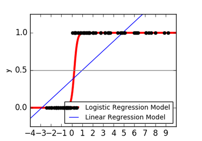
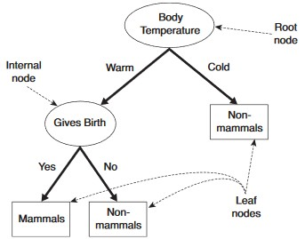
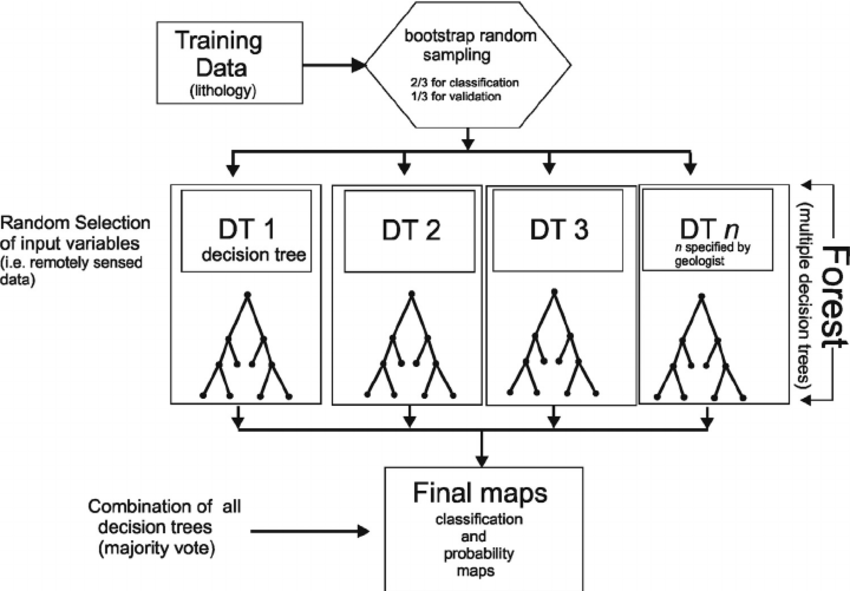

```{r classification, echo=FALSE}
## global chunk option ##
library('knitr')
knitr::opts_chunk$set(echo=TRUE, message=FALSE, warning=FALSE, fig.width=9, fig.height=5, fig.show='hold', results='markup', collapse=F) 
```

# Classification

## Introduction

The goal of classification prediction is to estimate binary outcome of TRUE or FALSE.  

### Application

### Types of Classification

#### Probability Outcome

- Logistic regression falls into this category  
- It predicts the probability of binary outcome  
- Researcher need to determine the cutoff threshold to derive binary outcome  
- Cutoff determines variuos  performance metrics, hence usefulness of the model  

#### Binary Outcome  

Here are the list of algorithm produce direct binary prediction:  

1.Decision Tree  
2.Conditional Forest  
3.Ensemble Learning  
4.Support Vector Machine (SVM)  
5.Neural Networks  
6.Tree Ensembles  
    - Random Forest  
    - Gradient Boosted Trees  
7.Deep Learning  

### Comparing Algorithm

## Library

**Summary of Libraries And Functions**  

|   | Package      | Function      | Purpose                                           |
|---|--------------|---------------|---------------------------------------------------|
| 1 | Base - R     | glm           | General linear model, use for logistic regression |
| 2 | ROCR         | prediction    | (logistic regression use only) create prediction object from score and label, simulate confusion table for multiple thresholds  |
|   |              | performance   | (logistic regression use only) create performane object from prediction object, and support plotting |
| 3 | rpart        | rpart         | Create a decision tree model  |
|   |              | plotcp        | Visualize decision tree model |
| 4 | rpart.plot   | prp           | |
| 5 | party        | ctree         | Create a conditional inference tree model  |
| 6 | randomForest | randomForest  | Create a random forest model               |
| 7 | e1071        | svm           | Create a SVM model                         |

**Load the R libraries**  

```{r}
library(ROCR)
library(rpart)
library(rpart.plot)
library(party)
library(randomForest)
library(e1071)
```


```{r, echo=FALSE}
eval.binclass = function(score = NULL, label = NULL, cutoff = NA) {
    actual = factor(as.logical(as.integer(as.character(label))), levels = c(TRUE, FALSE))
    if (is.na(cutoff))
        predicted = factor(as.logical(as.integer(as.character(score))), levels = c(TRUE, FALSE)) # binary
    else
        predicted = factor(as.logical(score > cutoff), levels = c(TRUE, FALSE)) # regression
    ct = table(actual, predicted, useNA = 'no', exclude = c(NA)) #confusion table
    tp = ct[1]
    fp = ct[2]
    fn = ct[3]
    tn = ct[4]
    accuracy = (ct[1] + ct[4]) / (sum(ct))
    recall = ct[1] / (ct[1] + ct[3])
    precision = ct[1] / (ct[1] + ct[2])
    fpr = ct[2] / (ct[2] + ct[4])
    specificity = ct[4] / (ct[2] + ct[4])
    tpr_fpr = recall / (1 - specificity)
    fscore = 2 * (precision * recall / (precision + recall))
    data.frame(cutoff = cutoff, accuracy = accuracy, recall = recall, precision = precision,
             specificity = specificity, fscore = fscore, fpr = fpr, tpr_fpr = tpr_fpr,
             tp = tp, fp = fp, fn = fn, tn = tn)
}
```

## Sample Dataset

This chapter will use a **Human Resource** dataset that contain 12,000 training records.  
The dataset will be splited into training set (70%), and test set (30%).  

```{r collapse=T, results='markup'}
### Load The Data
set.seed(1234)
raw = read.csv('./datasets/hr.csv')
raw$left = as.factor(raw$left)

### Split Data
train.rows = sample( 1:nrow(raw), 0.7 * nrow(raw) )
train = raw[train.rows,]
test  = raw[-train.rows,]
```

### The Variables

#### Dependent Variable

We want to predict who are the employees that are likely to leave the company.  

- **left**: employee had left the company (binary)

#### Independent Variables

Here are the variables that are relevant to predicting employees leaving.  

- **S**: Satisfied Employee (binary, obtained through survey)  
- **NP**: Number of Project Currently Handled  
- **LPE**: Last Project Evaluation  
- **ANH**:  Average Number of Monthly Hours  
- **TIC**: Time in company (in years)  
- **Newborn**: Had a new born in last 12 months  

```{r results = 'markup'}
str(train)
```

### Explore The Data

Check the **structure and samples**.  

```{r results = 'markup'}
summary(raw)
head(raw)
```

Check any **class bias** (skewness)

```{r results = 'markup', fig.height=2.5}
barplot(table(raw$left), ylab='left', xlab='1=Yes, 0=No')
```

Calculate the **Accuracy baseline** - that is, probability of True(1) or False(0). Use whichever is higher.  

```{r results = 'markup'}
prop.table( table(raw$left) )
```


## Logistic Regression

### The Concept

Logistic Regression is a actually a **classification** algorithm. It is used to predict: 

- Binary outcome (1=Yes/Sucess, 0=No/Failure), given a set of independent variables. 
- Multinomial outcome (more than two categories) - however, reference category for comparison must be specified, otehrwise, must run multiple regressions with different refence categories  

Logistic Regression as a **special case** of linear regression where:  

- The outcome variable is categorical   
- **Ln of odds** as dependent variable  

Linear regression cannot be used for classification because:  

- Binary data does not have a normal distribution, which is a condition for many types of regressions  
- Predicted values can go beyond 0 and 1, which violates the definition of probability  
- Probabilities are often not linear  

### Assumptions

Since logistic regression is related to linear combination of IVs, it share some common asssumptions regarding IVs and error terms:  

1. Dependent variable must be 1/0 type eg. 'sucess/failure', 'male/female', 'yes/no'. Must not be ordinal and continous  
2. Observations must be independent  
3. Like OLS, Linearity between logit with all independent variables  
4. Like OLS, NO multicollinearity - if found, create interaction term, or drop one of the IVs  
5. Like OLS, error terms are assumed uncorrelated  

Although **logit**  is a linear relation with independent variables, logistic regression (which use MLE) is **different from OLS** Linear Regression as below, due to the fact that DV is categorical and not continuuous:  

- Can handle categorical independent variables  
- Does not assume normality of DV and IVs: becauae $p$ follow Bernoulli distribution  
- Does not assume linearity between DV and IVs: because DV is categorical  
- Does not assume homoscedasticity  
- Does not assume normal errors  

### Equations

- The goal of logistic regression is to estimate $p$ (the probability of 'Success') for a **linear combination** of the independent variables  
- This is done by 'linking' the linear combination of independent variables to Bernoulli probability distribution (with domain from 0 to 1), to predict the probability of success  

- The **link function** is called **logit**, which is the natural log of odds ratio. It is a linear function against independent variables:  
$logit(p) = ln(odds) = ln\bigg(\frac{p}{1-p}\bigg) = \beta_0 + \beta_1 x_1 + ... + \beta_n x_n$  

- Derive **Odd ratio** by anti-log. It measures the 'strength' of IV in affecting the outcome, p:  
$odds = \frac{p}{1-p} = e^{\beta_0 + \beta_1 x_1 + ... + \beta_n x_n}$  

- $p$ can be further derived as below sigmoid function. $p$ is **non-linear** against independent varibales :  
$p = \frac{1}{1+e^{-(\beta_0 + \beta_1x_1 + ... +  \beta_nx_n)}}$  

- The logistic graph below shows P(Y=1) vs $\beta_0 + \beta_1 x_1 + ... + \beta_n x_n$. **Intuitively, larger coefficients and independence varibles values increases the chance of being classified as Y=1*8  

- Compare the graph below to understand why logistic regression is better than linear regression in binary classification. However, it is simplied to illustrate single independent variable as multiple variables cannot be represented in 2D graph  

$\quad$   

### High School Formula

Some of the high scholl maths are useful for calculating the logistic scores. Remember them by heart.  

- **What is log**  
$y = 10^a$  
$log(y) = a$  
$y = e^a$  
$ln(y) = a$  

- Ln is log **base e**  
$ln(a) = log_e(a)$  

- Basic **properties** of log  
$ln(1) = log(1) = 0$  
$ln(0) = log(0) = Inf$  

- Log of **division** becomes substration of log  
$ln\bigg(\frac{a}{b}\bigg) = ln(a) - ln(b)$ 
  
- Exponential of **summation** becomes multiplication of exponential   
$e^{a+b} = e^a * e^b$  

### Run The Code

#### Build The Model
> **`glm`** `(formula, family=gaussian(link=identity), data)`  
> $\quad$ `formula : example y ~ x1 + x2 + x3`  
> $\quad$ `family  : binomial, gaussian, poisson, quasi etc`  
> $\quad$ `link    : logit:default binomial, identity:default gaussian, log:default poisson`  

```{r collapse=T}
fit.logit = glm(left ~ ., family = binomial, data = train)

# alternative: specifying link function
# fit = glm(left ~ ., family = binomial (link=logit), data = train)
```

#### Prediction
> **`predict`** `(object, newdata=NULL, type=c('link','response','term')`  
> $\quad$ `object  : model object from lm, glm, randomForest etc`  
> $\quad$ `newdata : dataset to predict on, default use train data stored in model`  
> $\quad$ `type    : for probability output:'response`

Logistic regression always returns prediction with **probability**.  

**Prediction on Test Data**  
Specify **`newdata`** parameter to predict result for test data.  
```{r}
pred.logit.test = predict(fit.logit, newdata = test, type = 'response')
head(pred.logit.test)
```

**Prediction on Training Data**  
Omitting **`newdata`** parameter, prediction default to training data.  
```{r}
pred.logit.train = predict(fit.logit, type = 'response')
head(pred.logit.test)
```


## Decision Tree

### The Concept

- A decision tree is a machine learning algorithm that partitions the data into subsets  
- It is a form of tree structure, containing three types of **nodes**:  
    - **Root Node**: no incoming, zero or more outgoing  
    - **Internal/Branch Nodes**: one incoming and two or more outgoing   
    - **Terminal/Leaf Nodes**: at the bottom of the tree, no outgoing edge  
  $\quad$   
- The tree building process starts with a split at the root, and continues splitting through branches until no further splits can be made  (leaf node reached)  
- N number of splits will create N+1 leafs  
- It classify observations by starting at the root of the tree and moving through it until a leaf node.  

#### The Goal

- The goal of a decision tree is to encapsulate the training data in the **smallest possible tree**  
- The rationale for minimizing the tree size is the logical rule that the **simplest possible explanation for a set of phenomena is preferred** over other explanations  
- **Small trees produce decisions faster than large trees**, and they are much easier to look at and understand  
- There are various methods and techniques to control the depth, or prune, of the tree  

#### Advantages

- Popular among non-statistician, as the model is very **easy to interpret**  
- **None-parametric**, therefore does not require normality assumption  
- Support **many data types**: continuous, categorical, ordinal and binary variable  
- **Transformation is not required**  
- Useful for **detecting important variables, interactions and identifying outliers**  

### Tree Building

Construcing a good decision tree involves below three processes:  

a. **Splitting Criteria** for each level of the tree:  
    - Selecting the variable to split  
    - Choosing the value to split  
    - Condition to stop splitting  
b. **Pruning**  
c. **Tree Selection**  

After a good decision tree model is built, you are ready to use it for **prediction**.  

### Splitting Criteria

Splitting is the process of partitioning the data set into subsets, from root to leaf nodes.  

- Splits are formed on a particular **variable and in a particular location**  
- For each split, two determinations are made:  
    - **Splitting variable** - The predictor variable used for the split   
    - **Split point** - The **set of values** for the predictor variable (which are split between the left child node and the right child node)  
        
- The **goal** of splitting each node is to select a combination of **splitting variable** and **splitting point** that minimizes the error (or maximizes the purity).  Two algorithmns (with **impurity measure**) can be used to make this decision:  
    

The picture below illustrates spliting of simple tree with two variables, X and Y with 3 splits  
  


#### Information Gain (based on Entropy value)
        
$Entropy = \sum_{i=1}^c{-p_i * log_2(p_i)}$  
$\quad$ c = number of class (1 if only single splitting variable), p = the probability of class  
$Information Gain = Entropy(Parent Node) - Entropy (Child Node)$  

- Partition the data into subsets that contain instances with similar values (**homogenous**)  
- Perfectly classified (**completely homogeneous**), the entropy is zero  
- Maximum Entropy is 1 for (binary class)  
- Weights probability of class by **log(base=2)**  
- The parent node will select a variable that maximize information gain (smallest Child Entropy) as its child node  

#### Gini (Gini Index)
        
$Gini = 1 - \sum_{i=1}^c (p_i)^2$  
$\quad$ c = number of class (1 if only single splitting variable), p = the probability of class  

- Partition the data into subsets that contain instances with similar values (**homogenous**)  
- Perfectly classified, Gini index would be zero (pure)  
- Maximum Gini Index is 1  
- Split that has lowest Gini index value is chosen (most pure)  
- Weights probability of class by **square**  

#### Gini or Information Gain ?
        
- **Gini index calculation is faster** compared to Information gain becuase it doesn't use log computation  
- This could be a reason why gini is **the default method** in some machine learning packages  
- Studies have shown that choice of impurity measures has **little effect** on the performance of the decision tree. This is because they are **quite consistent with each other**, as shown below:  
  

#### Splitting **Stops When**

- All samples belongs to same class (**pure**)  
- Most samples belongs to same class. This is **generalization** of the above approach with some error threshold  
- There are **no more variabels with samples** to be partitioned  
- There is **no more samples** for the branch test attributes  
- Additionally, some program will implement **extra parameters** to control the size of the tree, eg. `rpart::rpart.control`  

### Pruning Tree

#### Pruning Benefits

A decision tree can expanded until the it perfectly fit the training data (error is zero). However, it will perform poorly in test data (test error will be large). Such model does not generalize well to the test data, also known as **overfitting**.  The solution is called **pruning**:  

- Prunning a tree has greater impact than choosing the impurity measure  
- The larger the tree (more nodes), the more complex the tree is, the more risk of overfitting  

The **reason** and **benefits** of smaller tree size are:  

- Lower branches may be strongly affected by **outliers**. Pruning enables you to find the next largest tree and minimize this concern  
- A simpler tree **often avoids over-fitting**  

#### Pruning Process

Pruning **reduces the size of the tree** using **bottom-up appraoch**:  

- Pruning removes leaf nodes under original branch  
- Pruning turns some branch nodes into leaf nodes (**bottom-up approach**)  

#### When To Prune

- **Pre-Pruning**  
    - Stop the algorithm before it becomes a fully grown tree  

- **Post-Pruning**  
    - Grow decision tree to its entirety
    - Trim the nodes from bottom-up fashion  
    - If generalization error improves after trimming, replace the sub-tree by a leaf noes

### Tree Selection

- The process of finding the **smallest tree that fits the data**  
- This is the tree that yields the **lowest cross-validated error**  


### Run The Code

#### Build The Model

> **`rpart`** `(formula, method=, na.action=na.rpart, model=FALSE, x=FALSE, y=FALSE, data=)`  
> $\quad$ `formula  : example y ~ x1 + x2 + x3`  
> $\quad$ `data     : training data`  
> $\quad$ `method   : splitting method - 'class' for classification`  
> $\quad$ `control  : (optional) parameter used for controlling tree growth`  
> $\quad$ `na.action: default action delete all observations with y is missing`  
> $\quad$ `model: keep a copy of model in the result`  
> $\quad$ `x    : keep a copy of x matrix in result`  
> $\quad$ `y    : keep a copy of dependent variable y in result`  

**`rpart.control`** specifies the paramters that limits the growth of tree:  

> `rpart.control(`  
> $\quad$ minsplit = 20,  minbucket = round(minsplit/3), cp = 0.01,`  
> $\quad$ `maxcompete = 4, maxsurrogate = 5, usesurrogate = 2,`  
> $\quad$ `xval = 10,surrogatestyle = 0, maxdepth = 30)`  

The default `rpart.control` parameters specifies below criteria to be met before splitting a node:  

- **minsplit**: minimum number of observations in node to be 20  
- **minbucket**: if splitted, both sides must have at least 20/3 observations  
- **cp**: if splitted, the overall relative Cost of the entire tree must reduce by cp*T (T is number of terminal nodes). Cost is calculated as sum of square errors.  Relative cost is compared to baseline (where there is no split, with baseline error is scaled to 1)  
  **Low cp value** relaxed the error reduction expectation, hence creates **larger tree**  
- **maxdept**: tree depth not more than 30 levels

```{r}
fit.dtree1 = rpart(left ~ ., method = "class", data=train, cp = 0.001, minbucket=10)
fit.dtree2 = rpart(left ~ ., method = "class", data=train)
```

#### Prediction
> **`predict`** `(object, newdata=NULL, type=c('response','class')`  
> $\quad$ `object  : model object from lm, glm, randomForest etc`  
> $\quad$ `newdata : dataset to predict on, default use train data stored in model`  
> $\quad$ `type    : default-'prob', which is probability output, 'class' - class output`  

**Probability Prediction**  

- Probability output is flexble so that researcher can tune the threshold and perform ROC analysis  
- Output probability as multiple columns, each column represent resutls for one class. (for binary prediction, it will be just two columns)  
```{r}
pred.dtree.train1 = predict(fit.dtree1, type='prob')  # default newdata is model train set
pred.dtree.test1  = predict(fit.dtree2, newdata=test) # default probability output
head(pred.dtree.train1)
```

**Class Prediction (threshold = 0.5)**  

- Threshold of 0.5 applied  
- Single column output  
```{r}
pred.dtree.train2 = predict(fit.dtree1, type = "class") # default newdata is model train set
pred.dtree.test2  = predict(fit.dtree2, type = "class", newdata=test)
head(pred.dtree.train2)
```

#### Confusion Table
Confusion table below proofs that type='class' is indeed prediction with threshold >0.5.  
```{r}
table(test$left, pred.dtree.test1[,2] > 0.5, dnn=c("Actual", "Predicted"))
table(test$left, pred.dtree.test2,           dnn=c("Actual", "Predicted"))
```

#### Visualize The Model

**Visualize with Text**
```{r}
fit.dtree1  
```

**Visualize with Graph**  

Use `rpart::prp` to plot rpart model (prp is shortform for 'plot rpart').  
Notice that the graph has the below characteristics:  

- Nodes at the same depth level addes up to 100% probability  
- Leafs nodes are formed at different depth levels  
- All leaf nodes adds up to 100% probability  

```{r}
prp(fit.dtree1, type = 2, extra = 104, fallen.leaves = TRUE, main="Decision Tree")
```

#### Cross Validation Analysis

Yes, `rpart` has built-in cross validation, calculated when a model is created !  

- Use `rpart::cptable` to find out the lowest value of cross validation error (column **`xerror`**), and its cross standard deviation (column **`xstd`**)  
- Use **`xerror + xstd`** as the cutting point for best tree size for optimization (pruning), see `plotcp` below  

`cptable` is stored in the model built with `rpart`.  

```{r, results='hold'}
printcp(fit.dtree1)
#fit.dtree$cptable  # alternative 
```

**Visualize** `cptable` with `rpart::plotcp`.  

- `size of tree` means the number of nodes in the tree, it is the number of splits + 1  
- Horizontal line is the valued at lowest `xerror` + its `xstd`  
- Optimum tree size for pruning is **below the horizontal line**, use this chart to determine the **optimum tree size, and its cp value**, prune with this cp value  

```{r}
plotcp(fit.dtree1)
```

#### Pruning Tree

- The decision tree was originally built with some constrains (rpart::control) to limits its tree size  
- The tree size **can be further reduced by pruning**, with the use the **cp** value in prunning command  
- Prune the tree size that yields lowest **xerror**, based on the **cp analysis** above  
- Pruning creates new, reduced nodes decision tree model  
- For this example, we purposely prune the tree to one size smaller, for the sake of demonstration  
- Bigger tree size (lower complexity parameter, cp) means higher accuracy of the model to training data, hence it always reduce the errors (`error` in $cptable). However, cross validation error (xerror) may go up and down as the tree size increases  
- To choose pruning cp value, first choose the tree size:  
    - From `cptable`, pruning cp value = sqrt(cpvalue for tree-size N * cpvalue for tree-size N-1)  
    - From `plotcp`, choose a tree size, pruning cp value = corresponding cpvalue at the y-axis  
    - Remember, **tree size = nsplit + 1**  

```{r}
fit.dtree.prune = prune(fit.dtree1, cp = 0.005)
printcp(fit.dtree.prune)
plotcp(fit.dtree.prune)
```

#### Prediction

We would like to compare the model performance:  
a. Original Model with training set  
b. Pruned Model with training set  
c. Pruned Model with test set  

Overall, we can see that the performance dropped slightly after prunning for datset.  

```{r, results='markup'}
# original model with training set
dtree.pred.train  = predict(fit.dtree1,  newdata=train, type="class")
eval.binclass(score=dtree.pred.train, label=train$left)[2:5]

# original model with test set
dtree.pred.test1 = predict(fit.dtree1,        newdata=test, type="class")
eval.binclass(score=dtree.pred.test1, label=test$left)[2:5]

# pruned model with training set
dtree.pred.train.pruned = predict(fit.dtree.prune, data=train, type="class")
eval.binclass(score=dtree.pred.train.pruned, label=train$left)[2:5]

# pruned model with test set
dtree.pred.test2 = predict(fit.dtree.prune, newdata=test, type="class")
eval.binclass(score=dtree.pred.test2, label=test$left)[2:5]
```


## Conditional Inference Tree

```{r, eval=FALSE, include=FALSE}
library(party)
fit.ctree <- ctree(left~., data=train)
plot(fit.ctree, main="Conditional Inference Tree")
ctree.pred <- predict(fit.ctree, test, type="response")
ctree.perf <- table(test$left, ctree.pred, dnn=c("Actual", "Predicted"))
ctree.perf
```

## Random Forest

### The Concept

Random forest is a type of Ensemble Method, which enjoy all the ensemble benefits.  
Random forest model contain large amount of decision trees as oppose to tranditional single decision tree.  

#### How Does It Work ?

- Divides training data into large amount random subsets, each subset will draw samples from training data using bagging method (with  replacement). Each subset will contain the same number of observations as training set  
- Create a decision tree for each subset, resulting multiple trees (henced called Forest)  
- Each tree uses different set of random variables for splitting (not all variables are being used in each tree)  
- When doing prediction, all tress will votes and majority wins  



#### The Beliefs

Random Forest provides much better accuracy compared to single decision tree. The major belief why this works are:  

a. Most of the trees can provide correct prediction for most part of the data  
b. The tree are making mistake at different place  

Hence, major votes for classification result expected to be closer to correct classification  

#### Advantages and Disadvantages

**Advantages**

- A single decision tree suffers from the phenomena of overfitting, as the signle tree model **memorize** the data  
- Randomforest uses bagging (with replacement) to 'artificially' creates different types of dataset, hence reducing the phenomena of **memorizing**  
- **Cross validation is not required**, since each subset are already being randomized  
- It is usually **more accurate** than single tree, but no **guarantee**  

**Disadvantage**

- Ensemble method such as random forest is not interpretable  

### Run The Code

#### Determine Class or Probability Outcome

**`randomForest`** can build both **class** and **probability** model, depending on the dependent variable:  

- If the depenedent variable is factor, it will build a model for class prediction  
- If the depenedent variable is number, it will build a model for probability prediction  

For 0/1 dependent variable, if not factorized, it is treated as number, and therefore for probability prediction.  
Here we convert all independent variable to factor for class prediction.  

> This step is different from rpart (single decision tree), as rpart does not require this step.  rpart can predict both class and probability by just specifying the type='class'  or type='response'  

```{r, eval=T}
train$left = as.factor(train$left)
test$left  = as.factor(test$left)
```

#### Build The Model

```{r, eval=T}
library(randomForest)
set.seed(1234)
fit.forest <- randomForest(left~., data=train)
```

#### Prediction
Prediction syntax is similar to rpart decision tree.  

> **`predict`** `(object, newdata=NULL, type=c('response','class')`  
> $\quad$ `object  : model object from lm, glm, randomForest etc`  
> $\quad$ `newdata : dataset to predict on, default use train data stored in model`  
> $\quad$ `type    : default-'prob', which is probability output, 'class' - class output`  

**Probability Prediction**  

- Probability output is flexble so that researcher can tune the threshold and perform ROC analysis  
- Output probability as multiple columns, each column represent resutls for one class. (for binary prediction, it will be just two columns)  
```{r}
pred.rf.train1 = predict(fit.forest, type='prob')  # default newdata is model train set
pred.rf.test1  = predict(fit.forest, type='prob', newdata=test)
head(pred.rf.train1)
```

**Class Prediction (threshold = 0.5)**  

- Threshold of 0.5 applied  
- Single column output  
```{r}
pred.rf.train2 = predict(fit.forest, type = 'class') # default newdata is model train set
pred.rf.test2  = predict(fit.forest, newdata=test)   # default type='class' as class output
head(pred.dtree.train2)
```

#### Confusion Table
Confusion table below proofs that type='class' is indeed prediction with threshold >0.5.  
```{r}
#forest.pred <- predict(fit.forest, newdata=test)
table(test$left, pred.rf.test1[,2] > 0.5, dnn=c("Actual", "Predicted"))
table(test$left, pred.rf.test2,           dnn=c("Actual", "Predicted"))
```

#### Analyize Vairable Importance

**What Variables Are Important ?**  

- `randomForest::importance` output matrix of all variable used in the randomForest and **their contribution** in term of decreasing GiniIndex (decreasing impurity and increasing purity)  
- The higher the value, means the variable is more important in **contributing to accuracy** of the model  

```{r}
forest.imp = importance(fit.forest)
forest.imp[order(forest.imp, decreasing=T),, drop=FALSE]  ## order descendingly
```

**Visualize The Importance**  

**`randomForest::varImpPlot`** comes with handy plotting utility to plot the variable importance data.  

```{r}
varImpPlot(fit.forest)
```


#### Frequent Used Variables

- Random forest models work by building a large collection of trees. As a result, we lose some of the interpretability that comes with CART in terms of seeing how predictions are made and which variables are important  
- However, one of the way to give us insight into which variables are important, other than the decrease of impurity above, we can calculate how frequent a variable is being used for decision making (splitting)  

**`randomForest::varUsed`** returns a vector of frequency of each variable used.  
However, it doesn't comes with the variable name, which can be obtained from **`$forest$xlevels`**.  

> **`randomForest::varUsed(x, by.tree=FALSE, count=TRUE)`**
> $\quad$ `x       : model object of randomForest`  
> $\quad$ `by.tree : FALSE, default display per variable appearance, and not per tree`  
> $\quad$ `count   : TRUE, default aggregate all varibales appearance into frequency, otherwise display individual appearance`  

```{r}
vu = varUsed(fit.forest, count = TRUE)
vusorted = sort(vu, decreasing = FALSE, index.return = TRUE)
dotchart(vusorted$x, names(fit.forest$forest$xlevels[vusorted$ix]))
```

## SVM

```{r,eval=F}
library(e1071)
set.seed(1234)

fit.svm <- svm(class~., data=train)
fit.svm

#By default, the svm() function sets gamma to 1 / (number of predictors) and cost to 1.

svm.pred <- predict(fit.svm, na.omit(test))
svm.perf <- table(na.omit(test)$class, svm.pred, dnn=c("Actual", "Predicted"))
svm.perf

set.seed(1234)
tuned <- tune.svm(left~., data=train, gamma=10^(-6:1), cost=10^(-10:10))
tuned

fit.svm <- svm(left~., data=train, gamma=.01, cost=1)
fit.svm
svm.pred <- predict(fit.svm, na.omit(test))
svm.perf <- table(na.omit(test)$class, svm.pred, dnn=c("Actual", "Predicted"))
svm.perf
```

### Run The Code

## Performance Measurement

There are many performance measurement used for binary classification.  Here are the rules of thumb which one to use:  

- **Recall**: If you don't mind getting some inaccurate result, as long as you get as much correct ones 
- **Precision**: If you demand rate of correctness and willing to reject some correct results  
- **F1 Score**: For a more balanced measurement, taking into consideraton both recall and precision  

### Confusion Matrix


#### Accuracy

- Accuracy answers the question: **From the total samples, how many had been correctly predicted by the model ?**  
- $Accuracy = \frac{TP+TN}{TP+TN+FP+FN}$
- This measurement is useful when the both **classes are balanced** (that is, the number of TP and TN cases are almost balanced)  
- In practice, it seems that the best accuracy is usually achieved when the cutpoint is **near the Probability(actual TRUE)**  
- Accuracy is completely usessless in highly skewed class.  For example, with a disease that only affects 1 in a million people a completely bogus screening test that always reports “negative” will be 99.9999% accurate  

#### Recall

- Recall answers the question: **Out of all actual positive samples, how many were correctly predicted by classifiers ?**  
- $Recall = \frac{TP}{TP+FN}$

#### Precision

- Precison answers the question:  **Out of all the samples classifier predicted as positive, what fraction were correct ?**  
- $Precision = \frac{TP}{TP+FP}$

#### F1 Score

- F1 score is the **harmonic mean of Precision and Recall**. Intuitively, F1 Score is the **weighted average of Precision and Recall**. It takes into account all three measures: TP, FP and FN  
- $Precision = 2*\frac{Recall * Precision}{Recall + Precision}$  
- F1 is usually more useful than accuracy, especially if you have an unbalanced class distribution  
  
### Performance related to Logistic Regression

#### Area Under ROC (AUROC)

- ROC curve is basically a graph of **TPR vs FPR** (some refer to as Recall vs (1-Sensitivity), plotted for **different thresholds**  
- Comparing two different models, the model with **higher AUROC is considered to have higher overall Accuracy**  
- AUROC (Area Under ROC) measures :  
    - AUC of **0.5**: means the model is as good as tossing a coin, worthless  
    - AUC of **1.0**: means for all cutoff points, TPR=1 and FPR=0. Intuitively it means, all samples had been correctly classified into TP (TPR=1) and TN(FPR=0), and there is no FP and FN. Ultiamtely it means Accuracy is 100%  
    
    
  
  
#### Cutoff Threshold Impact

Cutoff threshold **direclty influence** the value of TP, FP, TN, FN.  
If **cutoff threshold is lowered** (lower probability to classify as Postive), the results are:  

- **More linient** and hence **more samples will be classified as Positive**  
- More predicted Positives means more TP and FP, hence **TPR and FPR increases**  
- However, **TPR and FPR increases at different rate**:  
    - If TPR increases faster than FPR -> this is **good**, as the lowered threshold generated more TP than FP  
    - If FPR increases faster then TPR -> this is **not good**, as the lowered threhsold generated more FP than TP  
- The cutoff with highest TPR/FPR value is the optimal  means optimum point whereby It is possible to discover the optimum cutoff by finding the cutoff with highest TPR/FPR

Different threshold produces different performance metrics (Accuracy, Recall, Precision and Specificity and F1-score). As an example, picture below shows how threshold influences the ROC curve.  

  

The only way to estimate the **optimum threshold** for each of the performance measurement will be to measure them for a **wide range of threshold**.  

#### Cutoff Visualization

Selecting a cutoff threshold depends on the objectives of the researcher. To help understanding the how cutoff changes the performance metircs, try **visualize** them in below graph:  

1.Threshold vs Accuracy  
2.Threshold vs Recall (TPR)  
3.Threshold vs TPR/FPR  
4.Threshold vs Precision  
5.Threshold vs F1 Score  
6.ROC Curve (TPR vs FPR)  


### Model Evaluation

#### Compare With Baseline

In an highly unbalanced dataset (eg. patients that is diagnosed with cancer skewed towards negative).  Hence, it is essential to make a **lazy baseline comparison** with simply classifying every records with negative (cutoff at 1) or positive (cutoff at 0).  

Put in mind of the dataset used for comparison:  

- Use data from training set as model baseline, when concerning training performance  
- Use dta from test set as model baseline, when concerning test performance  

**Model Accuracy is not better than 'lazy' baseline !**  

- In highly bias class, in term of accuracy, the model usually unable to outperform the baseline by good marign  
- Hence **accuracy** is not a good measurement in such case    
- Model is still useful if the research objective is towards other measurement usch as **recall, precision**  
- Adjust the threshold to achieve optimum better objectives  

#### Combination of Variables

Model AIC to measure the usefullness. It is like R-square in linear regression.  Use it to compare model with different combinations of variables. 

Since logistic regression is a actual **linear regression of ln(odds)**, **multicolinearity** rule apply.  

### Run The Code

#### General Function

This is a custom general function to evaluate all key metrics for Classification. 

> **`eval.bincalss ( score=NULL, label=NULL, cutoff=NULL)`**  
> `score: predicted value, either probability or binary`  
> `label: actual value`  
> `cutoff:  threshold (0-1) if score is probability`  

```{r}
eval.binclass = function(score = NULL, label = NULL, cutoff = NA) {
    actual = factor(as.logical(as.integer(as.character(label))), levels = c(TRUE, FALSE))
    if (is.na(cutoff))
        predicted = factor(as.logical(as.integer(as.character(score))), levels = c(TRUE, FALSE)) # binary
    else
        predicted = factor(as.logical(score > cutoff), levels = c(TRUE, FALSE)) # regression
    ct = table(actual, predicted, useNA = 'no', exclude = c(NA)) #confusion table
    tp = ct[1]
    fp = ct[2]
    fn = ct[3]
    tn = ct[4]
    accuracy = (ct[1] + ct[4]) / (sum(ct))
    recall = ct[1] / (ct[1] + ct[3])
    precision = ct[1] / (ct[1] + ct[2])
    fpr = ct[2] / (ct[2] + ct[4])
    specificity = ct[4] / (ct[2] + ct[4])
    tpr_fpr = recall / (1 - specificity)
    fscore = 2 * (precision * recall / (precision + recall))
    data.frame(cutoff = cutoff, accuracy = accuracy, recall = recall, precision = precision,
             specificity = specificity, fscore = fscore, fpr = fpr, tpr_fpr = tpr_fpr,
             tp = tp, fp = fp, fn = fn, tn = tn)
}
```

#### ROCR::Construct the Performance Metric

`ROCR::prediction`is the main function to crate prediction object that contains key data such as thresholds, TP, FP, TN, FP. With these data points, we can plot and calculate multiple performacne and visualization.  

It takes only two inputs:  
1. **Score** (probability of being POSITIVE)  
2. **Label** (actual POSITVE)  

```{r}
rocr.pred = prediction(pred.logit.test, test$left)

rocr.metrics = data.frame(
    cutoff   = rocr.pred@cutoffs[[1]],
    accuracy = (rocr.pred@tp[[1]] + rocr.pred@tn[[1]]) / (rocr.pred@tp[[1]] + rocr.pred@tn[[1]] + rocr.pred@fp[[1]] + rocr.pred@fn[[1]]),
    tpr = rocr.pred@tp[[1]] / (rocr.pred@tp[[1]] + rocr.pred@fn[[1]]),
    fpr = rocr.pred@fp[[1]] / (rocr.pred@fp[[1]] + rocr.pred@tn[[1]]),
    ppv = rocr.pred@tp[[1]] / (rocr.pred@tp[[1]] + rocr.pred@fp[[1]])
    )
rocr.metrics$fscore = 2 * (rocr.metrics$tpr * rocr.metrics$ppv) / (rocr.metrics$tpr + rocr.metrics$ppv)
rocr.metrics$tpr_fpr = rocr.metrics$tpr / rocr.metrics$fpr
```

####ROCR::List The Performance Table

The code below discover the **optimum threshold** for few metrices.  Threhold for the highest estiamtes is summarized.   

```{r collapse=T,fig.width=9, fig.height=9}
## discovery the optimal threshold for various metrics
rocr.best = rbind(
  best.accuracy = c(max = max(rocr.metrics$accuracy, na.rm = TRUE), cutoff = rocr.metrics$cutoff[which.max(rocr.metrics$accuracy)]),
  best.ppv = c(max = max(rocr.metrics$ppv, na.rm = TRUE), cutoff = rocr.metrics$cutoff[which.max(rocr.metrics$ppv)]),
  best.recall = c(max = max(rocr.metrics$tpr, na.rm = TRUE), cutoff = rocr.metrics$cutoff[which.max(rocr.metrics$tpr)]),
  best.fscore = c(max = max(rocr.metrics$fscore, na.rm = TRUE), cutoff = rocr.metrics$cutoff[which.max(rocr.metrics$fscore)]),
  best.tpr_fpr = c(max = max(rocr.metrics$tpr_fpr, na.rm = TRUE), cutoff = rocr.metrics$cutoff[which.max(rocr.metrics$tpr_fpr)])
)

kable(rocr.best)
```

####ROCR::Visualize The Data and Performance

**Plot TP, Tn, FP and FN**  
These data are available in the `ROCR::prediction` object.  
```{r}
plot (rocr.pred@cutoffs[[1]], rocr.pred@tp[[1]],xlim=c(0,1), ylim=c(0,12000), col='green')
lines(rocr.pred@cutoffs[[1]], rocr.pred@tn[[1]], xlim = c(0, 1), ylim = c(0, 12000),col='red')
lines(rocr.pred@cutoffs[[1]], rocr.pred@fp[[1]], xlim = c(0, 1), ylim = c(0, 12000), col='blue')
lines(rocr.pred@cutoffs[[1]], rocr.pred@fn[[1]], xlim = c(0, 1), ylim = c(0, 12000),col='orange')
legend("top",
       inset = .05, cex = 1, title = "Legend",
       c("TP", "TN", "FP","FN"), horiz = TRUE,
       lty = c(1, 1), lwd = c(2, 2),
       col = c("green", "red", "blue",'orange'), bg = "grey96")
```

**Plot ROC Curve**  
We can build a **`ROCR::performance` object, and plot it** !  
AUC is calculated with `ROCR::performance` as well.  
```{r collapse=T}
rocr.perf = performance(rocr.pred, measure = "tpr", x.measure = "fpr")
rocr.auc = as.numeric(performance(rocr.pred, "auc")@y.values)
plot(rocr.perf,
    lwd = 3, colorize = TRUE,
    print.cutoffs.at = seq(0, 1, by = 0.1),
    text.adj = c(-0.2, 1.7),
    main = 'ROC Curve')
mtext(paste('auc : ', round(rocr.auc, 5)))
abline(0, 1, col = "red", lty = 2)
```

**Plot Accuracy**
```{r}
rocr.perf = performance(rocr.pred, measure = "acc")
best.x = rocr.perf@x.values[[1]][which.max(rocr.perf@y.values[[1]])]
best.y = max(rocr.perf@y.values[[1]])
plot(rocr.perf, main = 'Accuracy vs Cutoff', xlim = c(0, 1), ylim = c(0, 1))
abline(v = best.x, col = 'red', lty = 2)
abline(h = best.y, col = 'red', lty = 2)
text(best.x + 0.1, 0.05, round(best.x, 5), col = "red")
text(0.05, best.y + 0.05, round(best.y, 5), col = "red")
```

**Plot Precesion**
```{r}
rocr.perf = performance(rocr.pred, measure = "prec")
best.x = rocr.perf@x.values[[1]][which.max(rocr.perf@y.values[[1]])]
best.y = max(rocr.perf@y.values[[1]][is.finite(rocr.perf@y.values[[1]])])
plot(rocr.perf, main = 'Precision vs Cutoff', xlim = c(0, 1), ylim = c(0, 1))
abline(v = best.x, col = 'red', lty = 2)
abline(h = best.y, col = 'red', lty = 2)
text(best.x + 0.1, 0.05, round(best.x, 5), col = "red")
text(0.05, best.y + 0.05, round(best.y, 5), col = "red")
```

**Plot Multiple Metrices Into One Graph**  
As we can see, `ROCR::performance` is good to build measure and plot for single y-axis measurement.  It unfortunately **does not support** plotting multiple y-axis into one graph.  Threfore, we shall build the plot using metrices table constructed earlier (variable `rocr.metrics`).  
```{r}
### set initial margin of the plot
par(mar = c(5, 5, 4, 6))

## plot graph on left hand side scale
plot(rocr.metrics$cutoff, rocr.metrics$tpr, axes = FALSE,, ylab = '', xlab = '', col = 'green', main = 'Multiple Performances vs Cutoff', ylim = c(0, 1))
lines(rocr.metrics$cutoff, rocr.metrics$fpr, col = 'red', ylim = c(0, 1))
axis(1, pretty(range(rocr.metrics$cutoff[is.finite(rocr.metrics$cutoff)]), 10))
axis(2, ylim = c(0, 1), col = "black", las = 1) ## las=1 makes horizontal labels
lines(rocr.metrics$fpr, rocr.metrics$tpr, lwd = 3, col = 'black', ylim = c(0, 1), xlim = c(0, 1))
lines(rocr.metrics$cutoff, rocr.metrics$accuracy, col = 'purple', ylim = c(0, 1), xlim = c(0, 1))
lines(rocr.metrics$cutoff, rocr.metrics$ppv, col = 'cyan', ylim = c(0, 1), xlim = c(0, 1))
lines(rocr.metrics$cutoff, rocr.metrics$fscore, col = 'pink', ylim = c(0, 1), xlim = c(0, 1))
abline(0, 1, lty = 2, col = 'black')

## plot graph on right hand side scale
par(new = TRUE)
plot(rocr.metrics$cutoff, rocr.metrics$tpr_fpr, axes = FALSE, ylab = '', xlab = '', col = 'orange')
axis(4, col = "orange", las = 1) ## las=1 makes horizontal labels
best = rocr.metrics$cutoff[which.max(rocr.metrics$tpr_fpr[is.finite(rocr.metrics$tpr_fpr)])]
abline(v = best, col = 'red', lty = 2)
text(best + 0.075, 0.05, round(best, 5), col = "red")

## axis labels
mtext("cutoff", side = 1, col = "black", line = 2.5)
mtext("tpr, fpr, accuracy, precision, f1-scaore", side = 2, col = "black", line = 2.5)
mtext("tpr/fpr", side = 4, col = "black", line = 2.5)

## legend
legend("topright",
       inset = .05, cex = 1, title = "Legend",
       c("TPR", "FPR", "TPR/FPR", "ROC", "Accuracy", "Precision", "F1-Score"),
       horiz = FALSE, lty = c(1, 1), lwd = c(2, 2),
       col = c("green", "red", "orange", 'black', 'purple', 'cyan', 'pink'), bg = "grey96")
```

