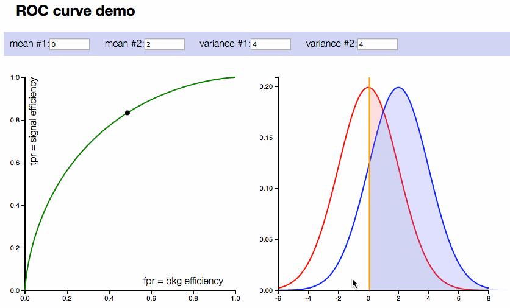

```{r classification, echo=FALSE}
## global chunk option ##
library('knitr')
knitr::opts_chunk$set(echo=TRUE, message=FALSE, warning=FALSE, fig.width=9, fig.height=5, fig.show='hold') 
```

# Classification

## Introduction

## Application

## Comparing Algorithm


## Performance Measurement

There are many performance measurement used for binary classification.  Here are the rules of thumb which one to use:  

- **Recall**: If you don't mind getting some inaccurate result, as long as you get as much correct ones 
- **Precision**: If you demand rate of correctness and willing to reject some correct results  
- **F1 Score**: For a more balanced measurement, taking into consideraton both recall and precision  

### Confusion Matrix


#### Accuracy

- Accuracy answers the question: **From the total samples, how many had been correctly predicted by the model ?**  
- $Accuracy = \frac{TP+TN}{TP+TN+FP+FN}$
- This measurement is useful when the both **classes are balanced** (that is, the number of TP and TN cases are almost balanced)  
- In practice, it seems that the best accuracy is usually achieved when the cutpoint is **near the Probability(actual TRUE)**  
- Accuracy is completely usessless in highly skewed class.  For example, with a disease that only affects 1 in a million people a completely bogus screening test that always reports “negative” will be 99.9999% accurate  

#### Recall

- Recall answers the question: **Out of all actual positive samples, how many were correctly predicted by classifiers ?**  
- $Recall = \frac{TP}{TP+FN}$

#### Precision

- Precison answers the question:  **Out of all the samples classifier predicted as positive, what fraction were correct ?**  
- $Precision = \frac{TP}{TP+FP}$

#### F1 Score

- F1 score is the **harmonic mean of Precision and Recall**. Intuitively, F1 Score is the **weighted average of Precision and Recall**. It takes into account all three measures: TP, FP and FN  
- $Precision = 2*\frac{Recall * Precision}{Recall + Precision}$  
- F1 is usually more useful than accuracy, especially if you have an unbalanced class distribution  
  
#### Area Under ROC (AUROC)

- ROC curve is basically a graph of **TPR vs FPR** (some refer to as Recall vs (1-Sensitivity), plotted for **different thresholds**  
- Comparing two different models, the model with **higher AUROC is considered to have higher overall Accuracy**  
- AUROC (Area Under ROC) measures :  
    - AUC of **0.5**: means the model is as good as tossing a coin, worthless  
    - AUC of **1.0**: means for all cutoff points, TPR=1 and FPR=0. Intuitively it means, all samples had been correctly classified into TP (TPR=1) and TN(FPR=0), and there is no FP and FN. Ultiamtely it means Accuracy is 100%  
    
    
  
  
### Cutoff Threshold Optimization

#### Understanding Cutoff Impacts

Cutoff threshold **direclty influence** the value of TP, FP, TN, FN.  
If **cutoff threshold is lowered** (lower probability to classify as Postive), the results are:  

- **More linient** and hence **more samples will be classified as Positive**  
- More predicted Positives means more TP and FP, hence **TPR and FPR increases**  
- However, **TPR and FPR increases at different rate**:  
    - If TPR increases faster than FPR -> this is **good**, as the lowered threshold generated more TP than FP  
    - If FPR increases faster then TPR -> this is **not good**, as the lowered threhsold generated more FP than TP  
- The cutoff with highest TPR/FPR value is the optimal  means optimum point whereby It is possible to discover the optimum cutoff by finding the cutoff with highest TPR/FPR

Different threshold produces different performance metrics (Accuracy, Recall, Precision and Specificity and F1-score). As an example, picture below shows how threshold influences the ROC curve.  

  

The only way to estimate the **optimum threshold** for each of the performance measurement will be to measure them for a **wide range of threshold**.  

#### Cutoff Impact Visualization

Selecting a cutoff threshold depends on the objectives of the researcher. To help understanding the how cutoff changes the performance metircs, try **visualize** them in below graph:  

1.Threshold vs Accuracy  
2.Threshold vs Recall (TPR)  
3.Threshold vs TPR/FPR  
4.Threshold vs Precision  
5.Threshold vs F1 Score  
6.ROC Curve (TPR vs FPR)  


### Model Evaluation

#### Compare With Baseline

In an highly unbalanced dataset (eg. patients that is diagnosed with cancer skewed towards negative).  Hence, it is essential to make a **lazy baseline comparison** with simply classifying every records with negative (cutoff at 1) or positive (cutoff at 0).  

Put in mind of the dataset used for comparison:  

- Use data from training set as model baseline, when concerning training performance  
- Use dta from test set as model baseline, when concerning test performance  

**Model Accuracy is not better than 'lazy' baseline !**  

- In highly bias class, in term of accuracy, the model usually unable to outperform the baseline by good marign  
- Hence **accuracy** is not a good measurement in such case    
- Model is still useful if the research objective is towards other measurement usch as **recall, precision**  
- Adjust the threshold to achieve optimum better objectives  

#### Combination of Variables

Model AIC to measure the usefullness. It is like R-square in linear regression.  Use it to compare model with different combinations of variables. 

Since logistic regression is a actual **linear regression of ln(odds)**, **multicolinearity** rule apply.  

### Run The Code

#### Library

ROCR is a great and fast library for measuring calssification performance. I

```{r}
library(ROCR)
```

#### Import Data and Train The Model

```{r collapse=T}
### Load The Data
train = read.csv('./datasets/hr.train.csv')
test = read.csv('./datasets/hr.test.csv')
str(train.data)

## Trian The Model Using Logistic Regression
fit = glm(left ~ ., family = binomial, data = train)
pred = predict(fit, type = 'response', newdata = test)
```

#### Construct the Performance Metric

`ROCR::prediction`is the main function to crate prediction object that contains key data such as thresholds, TP, FP, TN, FP. With these data points, we can plot and calculate multiple performacne and visualization.  

It takes only two inputs:  
1. **Score** (probability of being POSITIVE)  
2. **Label** (actual POSITVE)  

```{r}
rocr.pred = prediction(pred, test$left)

rocr.metrics = data.frame(
    cutoff = rocr.pred@cutoffs[[1]],
    accuracy = (rocr.pred@tp[[1]] + rocr.pred@tn[[1]]) / (rocr.pred@tp[[1]] + rocr.pred@tn[[1]] + rocr.pred@fp[[1]] + rocr.pred@fn[[1]]),
    tpr = rocr.pred@tp[[1]] / (rocr.pred@tp[[1]] + rocr.pred@fn[[1]]),
    fpr = rocr.pred@fp[[1]] / (rocr.pred@fp[[1]] + rocr.pred@tn[[1]]),
    ppv = rocr.pred@tp[[1]] / (rocr.pred@tp[[1]] + rocr.pred@fp[[1]])
    )
rocr.metrics$fscore = 2 * (rocr.metrics$tpr * rocr.metrics$ppv) / (rocr.metrics$tpr + rocr.metrics$ppv)
rocr.metrics$tpr_fpr = rocr.metrics$tpr / rocr.metrics$fpr
```

####List The Performance Table

The code below discover the **optimum threshold** for few metrices.  Threhold for the highest estiamtes is summarized.   

```{r collapse=T,fig.width=9, fig.height=9}
## discovery the optimal threshold for various metrics
rocr.best = rbind(
  best.accuracy = c(max = max(rocr.metrics$accuracy, na.rm = TRUE), cutoff = rocr.metrics$cutoff[which.max(rocr.metrics$accuracy)]),
  best.ppv = c(max = max(rocr.metrics$ppv, na.rm = TRUE), cutoff = rocr.metrics$cutoff[which.max(rocr.metrics$ppv)]),
  best.recall = c(max = max(rocr.metrics$tpr, na.rm = TRUE), cutoff = rocr.metrics$cutoff[which.max(rocr.metrics$tpr)]),
  best.fscore = c(max = max(rocr.metrics$fscore, na.rm = TRUE), cutoff = rocr.metrics$cutoff[which.max(rocr.metrics$fscore)]),
  best.tpr_fpr = c(max = max(rocr.metrics$tpr_fpr, na.rm = TRUE), cutoff = rocr.metrics$cutoff[which.max(rocr.metrics$tpr_fpr)])
)

kable(rocr.best)
```

####Visualize The Data and Performance

**Plot TP, Tn, FP and FN**  
These data are available in the `ROCR::prediction` object.  
```{r}
plot (rocr.pred@cutoffs[[1]], rocr.pred@tp[[1]],xlim=c(0,1), ylim=c(0,12000), col='green')
lines(rocr.pred@cutoffs[[1]], rocr.pred@tn[[1]], xlim = c(0, 1), ylim = c(0, 12000),col='red')
lines(rocr.pred@cutoffs[[1]], rocr.pred@fp[[1]], xlim = c(0, 1), ylim = c(0, 12000), col='blue')
lines(rocr.pred@cutoffs[[1]], rocr.pred@fn[[1]], xlim = c(0, 1), ylim = c(0, 12000),col='orange')
legend("top",
       inset = .05, cex = 1, title = "Legend",
       c("TP", "TN", "FP","FN"), horiz = TRUE,
       lty = c(1, 1), lwd = c(2, 2),
       col = c("green", "red", "blue",'orange'), bg = "grey96")
```

**Plot ROC Curve**  
We can build a **`ROCR::performance` object, and plot it** !  AUC is calculated with `ROCR::performance` as well.  
```{r collapse=T}
rocr.perf = performance(rocr.pred, measure = "tpr", x.measure = "fpr")
rocr.auc = as.numeric(performance(rocr.pred, "auc")@y.values)
plot(rocr.perf,
    lwd = 3, colorize = TRUE,
    print.cutoffs.at = seq(0, 1, by = 0.1),
    text.adj = c(-0.2, 1.7),
    main = 'ROC Curve'
    )
mtext(paste('auc : ', round(rocr.auc, 5)))
abline(0, 1, col = "red", lty = 2)
```

**Plot Accuracy**
```{r}
rocr.perf = performance(rocr.pred, measure = "acc")
best.x = rocr.perf@x.values[[1]][which.max(rocr.perf@y.values[[1]])]
best.y = max(rocr.perf@y.values[[1]])
plot(rocr.perf, main = 'Accuracy vs Cutoff', xlim = c(0, 1), ylim = c(0, 1))
abline(v = best.x, col = 'red', lty = 2)
abline(h = best.y, col = 'red', lty = 2)
text(best.x + 0.1, 0.05, round(best.x, 5), col = "red")
text(0.05, best.y + 0.05, round(best.y, 5), col = "red")
```

**Plot Precesion**
```{r}
rocr.perf = performance(rocr.pred, measure = "prec")
best.x = rocr.perf@x.values[[1]][which.max(rocr.perf@y.values[[1]])]
best.y = max(rocr.perf@y.values[[1]][is.finite(rocr.perf@y.values[[1]])])
plot(rocr.perf, main = 'Precision vs Cutoff', xlim = c(0, 1), ylim = c(0, 1))
abline(v = best.x, col = 'red', lty = 2)
abline(h = best.y, col = 'red', lty = 2)
text(best.x + 0.1, 0.05, round(best.x, 5), col = "red")
text(0.05, best.y + 0.05, round(best.y, 5), col = "red")
```

**Plot Multiple Metrices Into One Graph**  
As we can see, `ROCR::performance` is good to build measure and build plot for single y-axis measurement.  It unfortunately **does not support** polotting multiple y-axis into one graph.  Threfore, we shall build the plot using metrices table constructed earlier (variable `rocr.metrics`).  
```{r}
### set initial margin of the plot
par(mar = c(5, 5, 4, 6))

## plot graph on left hand side scale
plot(rocr.metrics$cutoff, rocr.metrics$tpr, axes = FALSE,, ylab = '', xlab = '', col = 'green', main = 'Multiple Performances vs Cutoff', ylim = c(0, 1))
lines(rocr.metrics$cutoff, rocr.metrics$fpr, col = 'red', ylim = c(0, 1))
axis(1, pretty(range(rocr.metrics$cutoff[is.finite(rocr.metrics$cutoff)]), 10))
axis(2, ylim = c(0, 1), col = "black", las = 1) ## las=1 makes horizontal labels
lines(rocr.metrics$fpr, rocr.metrics$tpr, lwd = 3, col = 'black', ylim = c(0, 1), xlim = c(0, 1))
lines(rocr.metrics$cutoff, rocr.metrics$accuracy, col = 'purple', ylim = c(0, 1), xlim = c(0, 1))
lines(rocr.metrics$cutoff, rocr.metrics$ppv, col = 'cyan', ylim = c(0, 1), xlim = c(0, 1))
lines(rocr.metrics$cutoff, rocr.metrics$fscore, col = 'pink', ylim = c(0, 1), xlim = c(0, 1))
abline(0, 1, lty = 2, col = 'black')

## plot graph on right hand side scale
par(new = TRUE)
plot(rocr.metrics$cutoff, rocr.metrics$tpr_fpr, axes = FALSE, ylab = '', xlab = '', col = 'orange')
axis(4, col = "orange", las = 1) ## las=1 makes horizontal labels
best = rocr.metrics$cutoff[which.max(rocr.metrics$tpr_fpr[is.finite(rocr.metrics$tpr_fpr)])]
abline(v = best, col = 'red', lty = 2)
text(best + 0.075, 0.05, round(best, 5), col = "red")

## axis labels
mtext("cutoff", side = 1, col = "black", line = 2.5)
mtext("tpr, fpr, accuracy, precision, f1-scaore", side = 2, col = "black", line = 2.5)
mtext("tpr/fpr", side = 4, col = "black", line = 2.5)

## legend
legend("topright",
       inset = .05, cex = 1, title = "Legend",
       c("TPR", "FPR", "TPR/FPR", "ROC", "Accuracy", "Precision", "F1-Score"),
       horiz = FALSE, lty = c(1, 1), lwd = c(2, 2),
       col = c("green", "red", "orange", 'black', 'purple', 'cyan', 'pink'), bg = "grey96")
```


## Logistic Regression

### The Concept

Logistic Regression is a actually a **classification** algorithm. It is used to predict: 

- Binary outcome (1=Yes/Sucess, 0=No/Failure), given a set of independent variables. 
- Multinomial outcome (more than two categories) - however, reference category for comparison must be specified, otehrwise, must run multiple regressions with different refence categories  

Logistic Regression as a **special case** of linear regression where:  

- The outcome variable is categorical   
- **Ln of odds** as dependent variable  

Linear regression cannot be used for classification because:  

- Binary data does not have a normal distribution, which is a condition for many types of regressions  
- Predicted values can go beyond 0 and 1, which violates the definition of probability  
- Probabilities are often not linear  

### Assumptions

Since logistic regression is related to linear combination of IVs, it share some common asssumptions regarding IVs and error terms:  

1. Dependent variable must be 1/0 type eg. 'sucess/failure', 'male/female', 'yes/no'. Must not be ordinal and continous  
2. Observations must be independent  
3. Like OLS, Linearity between logit with all independent variables  
4. Like OLS, NO multicollinearity - if found, create interaction term, or drop one of the IVs  
5. Like OLS, error terms are assumed uncorrelated  

Although **logit**  is a linear relation with independent variables, logistic regression (which use MLE) is **different from OLS** Linear Regression as below, due to the fact that DV is categorical and not continuuous:  

- Can handle categorical independent variables  
- Does not assume normality of DV and IVs: becauae $p$ follow Bernoulli distribution  
- Does not assume linearity between DV and IVs: because DV is categorical  
- Does not assume homoscedasticity  
- Does not assume normal errors  

### Equations

- The goal of logistic regression is to estimate $p$ (the probability of 'Success') for a **linear combination** of the independent variables  
- This is done by 'linking' the linear combination of independent variables to Bernoulli probability distribution (with domain from 0 to 1), to predict the probability of success  

- The **link function** is called **logit**, which is the natural log of odds ratio. It is a linear function against independent variables:  
$logit(p) = ln(odds) = ln\bigg(\frac{p}{1-p}\bigg) = \beta_0 + \beta_1 x_1 + ... + \beta_n x_n$  

- Derive **Odd ratio** by anti-log. It measures the 'strength' of IV in affecting the outcome, p:  
$odds = \frac{p}{1-p} = e^{\beta_0 + \beta_1 x_1 + ... + \beta_n x_n}$  

- $p$ can be further derived as below sigmoid function. $p$ is **non-linear** against independent varibales :  
$p = \frac{1}{1+e^{-\beta_0 + \beta_1x_1 + ... +  \beta_nx_n}}$  

- The logistic graph below shows P(Y=1) vs $\beta_0 + \beta_1 x_1 + ... + \beta_n x_n$. **Intuitively, larger coefficients and independence varibles values increases the chance of being classified as Y=1*8  

- Compare the graph below to understand why logistic regression is better than linear regression in binary classification  

$\quad$   

#### High School Log Formula

Some of the high scholl maths are useful for calculating the logistic scores. Remember them by heart.  

- **What is ls log**  
$y = 10^a$  
$log(y) = a$  

$y = e^a$  
$ln(y) = a$  

- Ln is log **base e**  
$ln(a) = log_e(a)$  

- Basic **properties** of log  
$ln(1) = log(1) = 0$  
$ln(0) = log(0) = Inf$  

- Log of **division** becomes substration of log  
$ln\bigg(\frac{a}{b}\bigg) = ln(a) - ln(b)$ 
  
- Exponential of **summation** becomes multiplication of exponential   
$e^{a+b} = e^a * e^b$  

### Sample Data

### Run The Code

> **`glm`** `(formula, family=gaussian(link=identity), data)`  
> $\quad$ `formula : example y ~ x1 + x2 + x3`  
> $\quad$ `family  : binomial, gaussian, poisson, quasi etc  
> $\quad$ `link    : logit-default for binomial(), identity-default for gaussian, log-default for poisson`  

#### Binomial


**Binomial Example**

```
glm (y ~ x1 + x2 + x3 , family=binomial(logit), data=my.df)
```


