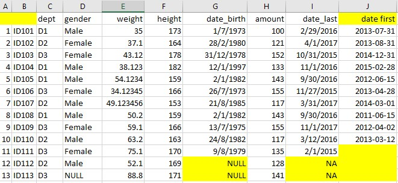

--- 
title: "Business and Technical Analytics with R"
author: "Yong Keh Soon"
date: "`r Sys.Date()`"
site: bookdown::bookdown_site
output: bookdown::html_book
documentclass: book
bibliography: [book.bib, packages.bib]
biblio-style: apalike
link-citations: yes
github-repo: yongks/biz_tech_analytics_r
description: "This is a study and reference notes to solving various business analytics problems using R."
---

# Preface {-}

<!--chapter:end:index.Rmd-->

# R Fundamentals {#fundamentals}


## Package Management

### Package Storage

Here is where all the libraries are stored.  
Can you guess which are the **baseR and third party libraries** stored ?  
```{r}
.libPaths()
```

### Package Listing

Use **`installed.packages()`** to return a data frame that list all installed packages.  
```{r}
head( installed.packages() )
```

**TOO MANY COLUMNS !!**  
Below are the column names and its numbering for filtering purpose.  
```{r}
colnames( installed.packages() )
```

**Perform column filter** based on column names as necessary.  
Set parameter **priority = 'NA' to exclude base R** packages.  

```{r}
head( installed.packages( priority='NA' ) [,c(1,3)] )
```

Set parameter **priority = 'high'** will include **ONLY base R** packages  
```{r}
head( installed.packages( priority='high' ) [,c(3,2)] )
```

### Package Install / Removal

```{r eval=FALSE}
install.packages( c('ggplot', 'ggExtra') )
remove.packages ( c('ggplot', 'ggExtra') )
```

### Package Update

```{r eval=FALSE}
old.packages()      ## list all old packages, their old version and available new version
update.packages()             ## need to input y/n/c for each old package to update
update.packages( ask=FALSE )  ## automatically update all packages without asking
```


### Package Corruption

Sometimes a corrupted R package can give below issues:  

- Error loading a library  
- Error installing a library  
- Error removing a library  

The solution is to:  

- Remove the problematic package folder (see where they are stored using **.libPaths()** )  
- Reinstall the package  

## Data Types

### String

#### String Comparison

#### String Manipulations

**Splitting**  
**Combining**  
**Extracting**  


### Dates Manipulation

#### Formatting

#### Dates Comparison

#### Dates Manipulation

**Days Between**  

**First Day of the Month**  

**Last Day of the Month**  

**Days/Months/Years After**  


## Conditioinal Decision

## Loops

### Sample Data
```{r,echo=FALSE}
set.seed(1234)
n=5
my.df = data.frame(
  com  = paste('C',sample(1:2, n, replace = T),sep=''),
  dept = paste('D',sample(1:3, n, replace = T),sep=''),
  grp  = paste('G',sample(1:2, n, replace = T),sep=''),
  team = paste('T',sample(1:2, n, replace = T),sep=''),
  value1 = rnorm(1:n, mean = 50, sd = 5),
  value2 = rnorm(1:n, mean = 20, sd = 3),
  value3 = rnorm(1:n, mean = 10, sd = 1),
  stringsAsFactors = F
)
```

```{r}
my.df
```


### Loop Through A Vector

### Loop Through Multiple Columns/Rows

**`apply`** loops through all rows or columns, take each column/row as a vector and supply them as input to a function. The function will compute the vector supplied, and return output in one of the form below base on the function used:    

- Return **single value** per row/column, eg. `sum()`  
- Return **multiple value** per row/column, eg. `function(x) x^2`  

At the end of the 'loop', all results from each iteration are combined into one vector or matrix as final output.  

> **`apply (X, MARGIN, FUN, ...)`**  
> $\quad$ `X : matrix (anything else will be converted to matrix`  
> $\quad$ `MARGIN: 1 - row-wise, 2-column-wise`  
> $\quad$ `FUN: function to apply, can be a custom function`  
> $\quad$ `... : optional parameters for FUN`  

#### Row-Wise Function

Iterate through each row with parameter `MARGIN=1`.  
**Each output column represent a data ROW**.  

```{r, collapse = TRUE}
# single value returned per row
apply( my.df[,5:7], 1, sum )

# multiple values returned per row
apply( my.df[,5:7], 1, function (x,y) x^y, y=3 )  
```

#### Column-Wise Function

Iterate through each column with paramneter `MARGIN=2`.  
**Each output column represent a data COLUMN**.  

```{r, collapse = TRUE}
# single value returned per column
apply( my.df[,5:7], 2, sum)   

# multiple values returned per column
apply( my.df[,5:7], 2, function (x,y) x^y, y=3 )
```


## Data Import

### Working Directory

To display the current working directory.  

```{r, collapse=TRUE}
getwd()
```

To set the working directory, use below:  

```{r eval=FALSE}
setwd("...new path...)
```

### Importing CSV

**read.csv** is a similar to **read.table** but with some defaults value set as below for convenience of CSV import.  

In the resulting data.frame, row.names attribute are automatically assigned with sequence number starting from 1.  

> **read.csv** ( file,   
> $\quad$ header = TRUE  - contain header row  
> $\quad$ sep = ","  - column seperator marked as ','  
> $\quad$ dec = "."  - decimals marked as '.'  
> $\quad$ na.strings = "NA"  - vectors that define missing data marking <NA>  
> $\quad$ check.names = TRUE - col names with white space replaced with '.'   
> $\quad$ stringsAsFactors = TRUE - convert string to factor  

Examine the below example of data import process (Excel-->csv-->R data.frame):  

#### Original Excel Data Source



#### Exported CSV File from Excel

```
,,dept,gender,weight,height,date_birth,amount,date_last,date first
1,ID101,D1,Male,35,173,1/7/1973,100,2/29/2016,2013-07-31
2,ID102,D2,Female,37.1,164,28/2/1980,121,4/1/2017,2013-08-31
3,ID103,D3,Female,43.12,178,31/12/1978,152,10/31/2015,2014-12-31
4,ID104,D1,Male,38.123,182,12/1/1997,133,11/1/2016,2015-02-28
5,ID105,D1,Male,54.1234,159,2/1/1982,143,9/30/2016,2012-06-15
,ID106,D3,Female,34.12345,166,26/7/1973,155,11/27/2015,2013-04-28
7,ID107,D2,Male,49.123456,153,21/8/1985,117,3/31/2017,2014-03-01
8,ID108,D3,Female,75.1,151,9/8/1983,135,2/1/2015,
9,ID109,D2,Male,52.1,169,NULL,128,NA,
10,ID110,D3,NULL,88.8,171,NULL,141,NA,
```
#### Import Into R Data Frame

Example below specify multiple string elements that represents  **missing data** in the CSV file.  Also turn FALSE for stirngsAsFactors so all string columns are not converted to factor automatically.  

**./** is a relative path represents  current R working directory. It can be replaced with complete non-relative path.  

```{r}
sample.df <- read.csv ( file="./datasets/import_sample.csv", 
    stringsAsFactors = FALSE,
    na.strings=c('NA','NULL',''),
    encoding="UTF-8")
sample.df
```

Parameter **check.names=TRUE** automatically named 'unnamed' column, as well as replacing white spaces for column names with '.'.  

All non-numeric data are imported as **chr** due to stringsAsFactor=FALSE.  

```{r, collapse=TRUE}
str(sample.df)
```

<!--chapter:end:01-fundamentals.Rmd-->

```{r datagen, echo=FALSE}
knitr::opts_chunk$set(echo=TRUE, message=FALSE, warning=FALSE, fig.width=2.6736, fig.height=2.5, fig.show='hold', results = 'hold') 
```

# Data Generation

Here is a review of existing methods.

## Sequential Number

### Using `:` : return vector
Produce sequantial integer with fix incremental or decremental by 1

**Incremental**
```{r}
3:6            # incremental integer
1.25:9.25      # incremental decimal
c(3:6, 4.25:8.25)  # combination of multiple sequence
```

**Decremental**
```{r}
6:3            # decremental integer
9.25: 1.25     # decremental decimal
```

### Using `seq` : return vector
Improvement from `:`, **`seq`** allows specifying **incremental steps** with `by=`.   

> `seq( from, to )`   
> `seq( from, to, by = )`   
> `seq( from, to, length.out = )     # potentially return decimal`   

**Incremental**  
```{r}
seq (3, 12)                   # default increment by=1
seq (3, 12, by = 4)           # increment of integer
seq (3.25, 12.25, by = 2.25)  # increment of decimal 
```

**Decremental** - `from` must be larger than `to`, and `by` has to be negative.  
```{r}
seq (12, 3)                    # default decrement by=-1
seq (12, 3, by = -4)           # decrement of integer
seq (12.25, 3.25, by = -2.25)  # decrement of decimal
```

**Equal Spreading** - with `length.out=`    

Equal Spreading of Integer  
```{r}
seq (10, 50, length.out = 9)   # incremental spreding of integer
seq (50, 10, length.out = 9)   # decremental spreading of integer
```

Equal Spreading of Decimal     
```{r}
seq (10.33, 50.55, length.out = 9)   # incremental spreading of decimal
seq (50.55, 10.33, length.out = 9)   # decremental spreading of decimal
```

## Random Number


### Unified Distribution

> `runif( n )                # default min=0, max=1`   
> `runif( n, min=, max= )`   

```{r}
set.seed(123)
runif(5)                 # geenrate 5 numbers within default min=0, max=1
runif(5, min=3, max=9)
```

Notice that the numbers generated are uniformly distributed.  

```{r fig.width=9, fig.height=3, fig.show='hold'}
hist(runif(300, min=3, max=9))
```

### Normal Distribution

> `rnorm( n )                # default mean=0, sd=1`   
> `rnorm( n, mean=, sd= )`   

```{r}
set.seed(123)
rnorm(5)                  # geenrate 5 numbers within default min=0, max=1
rnorm(5, mean=3, sd=1.5)
```

Notice that the numbers generated are uniformly distributed.  

```{r fig.width=9, fig.height=3, fig.show='hold'}
hist(rnorm(300, mean=3, sd=1.5))
```


### Binomial Distribution

The code below generates 'n' number of observations, each observation is the number of success for a number of trials, and there is a specific probability for success of each trial:  

The numbers generated has the below characteristic:

a. Discrete number  
b. Binomial distribution often well approximated by a **Normal distribution**, where:  
    - mean = n * prob  
    - variance = n * prob (1-prob)  
    Theoritically, when n approaches infitity, a binomial is a normal distribution  

> **`rbinorm( n, size, prob )`**   
> `rbinorm( n=, size=, prob= )`     
> $\quad$ `n = number of observations`  
> $\quad$ `size = number of trials per observations`  
> $\quad$ `prob = probability of success for each trial`  

```{r collapse=TRUE}
rbinom(100, 10, 0.4)
```

```{r}
hist(rbinom(100, 10, 0.4))
```


### Beta Distribution

**Balanced Skewness**  

```{r fig.show='hold'}
hist(rbeta(1000, 1,    1))     # no left and right skewness = uniform
hist(rbeta(1000, 10,   10))    # balanced left and right skew
hist(rbeta(1000, 100,  100))   # more balanced left and right skew
```

**Left or Right Skew**

```{r fig.show='hold'}
hist(rbeta(1000, 1000, 10))    # left skewed more
hist(rbeta(1000, 100,  1000))  # right skew more
```

### Drawing From A Bag

+ A bag has been occupied with vector `x` (produced using `:` or any other vector)  
+ `sample()` will draw from this bag  
+ Specifying `replace=T` emulate that the drwan sample will be put back to the bag for next draw    
+ R will generate error if no enough samples to draw from ( size > length(x) )  

> `sample( x=, size= )`    
> `sample( x=, size=, replace=T) # recycle number even though it is not exhausted`    

```{r results='hold'}
set.seed (123)
sample (10,   5)        # choose 5 numbers from the 'bag' containing 1:10
sample (3:10, 5)        # choose 5 numbers from the 'bag' containing 3:10

bag = runif(8, min=3, max=9)  # define the content of the bag
sample (bag, 5, replace=T)    # draw from the bag, recycling numbers
```


## Factor

**gl** generates elements based on given levels. However, it is not randomized.  

> gl ( n, k, ordered=FALSE )  
> gl ( n, k, length = n*k, ordered=FALSE )  
> $quad$ `n = number of levels`  
> $quad$ `k = number of elements to be created per level`  
> $quad$ `length = number of elements to be generated`  

```{r, collapse = TRUE, results='markup'}
gl( 3, 5, 9, c('Aaa','Bbb','Ccc'), ordered=TRUE )
str( gl(3,5, 9, c('Aaa','Bbb','Ccc')) )
```


<!--chapter:end:02-datagen.Rmd-->

```{r setup, include=FALSE}
knitr::opts_chunk$set(echo = TRUE, fig.show='hold', fig.width=9, fig.height=6)
```

# Data Simulation

## Linear Simulation

```{r}
gen_slinear = function(n = 50, start = 0, intercept = 0, coef = 1, mean = 0, sd = 1, visual=TRUE) {
    par(mfrow = c(2, 2))
    if (start == -1)
        my.df = data.frame(x = rnorm(n))   # x is normally distributed random number
    else
        my.df = data.frame(x = start:n)    # x from 0 to 50
    my.df$f = my.df$x * coef + intercept   # y = coef * x
    my.df$residuals = rnorm(length(my.df$x), mean = mean, sd = sd)
    my.df$y = my.df$f + my.df$residuals    # introduce errors
    if (visual){
      plot(my.df$x, my.df$f, main = paste('Perfect Fit Line:\nf = ', coef, 'x + ', intercept))
      plot(my.df$x, my.df$y, main = 'Constant Normal Errors Introduced')
      hist(my.df$y, main = 'Y Distribution')
      hist(my.df$residuals, main = 'Residuals Distribution')
    }
    my.df
}

my.slinear = gen_slinear(n = 250, start=-1, intercept = 30, coef = 2, mean = 0, sd = 10)
```

###Example of Random Normal X

```{r}
my.slinear = gen_slinear(n = 250, start=-1, intercept = 30, coef = 2, mean = 0, sd = 10)
```

###Example of Sequantial X (non-random)

```{r}
my.slinear = gen_slinear(n = 250, start=0, intercept = 30, coef = 2, mean = 0, sd = 10)
```

## Logarithm Simulation

```{r}


gen_log = function(n = 50, start = -1, root = 0, mean = 0, sd = 10) {
    par(mfrow = c(2, 2))
    if (start == -1)
        my.df = data.frame(x = rnorm(n)) # x is normally distributed random number
    else
        my.df = data.frame(x = start:n)  # x from 0 to 50
    
    my.df$f = log((my.df$x + root)) # y=log(x+root
    my.df$residuals = rnorm(length(my.df$x), mean = mean, sd = sd)
    my.df$y = my.df$f + my.df$residuals  # introduce errors
    plot(my.df$x, my.df$f, main = paste('Perfect Fit Line:\nf=log(x+', root, ')'))
    plot(my.df$x, my.df$y, main = 'Constant Normal Errors Introduced')
    hist(my.df$y, main = 'Y Distribution')
    hist(my.df$residuals, main = 'Residuals Distribution')
    my.df
}

gen_log(n=100, start=1, mean=10, sd=0.2)

```

## Parabola Simulation

```{r}
gen_parabola = function(n = 50, start = -1, root1 = -0.5, root2 = 0.5, mean = 0, sd = 1) {
    par(mfrow = c(2, 2))
    if (start == -1)
        my.df = data.frame(x = rnorm(n)) # x is normally distributed random number
    else
        my.df = data.frame(x = start:n)  # x from 0 to 50
    my.df$f = (my.df$x - root1) * (my.df$x - root2) # y=(x-20)(x-30), root at x=20 and x=30
    my.df$residuals = rnorm(length(my.df$x), mean = mean, sd = sd)
    my.df$y = my.df$f + my.df$residuals  # introduce errors
    plot(my.df$x, my.df$f, main = paste('Perfect Fit Line:\nf=(x-', root1, ')(x-', root2, ')'))
    plot(my.df$x, my.df$y, main = 'Constant Normal Errors Introduced')
    hist(my.df$y, main = 'Y Distribution')
    hist(my.df$residuals, main = 'Residuals Distribution')
    my.df
}
```

###Example of Random Normal X

```{r}
my.parabola = gen_parabola(n = 250, start=-1, root1 = 0.25, root2 = .5, sd = 1000)
```


###Example of Sequantial X (non-random)

```{r}
my.parabola = gen_parabola(n = 50, start=0, root1 = 20, root2 = 30, sd = 1000)
```

## Polynomial Simulation

$$ y = \beta_0 + \beta_1 x + \beta_2 x^2 +  \beta_3 x^3 + ...+ \beta_k x^k $$


<!--chapter:end:03-datasim.Rmd-->

```{r setup_aggregation, echo=FALSE}
## global chunk option ##
knitr::opts_chunk$set(echo=TRUE, message=FALSE, fig.width=2.6736, fig.height=2.5, fig.show='hold', results = 'hold') 
```


# Data Summarization


## Library


## Sample Data
Sample data used simulate two categorical-alike feature, and two numeric value feature:  

- **dept** is random character between 'D1', 'D2' and 'D3'  
- **grp** is random character with randomly generated 'G1', 'G2'  
- **value1** represents numeric value, normally distributed at mean 50  
- **value2** is numeric value, normally distributed at mean 25  

```{r}
set.seed(1234)
my.df = data.frame(
  com  = paste('C',sample(1:2, 100, replace = T),sep=''),
  dept = paste('D',sample(1:3, 100, replace = T),sep=''),
  grp  = paste('G',sample(1:2, 100, replace = T),sep=''),
  team = paste('T',sample(1:2, 100, replace = T),sep=''),
  value1 = rnorm(1:100, mean = 50, sd = 5),
  value2 = rnorm(1:100, mean = 20, sd = 3),
  value3 = rnorm(1:100, mean = 5, sd = 1),
  stringsAsFactors = F
)
head(my.df)
```

## Frequency Table

`table` return table object (which is also array) that report frequency count base of categorical-alike data provided.  

`table` has the below data type characteristics. Note that only 2-dimensional table object is a matrix 

| Dimension | is.atomic | is.vector | is.matrix | is.array | is.table |
|:---------:|:---------:|:---------:|:---------:|:--------:|:--------:|
| t1        |     T     |     F     |     F     |     T    |     T    |
| t2        |     T     |     F     |     T     |     T    |     T    |
| t3        |     T     |     F     |     F     |     T    |     T    |
| t4        |     T     |     F     |     F     |     T    |     T    |

`ftable` is technically a **matrix** with two dimensional data (it flatten multiple dimension data). It has below data type characteristic.

| Dimension | is.atomic | is.vector | is.matrix | is.array | is.table |
|:---------:|:---------:|:---------:|:---------:|:--------:|:--------:|
| 1         |     T     |     F     |     T     |     T    |     F    |
| 2         |     T     |     F     |     T     |     T    |     F    |
| 3         |     T     |     F     |     T     |     T    |     F    |
| 4         |     T     |     F     |     T     |     T    |     F    |

### Single Dimension Data
```{r results='markup'}
t1 = table( my.df$com )
t1
str(t1)
```

### Two Dimension Data
```{r results='markup'}
t2 = table( my.df$com, my.df$dept )
t2
str(t2)
```

### Three Dimension Data
When table contain three or more dimension, use `ftable (flat table)` to put multi dimension table into one flat output
```{r results='markup'}
t3 = table( my.df$com, my.df$dept, my.df$grp )
t3
str(t3)
f3 = ftable( t3 )
f3
str(f3)
```

### Four Dimension Data
When table contain three or more dimension, use `ftable (flat table)` to put multi dimension table into one flat output
```{r results='markup', class.source='bg-success', class.output='bg-info'}
t4 = table( my.df$com, my.df$dept, my.df$grp, my.df$team )
t4
str(t4)
f4 = ftable( t4 )
f4
str(f4)
```

### Making Table Proportion

`prop.table` **converts** `table` or `ftable` object into proportion. It can calculate table-wise, column-wise or row-wise proportion.  

> prop.table (x,margin=NULL)  
> $\quad$ x = table object  
> $\quad$ margin = NULL: proportion table-wise, 1-row_wise, 2-column_wise  

#### Proportion Table on 'table' object  

```{r results='markup'}
prop.table( t1 )
prop.table( t2 )
prop.table( t2, margin=1 )
prop.table( t2, margin=2 )
```

#### Proportion Table on 'ftable' object  

```{r results='markup'}
prop.table( f3 )
prop.table( f4 )

prop.table( f3, margin=1 )
prop.table( f4, margin=1 )

prop.table( f3, margin=2 )
prop.table( f4, margin=2 )
```

### Adding Margin Info To Table

> addmargins (x, margin=NULL)  
> $\quad$ x = table or ftable object  
> $\quad$ margin = NULL: row and column-sum, 1-col_sum, 2-row_sum  

#### Margin Info on 'table' object
```{r results='markup'}
addmargins( t2)
addmargins( t2,margin=1 )
addmargins( t2,margin=2 )
addmargins( t3 )
addmargins( t4 )
```

#### Margin Info on 'ftable' object
```{r results='markup'}
addmargins( f3 )
addmargins( f4 )
```

### Proportion Table with Margin

First to obtain the proportion table, then only add the margin.  

```{r results='markup'}
addmargins( prop.table( t2 ))    # add both column and row margin
addmargins( prop.table( t2 ), 1) # add column margin
addmargins( prop.table( t2 ), 2) # add row margin
addmargins( prop.table( t3 ))
addmargins( prop.table( t4 ))
```

```{r results='markup'}
addmargins( prop.table( f3 ))
addmargins( prop.table( f4 ))
```

## Data Aggregation

This chapter explore multiple methods to group data columns and computes value within groups:  

1. tapply
2. aggregate (10x slower than apply)

### tapply

`tapply` is quick and fast way to produce aggregation with **ONE level of grouping**.   

> **`tapply ( X, INDEX, FUN, na.rm = FALSE )`**  
> \$quad$ ` X = value vector`  
> \$quad$ ` INDEX = groups data, can be factor, number of string`  
> \$quad$ ` FUN = function to apply to elements in X according to group specified in INDEX`  
> \$quad$ ` na.rm = ignore <NA> values`  

`tapply` will divide the vector (X) into groups (base on index INDEX), and perform computation (FUN) on each group.  

If there are **`<NA>`** in the vector X, some FUN may fail to return value, such as mean, sum.  So it is essential to specify **`na.rm = TRUE`** in these cases.  
Group identifier will be used as column name (accessible through **`names()`**).  

#### FUN That Returns Vector 

```{r results='markup'}
t1 = tapply(my.df$value1, my.df$com, FUN=mean)
t1
names( t1 )
```

#### FUN That Returns Non-Vector -  output is list

```{r results='markup'}
t2 = tapply(my.df$value1, my.df$com, FUN=summary)
t2
names( t2 )
```


### aggretate - base R

**Aggregate** is a very useful base R function and provides quick way to group data and values:  

- Input in **list/data.frame**, computes and **output new data.frame**.  
- It groups categorical variable(s) and compute value variable(s) based on function FUN.  
- FUN can be **min, max, mean, sd, sum or length (frequency count)**.  
- **ONLY ONE function** is supported, and it applies to all value variables !!!

#### Basic Syntax (formula method) - data source is data.frame
The **formula method** use **'data'** parameter and therefore apply for single data source only. The objective is simplicy and without flexibility to customize column names

> **aggregate (data = df, formula, FUN = function)  **  
Formula in the form: **value~categorical**   

> one value variable ~ one categorical variable
```{r}
aggregate (data = my.df, value1 ~ grp, FUN = length)
```

> one value variable ~ multiple categorical variables
```{r}
aggregate (data = my.df, value1 ~ grp + dept, FUN = length)
```

> multiple value variables ~ one categorical variable, **use cbind()**
```{r}
aggregate (data = my.df, cbind(value1,value2) ~ grp, FUN = length)
```

> multiple value variables ~ multiple categorical variable
```{r}
aggregate (data = my.df, cbind(value1,value2) ~ grp + dept, FUN = length)
```

> **ALL** value variables ~ multiple categorical variable, **use dot notation**  
Change from FUN=length to sum results in **error** because sum() cannot be applied to non-numerical variable 'team'
```{r}
aggregate (data = my.df, . ~ grp + dept, FUN = length)
```

#### Advance Syntax (by method) - data source is either list or data.frame

The **advantage** of '**by method'** are:

- Can use list/data.frame subset method to choose column to display, hence flexible  
- Can customize output column names (list subset method only)  
- Flexibility to use multiple data sources, hence **'data' is not used** and has no effect if specified  

> Using **list subseting:** column name is not preserved, hence must specify meaningful column names. If not supplied, generic names and undesirable column names derived from data value will be used as column name  
_**aggregate (x = list(...value_variables...), by = list(...categorical_variables...), FUN = function)**_


```{r}
aggregate (x =  list( v1_mean = my.df$value1, my.df$value2 ), 
           by = list( my.df$grp, DEPT = my.df$dept), FUN=mean)
```

> Using **data.frame subseting:** column names are preserved and no option to change. Notice attempt below to change the column name does not succeed  
_***aggregate( x = df[,c(...)], by = df[,c(...)]), FUN = function) ***_  
_***aggregate( x = df[, p:q], by = df[,s:t]), FUN = function) ***_
```{r}
aggregate(x=my.df[, c(v1_mean='value1', 'value2')], by=my.df[,c(GRP='grp', 'dept')], FUN=mean)
# aggregate(x = my.df[, 4:5], by = my.df[, 1:2], FUN = mean) # produce similar result as above
```


## R with SQL Emulation

Running SQL statement on existing data.frame are useful to derive summarization and aggregation for someone who are familiar with SQL.  

### Library

**sqldf** library is required.  It has dependency on gsubfn, proto and RSQLite packages.  

```{r}
library(sqldf)
```

### Run The Code

R data.frame variable is specified in **'FROM'** clause.  
Note that `.` is a SQL operator, any variable with '.' must be contained within **single quote**.  

```{r}
sqldf("
  SELECT com, dept, count(*) AS qty, AVG(value1) AS v1_mean, SUM(value2) AS v2_sum
  FROM 'my.df'  
  GROUP BY com, dept
")
```

<!--chapter:end:04-data_summ.Rmd-->

# Data Preprocessing

## Library

```{r}
library('lubridate')
library('caTools')
```

Below summarizes all packages, their functions and purposes used in this **Data Preprocessing** chapter.  

|   | Package              | Function      | Purpose                                                                                                 |
|---|----------------------|---------------|---------------------------------------------------------------------------------------------------------|
| 1 | Base R (factor)      | as.factor     | Convert a vector to a new factor                                                                        |
|   |                      | droplevels    | Return a new factor with unused levels removed                                                          |
|   |                      | relevel       | Return a new factor with new reference level                                                            |
| 2 | Base R (missing data)| is.na         | Return TRUE if <NA> is found in vector                                                                  |
|   |                      | na.omit       | Return a new vector/dataframe with ALL <NA> removed, with attribute containing info ro rows removed     |
|   |                      | complete.cases| Return TRUE if vector/data.frame row does not contain any <NA>                                          |
| 3 | Base R (numeric)     | scale         | Centre numeric data (-mean), and optionally normalize it (/sd)                                          |
|   |                      | cut           | Cut numeric vector into breakpoints, and return grouping factor                                         |
| 4 | Base R (date)        | as.Date       | Parse a factor / string to date                                                                         |
|   | lubridate            | ymd,mdy,dmy   | Parse a string to date                                                                                  |
|   |                      | interval      | Return interval object betwen two given dates. Can be further used for deriving days/months in between  |
|   |                      | ceiling.date  | Return next nearest date according to unit (day / month / year)                                         |
| 5 | Base R (dataset)     | subset        | Return a new data based on input logical vector                                                         |
|   |                      | merge         | Merge two data.frame together based on common key                                                       |
|   |                      | nrow, ncol    | How many columns / rows in the dataset ?                                                                |
|   |                      | length        | How many elements in a vector ?                                                                         |
|   | caTools              | sample.split  | Split vector into two with a ratio, return result in logical vector                                     |


## Sample Data

```{r results='markup'}
my.df <- read.csv ( file="./datasets/import_sample.csv", 
    na.strings=c('NA','NULL',''),
    stringsAsFactors = FALSE )
my.df
str(my.df)
```

## Column Manipulation

### Duplicating Columns

Duplicate single column using `$` selector  

```{r}
my.df$Z1 = my.df$X
my.df$Z2 = my.df$X
str(my.df)
```

### Delete Columns

#### Delete One Column

Use `$` column selector, setting to NULL.  

```{r}
my.df$Z1 = NULL
```

#### Delete Multiple Columns

Use multiple columns selector `[,vector]`, with vector containing column numbers or names, setting to NULL.  

```{r}
my.df[,c('X','Z2')] = NULL
str(my.df)
```

### Renaming Columns

#### What Are The Column Names

**colnames** returns vector of names attribute of data.frame.  

```{r, results='hold'}
colnames(my.df)
```

#### Set the Column Name(s)

Use **colnames** to rename single or multiple columns. Use `[]` to select the specific column(s).  

```{r, results='hold'}
colnames(my.df)[c(1,9)] = c('id','date_first')
colnames(my.df)
```


## Missing Data

### Detecting Complete/Incomplete Vector/Row

**complete.cases** returns logical vector for elements that **doesn't** contain <NA>, with TRUE. It can be applied to both vector or data.frame.  

```{r results='hold'}
complete.cases(my.df$date_birth)   # vector example
complete.cases(my.df)              # data.frame example
```

**Negate** complete.cases resulting TRUE for rows containing <NA>.  

```{r results='hold'}
!complete.cases(my.df$date_birth)  # vector example
!complete.cases(my.df)             # data.frame example
```

Result from complete.cases is useful to **retrieve incomplete** rows for further investigation.  

```{r}
my.df[!complete.cases(my.df),]
```


### Removing Missing Data <NA>

**`na.omit`** returns data with <NA> removed.  The advantage of this method compare to **complete.cases** are:  
- **simpler syntax**, filtering using [rows,]  not require  
- **additonal attribute**, accessible through `na.action()`, providing information on element number removed  

#### Remove Elements with Missing Data In Vector

```{r collapse=TRUE}
na.omit(my.df$date_birth) # vector example
str(na.omit(my.df$date_birth))
```

#### Remove Rows with Missing Data In Data Frame

```{r results='markup'}
# my.df[complete.cases(my.df),]   # longer method which is less elegant
my.df = na.omit(my.df)            # data.frame example
na.action(my.df)                  # number of rows removed
```

## Merging Data

## Categorical Data

### Converting to Factor

`as.factor` converts string, discrete integer and logical data to factor. Each unique value will make up the levels for the factor, (sorted alphabatically during creation time).  

Convert below string to factor, and the first element of the **sorted unique value** - `D1` is the **reference level**.  

```{r, results = 'markup'}
x = as.factor( c('D2', 'D1', 'D3', 'D3', 'D2', 'D1', 'D3') )
x
```

### Releveling Factor

**`relevel`** return a new factor with base reference changed.  

Notice current factor **x** has 'D1` as the reference.  

```{r, results = 'markup'}
levels(x)
```

**Change the reference** to 'D3', return a new factor

```{r, results = 'markup'}
y = relevel(x, 'D3')
levels(y)
```


### Dropping Levels

**Levels can be 'squeezed'** if it contain levels that no longer have data in it.  

Original data below contain three levels, D1 D2 D3.  After removing all 'D2' value from the factor, all three original levels **still exist !**

```{r, results = 'markup'}
z = x[x!='D2']
str(z)
```

Use **`droplevels`** to remove all unused levels. All value will be **renumbered**.  

```{r, results = 'markup'}
z = droplevels(z)
str(z)
```


## String Manipulation

### Extration

### Removal

### Concatenation


## Date Manipulation

### Parsing Date

When import date date from text file using `read()`, often date column are imported as string or factor.  Note that `lubridate::dmy,ymd` can convert from string only, whereas `as.Date` can convert from both string and  factor.  

**Before Conversion**, verify that all dates column are actually `chr`.  

```{r}
str(my.df)
```

Two ways to convert string to date:  

- **as.Date** - convert vector into `date` data type. A format parameter has to be specified to match the source format. Otherwise `as.Date` will try default format of "%Y-%m-%d" then "%Y/%m/%d"  
- **lubridate::dmy, mdy, ymd** - this is more elegant because manual format is not required. However, it converts only string data. If the data source is factor, **convert it to string** first  

In both methods, unmatched rows with unrecognized format will throw an error.  

```{r results='markup'}
my.df$date_birth = as.Date( my.df$date_birth, format = "%d/%m/%Y" )  # base R
my.df$date_last  = mdy( my.df$date_last  )    # lubridate 
my.df$date_first = ymd( my.df$date_first )    # lubridate
str(my.df)
```

### What Day/Month/Year

**`lubridate`** has useful functions to return numeric day, month, year from date object.  

#### What Day
```{r}
d1 = as.Date('2017-03-31')
lubridate::day(d1)
```

#### What Month
```{r}
lubridate::month(d1)
```

#### What Year
```{r}
lubridate::year(d1)
```

### Days/Months/Year Difference

#### Days Difference

```{r results='hold'}
my.df$date_last
my.df$date_first
my.df$date_last - my.df$date_first
```

#### Months Difference

Combination of `lubridate::interval` and `lubridate operator` provides a integer vector of months elapsed between two date:  
- The result can be negative if first date parameter > second date parameter  
- lubridate 'intelligently' knows interval is from end of month to end of month interval  

```{r, results='hold'}
interval( ymd('2016-03-30'), ymd('2016-04-29') ) %/% months(1) # end day no. < begining day no.
interval( ymd('2016-03-30'), ymd('2016-04-30') ) %/% months(1) # end day no. == beginning day no.
interval( ymd('2016-03-31'), ymd('2016-04-30') ) %/% months(1) # end of month to end of month
```

Apply this to data frame / vector.  

```{r, results='hold'}
my.df$date_first
my.df$date_last
interval( my.df$date_first, my.df$date_last ) %/% months(1) 
```

#### Years Difference

Use **`lubridate::year` function to find the year (integer) of a given date**. Difference of the year() results from the birthdate and current date is the **Age**.  

```{r}
year(now()) - year(my.df$date_birth)
```

However in **insurance** industry, only a **full year** is considred for age.  

```{r results='hold'}
interval( ymd('2016-02-29'), ymd('2017-02-27') ) %/% years(1) # a day short for a year
interval( ymd('2016-02-29'), ymd('2017-02-28') ) %/% years(1) # EoM to EoM
```

Apply this to data frame / vector.  

```{r, results='hold'}
my.df$date_first
my.df$date_last
interval( my.df$date_first, my.df$date_last ) %/% years(1) 
```

### Days/Monhts/Years Later
Adding days to a date is simple. Just + days(123) for 123 days later.  
However, adding months and years is tricky, because certain months are shorter. Good solution is to use **`lubridate::%m+%`** operator.  

#### Days Later

**Adding days** is as simple as  **add number of days** to the date variables.  

```{r}
my.df$date_last
```

#### Months Later

Adding month(s) is tricky on the **last day of month**.  Use **`lubridate operator` for correct solution**, because it takes cares of last day of month including February of leap years.  

```{r, results='hold'}
my.df$date_last
my.df$date_last   +  months(1)   # 1 month later, bad solution, can result in <NA>
my.df$date_last %m+% months(1)   # 1 month later, good solution
```

#### Years Later

Adding year(s) is similar to adding month(s) above.  

```{r, results='hold'}
my.df$date_last
my.df$date_last   +  years(1)   # 1 year later, bad solution
my.df$date_last %m+% years(1)   # 1 year later, good solution
```

### Last Day of Month

**`lubridate::ceiling_date`** rounds up the date to the nearest unit. 

When rounding up a date to the **next nearest month*, it results the **first day of next month**. 

```{r, results='hold'}
my.df$date_last
ceiling_date(my.df$date_last, "month")
```

**Substracting this date by one** will return last day of the month.  

```{r}
ceiling_date(my.df$date_last, "month") - days(1)
```


## Number Manipulation

### Sample Data

Scaling section will use sample data generated as below:  

```{r}
set.seed(1234)
my.df = data.frame(
  id = paste('ID_', 1:5, sep = ''),
  value1 = sample(50:100, 5),
  value2 = sample(10:50, 5),
  stringsAsFactors = F
)
my.df
```

### Z-Score Scaling

`scale` apply transformation **column-wise**, for  columns within matrix or dataframe  
`scale` return a **matrix**  

>`scale (x, center=T, scale=T)`  # default S-Score transformation  
>$\quad$ `center = T (default) means value minus with mean`  
>$\quad$ `scale  = T (default) means value divide by sd`  
>$\quad$ $\quad$ `output scaled:center --> mean`  
>$\quad$ $\quad$ `output scaled:scale  --> sd`  

```{r results='markdown'}
scale( my.df[,2:3] )
scale( my.df[,2:3], scale=F )
```

### Min Max Scaling

Min-Max scaling will transform all numbers between 0 and 1.  
Easiest way to perform this transformation is to write a function then `apply`.  

```{r}
min_max = function(x){(x-min(x))/(max(x)-min(x))}
apply( my.df[,2:3], MARGIN = 2, FUN = min_max )  ## 2 means column-wise
```


## Artificial Grouping

Artificial group can be created based on existing numeric data.  Such as age_group based on age.  

### Grouping with Numeric Breakpoints

Simulate data with x,y,z variables. p simulates priority scoring.  

```{r}
x = rnorm(10, mean = 10)
y = rnorm(10, mean = 10)
p = x * y
```

Articial groups is created first by identifying the **number of groups**, generate the break points vector, then **cut** the data base on **break points** and return **factor** as output.  

Automatically calculate breakpoints by distributing numbers into the min-max range, in low to high order:  

```{r, results='markup'}
num_groups = 4
breakPoints = seq(min(p), max(p), length.out = num_groups + 1)
breakPoints
```

> `cut ( x, breaks, right = TRUE, include.lowest = FALSE)`  
> $\quad$ `x: numeric vector to be cutted`   
> $\quad$ `breaks: numeric vector ranging from low to high (in order)`  
> $\quad$ `include.lowest: FALSE - ommit element matching lowest number in breaks`  
> $\quad$ `right: TRUE - close end on right;open end on left`  

The result from **cut** is factor based on order from breakPoints. Therefore, once convert into numeric, the group number is in order of low to high accoriding to breakPoints.  

Verify that group (g) has been assigned for each priority (p).    

```{r}
g = as.numeric( cut( p, breakPoints, include.lowest=TRUE))
data.frame(p,g)
```

### Grouping based on Custom Criteria

creates a logical vector, indicating. Ratio specified in SplitRatio will be have value 'TRUE'


## Splitting Into Train and Test Dataset

When we have only ONE dataset, we can split them into training and testing, example 0.7/0.3 split. 

#### Using Base R Method

**First, create the vector of row numbers for training data**.  

```{r}
set.seed(8034)
train.rows = sample( 1:nrow(my.df), 0.6 * nrow(my.df) )
```

**Then split the data into two**.  

Subseting for the **training data**

```{r, collapse=TRUE }
my.df [train.rows, ]          # Training Data (0.6)
```

Subsetting the test data by **negating** the splitting row numbers.  

```{r, collapse=TRUE }
my.df [-train.rows, ]         # Training Data (0.4)
```

We can of course **reverse** by the splitting row vector as test rows instead of training rows. This will **reduce memory footprint** of the splitting row vector as test row numbers are generally smaller.  

#### Using caTools::sample.split

**`caTools::sample.split`** takes a **vector (or a column from a data.frame)**, randomly assign TRUE (training data) and FALSE (test data) according to a specified ratio.  It returns a **logical vector for data subsetting** purpose.

> **`sample.split (Y, SplitRatio = 2/3, group = NULL)`**  
> $\quad$ `Y = vector`  
> $\quad$ `SplitRatio = ratio of split`  

**First, create the logical vector of the split**. Randomly split the data and verify the **logical vector** output.  

```{r}
set.seed(8034)
split.data = sample.split(my.df$id, 0.6)  # randomly 0.6 set to TRUE, remaining FALSE
split.data
```

**Then split the data into two**.  

Subseting for the **training data**

```{r, collapse=TRUE }
subset( my.df, split.data )   # Training Data (0.6)
```

Subsetting the test data by **negating** the splitting logical vector.  

```{r, collapse=TRUE }
subset( my.df, !split.data )  # Testing Data (0.4)
```


<!--chapter:end:05-pre_process.Rmd-->

```{r ordering, echo=FALSE}
## global chunk option ##
knitr::opts_chunk$set(echo=TRUE, message=FALSE, warning=FALSE, fig.width=2.6736, fig.height=2.5, fig.show='hold', results = 'hold') 
```

# Find, Order and Filter Data

## Library

Functions and libraries used in this chapter are as below:  

|   | Package              | Function      | Purpose                                                                                                 |
|---|----------------------|---------------|---------------------------------------------------------------------------------------------------------|
| 1 | Base R               | match         | return the position(s) of first match                                                                   |
|   |                      | order         | return the positions for each vector element with order                                                 |
|   |                      | which         | return the positions of value TRUE of a logical vector                                                  |

## Sample Data

```{r echo=FALSE}
set.seed(1234)
my.df = data.frame(
  dept = paste('D',sample(1:3, 10, replace = T),sep=''),
  value1 = rnorm(1:10, mean = 50, sd = 5),
  stringsAsFactors = F )

my.vector = sample(1:100,17, rep=T)
```

### Sample Data Frame

```{r  collapse=T}
str( my.df )

head( my.df )
```


### Sample Vector

```{r results='markup', collapse=T}
str( vector )

head( my.vector )
```

## Finding Data in Vector

Find the **first match position number(s)** of specific element(s).  

> `match ( x, y )`  
> $\quad$ `x = vector of criteria`  
> $\quad$ `y = vector of elements to look in`   

Let's look at the **sample vector**.  

```{r, collapse=TRUE}
my.df$dept
```

Find the position of **one criteria**.  

```{r, collapse=TRUE}
match( 'D2', my.df$dept )
```

Find the positions of **multiple criterias**.  

```{r, collapse=TRUE}
match( c('D1','D2','D3'), my.df$dept )
```


## Ordering Data

The key **idea** of ordering data is to produce an 'order' vector representing the **position** of the elements.  Then apply the order list to vector/data.frame to produce sorted result.  

**order** make ordering based on a **numeric vector**. The order result can be applied to vector or data.frame.  

> **`order`** `( x,             x must be numeric number`  
> $\quad$ `decreasing = FALSE,   ascending or descending`  
> $\quad$ `na.last = TRUE)       if TRUE, NA value are put last`  

### Ordering Vector

Let's look at the **sample vector**.  

```{r, collapse=TRUE}
my.vector
```

**Create the order**.  

```{r, collapse=TRUE}
the.order = order (my.vector, decreasing=T) 
the.order
```

**Apply the order** on vector.  

```{r, collapse=TRUE}
my.vector[ the.order ]
```

### Ordering Data Frame

We want to order a data.frame based on the values in one or more columns.  
Here is the data.frame example.  

```{r, collapse=TRUE}
head(my.df)
```

#### One Level Ordering

Order the data.frame based on one column - dept.  

```{r}
the.order = order(my.df$dept, decreasing=TRUE)
head( my.df[the.order,] )
```

#### Multi Levels Ordering

Order the data.frame based on two columns. However, all columns follow the same decreasing (ascending/desceding).  

```{r results='hold'}
attach(my.df)
the.order = order(dept, value1, decreasing=TRUE)
head( my.df[the.order,] )
detach(my.df)
```


## Filtering Data

There are two methods of filtering data:  

- Using **logical vector**  
- Using **`subset`** function  
- Using row numbers: **`which()`**  

With these methods, **row.names are retained** in the output vector/dataframe.  

- **subset()** is a general function that can be used to filter vector, matrix and data.frame  
- logical vector method - derive a conditional criteria that produce a logical vector, then apply to element selection
- `which()` takes logical vector and return actual indices of TRUE elements. The output from which can be use for subsetting  

### Subseting Vector

All methods show in below section has similar results.  

#### Using subset()

```{r}
my.vector = 1:100
subset( my.vector, my.vector>10 & my.vector<20)
```

#### Using Logical Vector

**First, create a logical vector**.  

```{r, collapse=T}
my.vector = 1:100
lvector = my.vector>10 & my.vector<20
head( lvector, 24 )
```

**Then apply the logical vector with selection**.  

```{r, collapse=T}
my.vector[ lvector ]
```

#### Using Row Numbers

**`which`** returns the **indices of TRUE value, of a logical vector**.  

**Create a vector containing row numbers for all TRUE values**.  

```{r, collapse = TRUE}
my.vector = 1:100
w = which (my.vector>10 & my.vector<20)
w
```

**Then apply the row numbers with selection**.  

```{r, collapse=TRUE}
my.vector[ w ]
```

**'which'** has a useful form to return position of **max or min** value.  

```{r, collapse=TRUE}
my.vector = 1:100
which.min ( my.vector )

my.vector [ which.min(my.vector) ]
```

```{r, collapse=TRUE}
which.max ( my.vector )

my.vector [ which.max(my.vector) ]
```

### Subseting Data Frame

Subsetting data.frame is generally similar to subsetting vector, except that it uses **[rows,cols] selectors**.  

#### Using subset()

```{r}
my.df = data.frame( 
  x = 1:100,
  y = 300:201
)
head( my.df ) 

subset( my.df, x<10 & y<297 )
```

#### Using Logical Vector

```{r}
lvector = my.df$x<10 & my.df$y<297
my.df [ lvector, ]
```

#### Using Row Numbers

**`which`** returns the **positions of value TRUE of a logical vector**.  

```{r}
z = which (my.df$x<10 & my.df$y<297)
my.df [ z, ]
```

<!--chapter:end:06-sort_filter.Rmd-->

```{r init, echo=FALSE}
## global chunk option ##
knitr::opts_chunk$set(echo=TRUE, message=FALSE, fig.width=2.6736, fig.height=2.5, fig.show='hold') 
```

# Graphic Visualization

This chapter compares various method to plotting using base-R and ggplot.

## Library used

- Loading necessary library as below:
- Base R library already included functions: ** hist, plot, barplot, boxplot**

```{r}
library(ggplot2)    ## ggplot, qplot
```


## Sample Data
This chapter uses the sample data generate with below code. The idea is to simulate two categorical-alike feature, and two numeric value feature:  

- **dept** is random character between 'D1', 'D2', 'D3', 'D4' and 'D5'  
- **grp** is random character with randomly generated 'G1', 'G2'  
- **value1** represents numeric value, normally distributed at mean 50  
- **value2** is numeric value, normally distributed at mean 25  

```{r}
set.seed(1234)
my.df = data.frame(
  dept = paste('D',sample(1:5, 100, replace = T),sep=''),
  grp  = paste('G',sample(1:2, 100, replace = T),sep=''),
  value1 = rnorm(1:100, mean = 50, sd = 5),
  value2 = rnorm(1:100, mean = 20, sd = 3),
  stringsAsFactors = F
)
head(my.df)
```

## Histogram

### Single Dimension Data
- Require **x** as numerical data
- In **hist**, **binwidth** setting is not available, only breaks (number of bins) can be specified
- Default hist/ggplot/qplot number of bins is **30**
- In **qplot**, single x numerical variable **default to histogram**
- You can't specify both **bins/breaks** and **bindwidth** together, as it implies each other

```{r, fig.width=9}
par(mfrow=c(1,2))
hist  (my.df$value1) # default breaks = 30
hist  (my.df$value1, breaks=3)
```

```{r}
qplot (data = my.df, x=value1)
qplot (data = my.df, x=value1, geom='histogram')
qplot (data = my.df, x=value1, bins=15)
ggplot(data = my.df, aes(x=value1)) + geom_histogram() # default bins = 30
ggplot(data = my.df, aes(x=value1)) + geom_histogram(bins = 15)
ggplot(data = my.df, aes(x=value1)) + geom_histogram(binwidth = 10)
```


### Two Dimension Data
- x = numerical data  
- fill = categorica-alike data
```{r, fig.width=4}
qplot (data = my.df, x=value1,  fill=grp, geom='histogram')
ggplot(data = my.df, aes(x=value1, fill=grp)) + geom_histogram()
```


## Scatter Plot
### Two Dimension Data
- Use scatter plot to represent **correlation** between two numeric variables
- x = number, y = number  
- qplot default to **geom_point** when two numerical value is supplied for x and y

```{r, fig.width=8}
plot  (my.df$value1, my.df$value2)
```

```{r}
qplot (data = my.df, x = value1, y = value2)
qplot (data = my.df, x = value1, y = value2, geom='point')
ggplot(data = my.df, aes(x=value1, y=value2)) + geom_point()
```


### Two + One Dimension Data
- Base-R does not support extra dimension visualization
- In **qplot/ggplot**, the third dimension of data can be represented by assigning **color** parameter to the third variable
- Note that **fill has not effect** on scatter plot. **fill** should only be used for bar like chart eg. **geom_hist** or **gem_bar**

```{r, fig.width=8}
plot  (my.df$value1, my.df$value2)
```

```{r}
qplot (data = my.df, x = value1, y = value2, color = grp, geom='point')
ggplot(data = my.df, aes(x=value1, y=value2, color = grp)) + geom_point()
ggplot(data = my.df, aes(x=value1, y=value2, fill = grp)) + geom_point()
```


## Bar Chart

### Single Dimension Data
- Use bar to repfresent **frequency** chart
- **plot** requre a factor to plot frequency chart
- **barplot** require conversion of vector into **table** for plotting
- **qplot** default to **geom_bar** when **single categorical-alike** feature is used

```{r,fig.width=8}
par(mfrow=c(1,2))
plot(as.factor(my.df$dept))
barplot(table(my.df$dept))
```

```{r}
qplot (data = my.df, x=dept)
qplot (data = my.df, x=dept, geom='bar')
ggplot(data = my.df, aes(x=dept)) + geom_bar()
```

### Two + One Dimension Data
- Use **fill**  to introduce extra variable visualizion in filling the bar
- Use **color** to have the extra variable represented with **border** color
```{r}
qplot (data = my.df, dept, fill = grp)
qplot (data = my.df, x = dept, fill = grp, geom='bar')
ggplot(data = my.df, aes(x = dept, fill = grp)) + geom_bar()
ggplot(data = my.df, aes(x = dept, color= grp)) + geom_bar()
```

### Reordering

```{r,fig.width=8}

```

```{r}
qplot (data = my.df, x=dept)
qplot (data = my.df, x=dept, geom='bar')
ggplot(data = my.df, aes(x=dept)) + geom_bar()
```


### Positioning
- **qplot does not** support positioning
- For **ggplot/qplot**, default position is **stack**
- position = 'dodge' similar to **position = position_dodge()**, however the later is more flexible with ability to adjust overlapping level between sub-bar (default is 0.9)

```{r}
g = ggplot(data = my.df, aes(x=dept, fill=grp)) 
g + geom_bar(position='stack') # default position
g + geom_bar(position='dodge')
g + geom_bar(position=position_dodge()) # default 0.9
g + geom_bar(position=position_dodge(0.5))
g + geom_bar(position=position_dodge(1.0))
```

### In-Bar Text Labeling


## Box Plot

### One Dimension Data

- In boxplot(), only single variable need to be supplied
- In **ggplot/qplot**, variable x and y is required. Variable y is the actual value, variable x is the group variable. Case of one dimension, use x='' when no grouping is desired

```{r}
boxplot(my.df$value1)
qplot  (data = my.df, x = '' ,  y = value1, geom='boxplot')
ggplot (data = my.df, aes( x= '', y=value1 )) + geom_boxplot()
```


### Two Dimension Data
- In **boxplot**, use ~ to specify **y~x**, where **x** is grouping variable

```{r}
boxplot(data = my.df, value1~grp)
qplot  (data = my.df, x = grp , y = value1, geom='boxplot')
ggplot (data = my.df, aes(x=grp, y=value1)) + geom_boxplot()
```

### Two + One Dimension Data
- Extra dimension can be included in for **x-axis**
- In **boxplot**, use **+** to specify extra dimension
- In **qplot/ggplot**, use **interaction** to specify extra dimension

```{r, fig.width=8.05}
boxplot(data = my.df, value1~grp+dept)
```

```{r, fig.width=8.05}
qplot  (data = my.df, x=interaction(grp,dept) , y=value1, geom='boxplot')
ggplot (data = my.df, aes(x=interaction(grp,dept) , y=value1)) + geom_boxplot()
```

## Pie Chart

## Advance

### Double Y-Axis Scale

```{r}
## set up some fake test data
time <- seq(0, 72, 12)
betagal.abs <- c(0.05, 0.18, 0.25, 0.31, 0.32, 0.34, 0.35)
cell.density <- c(0, 1000, 2000, 3000, 4000, 5000, 6000)

## add extra space to right margin of plot within frame
par(mar = c(5, 4, 4, 6) + 0.5)

## Plot first set of data and draw its axis
plot(time, betagal.abs, pch = 16, axes = FALSE, ylim = c(0, 1), xlab = "", ylab = "",
   type = "b", col = "black", main = "Mike's test data")
axis(2, ylim = c(0, 1), col = "black", las = 1) ## las=1 makes horizontal labels
mtext("Beta Gal Absorbance", side = 2, line = 2.5)
box()

## Allow a second plot on the same graph
par(new = TRUE)

## Plot the second plot and put axis scale on right
plot(time, cell.density, pch = 15, xlab = "", ylab = "", ylim = c(0, 7000),
    axes = FALSE, type = "b", col = "red")
## a little farther out (line=4) to make room for labels
mtext("Cell Density", side = 4, col = "red", line = 4)
axis(4, ylim = c(0, 7000), col = "red", col.axis = "red", las = 1)

## Draw the time axis
axis(1, pretty(range(time), 10))
mtext("Time (Hours)", side = 1, col = "black", line = 2.5)

## Add Legend
legend("topleft", legend = c("Beta Gal", "Cell Density"),
  text.col = c("black", "red"), pch = c(16, 15), col = c("black", "red"))

```

<!--chapter:end:07-visualization.Rmd-->

# Statistics

## Sample Data
This chapter uses the sample data generate with below code. The idea is to simulate two categorical-alike feature, and two numeric value feature:  

- **dept** is random character between 'D1', 'D2', 'D3', 'D4' and 'D5'  
- **grp** is random character with randomly generated 'G1', 'G2'  
- **value1** represents numeric value, normally distributed at mean 50  
- **value2** is numeric value, normally distributed at mean 25  
```{r}

```

```{r}
is.matrix(state.x77)
str(state.x77)
dimnames(state.x77)[1]
dimnames(state.x77)[2]
head(state.x77)
```


```{r}
set.seed(1234)
my.df = data.frame(
  dept = paste('D',sample(1:5, 100, replace = T),sep=''),
  grp  = paste('G',sample(1:2, 100, replace = T),sep=''),
  value1 = rnorm(1:100, mean = 50, sd = 5),
  value2 = rnorm(1:100, mean = 20, sd = 3),
  stringsAsFactors = T
)
head(my.df)
```

## Descriptive Summary

### Single Vector

- **summary** provides min, max, quantiles, mean for numerical vector. But it doesn't provide standard deviation.
- Other functions below take single vector as input, and output a single value
```{r, echo=TRUE, results='hold'}
summary(my.df$value1)
mean   (my.df$value1)
max    (my.df$value1)
median (my.df$value1)
sd     (my.df$value1)    # standard deviation
var    (my.df$value1)    # variance
length (my.df$value1)    # number of elements
```

### Multiple Vectors

- **summary** can be used for multiple columns in a data frame, which each columns is evaluated
- For factor data, **summary** provides frequency count
- For individual functions (**mean, max, min, sd, var**) that take only single vecotr and output single value, use **sapply** to provide calculation for multiple columns of a dataframe
```{r, echo=TRUE, results='hold'}
summary (my.df)
sapply (my.df[,3:4], min)
sapply (my.df[,3:4], max)
sapply (my.df[,3:4], median)
sapply (my.df[,3:4], sd)
sapply (my.df[,3:4], var)
```


### Custom Function

- Custom function can be built to accept single vector and return single vector
- Use **sapply** with the custom function to sweep through multiple columns in a dataframe and return a matrix (with row and col names) as a result
```{r}
mystats = function(x, na.omit=FALSE){
  if (na.omit)
    x =x[!is.na(x)]
  m = mean(x)
  med = median(x)
  v = var(x)
  s = sd(x)
  n = length(x)
  skew = sum((x-m)^3/s^3)/n
  kurt = sum((x-m)^4/s^4)/n - 3
  return(c(length=n, mean=m, median=med, stdev=s, skew=skew, kurtosis=kurt))
}

sapply(my.df[,3:4], mystats)
```
## T-Test

## Covariance / Correlation

If two variables are independent, their **covariance/correlation  is 0**.  
**But**, having a covariance/correlation  of 0 does not imply the variables are independent. 

### Covariance

$$Pearson - Cov(X,Y)= \frac{\sum_{i=1}^n (X_i-\bar{X})*(Y_i-\bar{Y})}{n-1}$$  

- Covariance doesn't really tell you about the strength of the relationship between the two variables. - A large covariance can simply means the variables are made of large numbers, **doesn't means that the relation are strong**.  
- Hence **correlation (scaled covariance)** is a better indicator of the relation strenght.  

### Correlation

$$Pearson-Cor(X,Y)= \frac{Cov(X,Y)}{sd(X)sd(Y)}$$  

- Correlation is a **scaled version** of covariance that takes on values between -1 and 1  
- Correlation  are used to measure the **strength** of relationship among linearly related quntitative variables (numerical)  
- 0 indicates no correlation. +1 and -1 indicates perfect correlation  

>**`cor(x, y, use= , method= )`**  
>$\quad$ **`x`**`      = matrix or dataframe`  
>$\quad$ **`y`**`      = matrix or dataframe, default = x`  
>$\quad$ **`method`**` = pearson, spearman, kendall, default is pearson`  
>$\quad$ **`use`**`    = everthing:missing value will set to missing, complete.obs:listwise deletion, pairwise.complete.obs:pairwise deletion`  

- If y is not specified, you get **cross matrices** by default (all variables crossed with all other variables).  
```{r, collapse=FALSE}
states = state.x77[,1:5]
cor(states) 
cor(states, method = 'kendall') 
```

- If x and y are specified, you can produce **non squared correlation matrices** with only the variables specified for both x and y axis 
```{r, collapse=FALSE}
cor(states[,1:5], states[,3:5])
```


### Correlation Test for significance

From the `cor` function, we know that Murder rate and Illiteracy are highly correlated (>0.7). However, is this merely by chance, or it is statistically significant that there are indeed correlated ?   

To answer this question, we need to perform hypotesis testing:  

- $H_0$ : (population) correlation betwen Murder rate and Illiteracy **is** zero  
- $H_1$ : (sample) correlation between Murder rate and Illiteracy **is not** zero  

We then test our sample data using `cor.test` to find out the p-value:  

- If p-value < 0.025 (two sided test), means $H_1$ is significant, therefore reject $H_0$.  
- If p-value > 0.025 (two sided test), means $H_0$ is significant, therefore accept $H_0$.  

>**`cor.test(x, y, method = , alternative= , conf.level= )`**  
>$\quad$ **`x`**`      = vector 1`  
>$\quad$ **`y`**`      = vector 2`  
>$\quad$ **`method`**` = pearson (default), spearman, kendall`  
>$\quad$ **`alternative`**`    = two.sided (default), less, more`  
>$\quad$ **`conf.level`** `= 0.95(default), any value between 0 to 1`  

```{r}
cor.test (states[,'Murder'], states[,'Illiteracy'])
```

If $H_0$ is true, then chance of observing the sample data (with correlation of 0.7) is 1.258e-08 (too low to be true).  Hence we reject $H_0$, and accept $H_1$ that there is indeed a significant correlation between the variables.

<!--chapter:end:08-statistics.Rmd-->

```{r 09-init, echo=FALSE}
## global chunk option ##
knitr::opts_chunk$set(echo=TRUE, message=FALSE, fig.width=9, fig.height=2.5, fig.show='hold') 
```

# Clustering Analysis

- Cluster analysis is a data-reduction technique designed to uncover subgroups of observations within a dataset  
- It reduce a large number of observations to a much smaller number of clusters or types  
- A cluster is defined as a group of observations that are more similar to each other than they are to the observations in other groups  

## Library

Below summarizes all packages, their functions and purposes used in this **Clustering Analysis** chapter.  

|   | Package           | Function      | Purpose                                                                                                 |
|---|-------------------|---------------|---------------------------------------------------------------------------------------------------------|
| 1 | Base - R          | dist          | Calculate distance between data points with methods: euclidean, maximum, cenberra, minkowski, manhattan |
|   |                   | scale         | Scale data (minus mean, div by SD)                                                                      |
|   |                   | hclust        | Build hirerchical cluster model (no cutting)                                                            |
|   |                   | kmeans        | Build k-means cluster model                                                                             |
| 2 | factoextra        | fviz_nbclust  | Optimum number of cluster (K) visual analysis, methods: wss, silhoutte                                  |
|   |                   | hcut          | Build hirerchical cluster model (with cutting)                                                          |
|   |                   | fviz_dend     | Visualize h-cluster model in dendrogram graph  as ggplot object                                         |
|   |                   | fviz_cluster  | Visualize data points with cluster grouping as ggplot object                                            |
| 3 | NbClust           | NbClust       | 30 indices to analyze optimal number of cluster, K                                                      |
| 4 | flexclust         | randIndex     | Agreement measure for two cluster results                                                               |

## Application


Finding groups within data and distinguishing observation in your data set that are similar from those that are different. The objective is to find the right balance between similarities and differences. On the one hand we want to treat similar cases in a similar way to benefit from economies of scale.  

Finding groups within data will allow you to allocate your effort more efficiently:  

- Leveraging synergies between cases that are similar  
- Allocating specific case houses to different cases if needed in order to maximize your effectiveness  


Example Usages are:  

- **Business** : researchers use cluster analysis for customer segmentation. Customers are arranged into clusters based on the similarity of their demographics and buying behaviours. Marketing campaings are then tailored to appeal to the groups  
  
  
- **Human Resource** : you're concerned by the number of employees leaving the firm. As an HR manager, you want to retain your best employees within the company but you cannot follow-up with each one of them too often as that would be very time consuming.  Instead, you may rely on an HR analytic solution to understand what are the most frequent situations explaining why an employee decides to leave, with variables like number of completed projects for the past 12 months/utilization, age, last project evaluation, time spent in company, position, number of newborn, etc.   

- **Psychological**: researchers cluster data on the symptoms and demographics of depressed patients, seeking to uncover subtypes of depression, with the hope of finding more effective targeted treatments and a better understanding of the disorder.
  
- **Medical**: researchers use cluster analysis to help catalog gene-expression patterns obtained from DNA microarray data. This can help them to understand normal growth and development and the underlying causes of many human diseases

- **Information Retrieval**: The world wide web consists of billions of Web pages, and the results of a query to a search engine can return thousands of pages. Clustering can be used to group these search results into a small number of clusters, each of which captures a particular aspect of the query. For example, a query of "movie" might return Web pages grouped into categories such as reviews, trailers, starts and theaters. Each category (Cluster) can be bnorken into subcategories (sub-clusters), producing a hierachical structure that further assists a user's exploration of the query results.

## Sample Data

Sample data used in this chapter emulate two dimensional data points with three groups with clear grouping when visualize. 

```{r fig.width=9, fig.height=4, fig.show='asis'}
set.seed(1234)
my.df = data.frame(
  id = paste('ID_', 1:15, sep = ''),
  grp = c(rep('G1', 5), rep('G2', 5), rep('G3', 5)),
  value1 = c( round(rnorm(5, mean = 10,  sd = 3)),
              round(rnorm(5, mean = 10, sd = 3)),
              round(rnorm(5, mean = 30, sd = 3))),
  value2 = c( round(rnorm(5, mean = 10, sd = 3)),
              round(rnorm(5, mean = 20, sd = 3)),
              round(rnorm(5, mean = 20, sd = 3))),
  stringsAsFactors = F
)
rownames(my.df) = my.df[,1]
str(my.df)
plot(my.df$value1, my.df$value2)
```


## General Steps

1. **Choose appropriate attributes**  
    + This is the most important steps. 
    + Choose attributes that that actions can be taken upon
    + A sohisticated cluster analysis can't compensate for a poor choice of variables  <br><br>

2. **Scale Data**  

    **When NOT to scale **  

    If you have attributes with a well-defined meaning. Say, latitude and longitude, then you should not scale your data, because this will cause distortion  

    **When To Scale **  

    + If you have mixed numerical data, where each attribute is something entirely different (say, shoe size and weight), has different units attached (lb, tons, m, kg ...) then these values aren't really comparable anyway; z-standardizing them is a best-practise to give equal weight to them  

    + If variables vary in range, then the variable with the largest value will have the greatest impact on result. This is undesirable  

    + Therefore data must be scaled so that they can be compared fairly  

    **Methods of Scaling**  

    Popular scaling methods are:  
      + Normalize to mean=0 and sd=1  
      + Divide by Max  
      + Minus min, divide by Min-Max range  <br><br>  

3. **Screen for Outliers**  
    + Outliers can distort results. Screen to remove them  <br><br>
    
4. **Calculate Data Point Distances**
    + Popular measure of distance between two data point is Euclidean distance
    + Others are Manhattan, Canberra, Asymmetric Binary, Maximum and Minkowski also available  <br><br>
    
5. **Chosoe a Clustering Alrorithm, and Inter-Custer Distance Method**
    

6. **Try few Clustering Solutions**

    + Decide the best clustering algorithm, cluster distance method and **number of cluster, K**  
    + Use `NbClus` as a tool to guide choosing K (number of cluster)  

7. **Visualize the result**
    + Visualization can help you determine the meaning and usefulness of the cluster solution  
    + **Hierarchical** clustering are usually presented as a dendrogram  
    + **Partitioning** results are typically visualized using a bivariate cluster plot  <br><br>

8. **Intepret the Cluster**
    + Once a cluster solution has been obtained, you must interpret (and possibly name) the clusters
    + What do the observations in a cluster have in common? 
    + How do they differ from the observations in other clusters? 
    + This step is typically accomplished by obtaining summary statistics for each variable by cluster
    + For continuous data, the mean or median for each variable within each cluster is calculated. 
    + For mixed data (data that contain categorical variables), the summary statistics will also include modes or category distributions  <br><br>
    
9. **Validate Result**
    + Validating the cluster solution involves asking the question:
        + Are these groupings in some sense real, and not a manifestation of unique aspects of this dataset or statistical technique?   
        + If a different cluster method or different sample is employed, would the same clusters be obtained?  
        + If actual grouping data is known, run randIndex to measure the degree of agreement  
        + The fpc, clv, and clValid packages each contain functions for evaluating the stability of a clustering solution (not discussed here)  

## Distance Algorithm

The choice of an appropriate metric will influence the shape of the clusters, as some elements may be close to one another according to one distance and farther away according to another. 

For example, in a two dimensional data, the distance between the point (1,1) and the origin (0,0) can be 2 under **Manhattan distance**, $\sqrt{2}$ under **Euclidean distance**, or 1 under **Maximum distance**.

**`dist`** is used to measure distance for all **numeric**  elements in dataframe or matrix. Supplying non-numeric columns for `dist` will incur warning.

> **`dist`**`( x, method = )   default method = 'euclidean'`  
> $\quad$ `method = 'euclidean', "maximum", "manhattan", "canberra", "binary" or "minkowski"`  

### Euclidean Distance

$$Euclidean-d(p,q) = \sqrt{\sum_{i=1}^n (p_i-q_i)^2} \quad,n = dimension$$  

- The Euclidean distance is a distance measure between two points or or vectors in a two- or multidimensional (Euclidean) space **based on Pythagoras' theorem**   
- The distance is calculated by taking the square root of the sum of the squared pair-wise distances of every dimension 

Below command measures distance for  numeric columns of **all data points** in my.df, using **euclidean** algorithmn.  

```{r}
data.scaled = scale(my.df[,3:4])  # Z-Score scaling
d.euclidean = dist( data.scaled )          # Euclidean distance
round (d.euclidean,1)
```
    

### Manhattan Distance

$$Manhattan - d(p,q) = \sum_{i=1}^n |p_i-q_i| \quad,n = dimension$$  

+ The Manhattan distance (sometimes also called **Taxicab** distance) metric is related to the Euclidean distance
+ But instead of calculating the shortest diagonal path ("beeline") between two points, it calculates the distance based on gridlines  

Below command measures distance for  numeric columns of **all data points** in my.df, using **manhattan** algorithm.  

```{r}
data.scaled = scale(my.df[,3:4])  # Z-Score scaling
d.manhattan = dist( data.scaled, method='manhattan')
round (d.manhattan, 1)
```

### Maximum Distance

$$d(x,y)= sup|x_j - y_j|, 1 j  d$$

### Canberra Distance

$$\sum_{j=1}^{d}|x_j - y_j|) / (|x_j|+|y_j|)$$


### Minkowski Distance

The Minkowski distance is a generalized form of the **Euclidean distance** (if m=2) and the **Manhattan distance** (if m=1).  

$$\left(\sum_{i=1}^n |p_i-q_i|^p\right)^{1/m}$$


## Optimum Number of Clusters (K)  

There are three (3) popular methods for determining the optimal number of clusters.  

1. Elbow Method
    Applicable for partioning clustering, such as k-means
    
2. Average Silhoutte Method  


3. Gap Statistics  (not discussed here)


There is no guarantee that they will agree with each other. In fact, they probably wont. However, use this as a guidine and test few highest criteria score to determinee final number of cluster.  

### Elbow Method 

#### Elbow Concept

The objective of partitioning clustering (such as K-Mean) is to define clusters such that the total intra-cluster variation (known as total within-cluster variation or total within-cluster sum of square, wss) is minimized.

#### Elbow Algorithm

1. Run K-mean clustering algorithm for K=1 to n  
2. For each K, calculate the within-cluster-sum-of-square (wss)  
3. Plot the curve of wss against the number of clusters K  
4. The location of bend (knee) in the plot is generally considered as the indicator of the appropriate number of clusters  

When the WSS value stop decreasing significantly (at the knee), then the number of clusters probably had reached its optimum. Although this approach is heuristic, it still provide a good guideline for K selection.  

#### Elbow Codes (for K-mean) - Do It Yourself!

The method presented here does not require any external library !  However, it requires writing a funciton to calculate WSS and plot the results.  

**Define the The Algorithmn**  

```{r}
# Algorithmn: Compute k-means and plot wss for k=2 to k=15
wssplot = function(data, nc=15, seed=1234){
            wss <- (nrow(data)-1)*sum(apply(data,2,var))
            for (i in 2:nc) {
              set.seed(seed)
              wss[i] <- sum(kmeans(data, centers=i)$withinss)
            }
            plot(1:nc, wss, type="b", 
                xlab="Number of Clusters (K)",
                ylab="Total Within Groups Sum of Squares")
            wss
}
```

**Run The Code**  

If number of observations <=nc(default 15), specify smaller nc.  

```{r, collapse=TRUE, fig.height=4, fig.show='hold'}
wssplot(data.scaled, nc=8)
abline(v=3, lty=2)     # mark the optimum K after facts 
```

The wssplot above indicates that there is a **distinct drop** in the within-groups sum of squares when moving **from 1 to 3 clusters**. After three clusters, this **decrease drops off**, suggestign that a three-cluster solution may be a good fit to the data.  

#### Elbow Codes - using `factoextra::fviz_nbclust,hcut`

+ `factoextra` combined functions to calculate 'silhoutte' and output `ggplot` object  
+ For k-mean wss analysis, `kmeans` helper function from base-R is required  
+ For pam wss analysis, `cluster:pam` helper function is required  
+ For h-cluster wss analysis, `hcut` helper function by its own library is used. Somehow base-R `hclust` is not supproted  

```{r, echo=FALSE}
par(mfrow=c(1,3))
```

```{r, fig.height=4, fig.width=2.65, fig.show='hold'}
library(factoextra)
library(cluster)

fviz_nbclust(data.scaled, kmeans, method = "wss") + labs(subtitle='kmeans')
fviz_nbclust(data.scaled, pam,    method = "wss") + labs(subtitle='pam')
fviz_nbclust(data.scaled, hcut,   method = "wss") + labs(subtitle='hcut') +
  geom_vline(xintercept = 3, linetype = 2)
```

### Average Silhoutte Method

#### Average Silhoutte Concept

Average silhouette method computes the average silhouette of observations for different values of k. The **optimal number** of clusters k is the one that **maximize the average silhouette** over a range of possible values for k (Kaufman and Rousseeuw [1990]).

Silhouette analysis can be used to study the **separation distance between the resulting clusters**. The silhouette plot displays a measure of how close each point in one cluster is to points in the neighboring clusters and thus provides a way to assess parameters like number of clusters visually. This measure has a range of [-1, 1].

Silhouette coefficients (as these values are referred to as) **near +1 indicate that the sample is far away from the neighboring clusters**. A value of 0 indicates that the sample is on or very close to the decision boundary between two neighboring clusters and negative values indicate that those samples might have been assigned to the wrong cluster.

#### Average Silhoutte Algorithm

1. Compute clustering algorithm (e.g., k-means clustering) for different values of k  
2. For each k, calculate the average silhouette of observations (avg.sil)  
3. Plot the curve of avg.sil according to the number of clusters k  
4. The location of the maximum is considered as the appropriate number of clusters  

#### Average Silhoutte Code - `factoextra:fviz_nbclust`

Example code below shows silhoute analysis for kmeans, pam and h-cluster:  

+ `factoextra` combined functions to calculate 'silhoutte' and output ggplot object   
+ For k-mean silhoutte analysis, `kmeans` helper function from base-R is required  
+ For pam silhoutte analysis, `cluster:pam` helper function is required  
+ For h-cluster silhoutte analysis, `hcut` helper function by its own library is used. Somehow base-R `hclust` is not supproted  

```{r, echo=FALSE}
par(mfrow=c(1,3))
```

```{r, fig.height=4, fig.width=2.65, fig.show='hold'}
library(factoextra)
library(cluster)

fviz_nbclust(data.scaled, kmeans, method = "silhouette") + labs(subtitle='kmeans')
fviz_nbclust(data.scaled, pam,    method = "silhouette") + labs(subtitle='pam')
fviz_nbclust(data.scaled, hcut,   method = "silhouette") + labs(subtitle='hcut')
```

### NbClust Package (with 30 Indices)

`NbClust` package offers numerous 26 indices for determining the best number of clusters in a cluster analysis.  

```{r}
library('NbClust')
```

+ Multiple indices are computed  **simultaneously** - a clear advantage  
+ Paramter `index='all'` will utilize all indices to evaluate the optimum number of clusters   
+ `Nbclust` returns a list that contains all evaluation statistic based on the indices used  
+ Results of the evaluation is stored in `Best.nc` vector  
+ Using `table` and `barplot` is best way to visualize the result of best K  

**Supported Indices are**  

+ kl, ch, hartigan, ccc, scott, marriot, trcovw, tracew, friedman, rubin, cindex, db, silhouette, duda, pseudot2, beale, ratkowsky, ball, ptbiserial, gap, frey, mcclain, gamma, gplus, tau, dunn, hubert, sdindex, dindex, sdbw  
+ **'all'** (all indices except GAP, Gamma, Gplus and Tau)  
+ 'alllong' (all indices with Gap, Gamma, Gplus and Tau included)  
 
> **`NbClust( data=, diss=NULL, distance='euclidean', min.nc=2, max.nc=15,`**  
> **`method=NULL, index='all', alphaBeale=0.1)`**  
> $\quad$ `data = matrix or dataframe`  
> $\quad$ `diss = dissimilarity matrix, if not NULL, then distance should be NULL`  
> $\quad$ `distance = "euclidean", "maximum", "manhattan", "canberra", "binary", "minkowski" or "NULL"`  
> $\quad$ `min.nc = minimum number of clusters`  
> $\quad$ `max.nc = maximum number of clusters`  
> $\quad$ `method = "ward.D", "ward.D2", "single", "complete", "average", "mcquitty", "median", "centroid", "kmeans"`  
> $\quad$ `index = 'all' to use all indices for evaluation`  

`NbClust` **output** an object with below values:  

> **`Best.nc`** `: Best number of clusters proposed by each index and the corresponding index value`  
> **`Best.partition`**` : vector of cluster group for every observation`   

#### Run The Code

Run `NbClust` for `average (h-clustering)` and `kmeans` method.  

```{r, warning=FALSE, results='hide', fig.show='hide', collapse=TRUE}
nbc.hclust = NbClust(data.scaled, distance="euclidean", min.nc=2, max.nc=8, method="average")
nbc.kmeans = NbClust(data.scaled,                       min.nc=2, max.nc=8, method="kmeans")
```

#### Visualize The Result

**Visualize using  Base-R**  

As output `Best.nc[1,]` shows, majority indices favor three (3) clusters.  

```{r, echo=FALSE}
par(mfrow=c(1,2))
```

```{r, warning=FALSE, fig.height=3.5, fig.width=4, collapse=TRUE}
table( nbc.hclust$Best.n[1,] )
barplot( table(nbc.hclust$Best.n[1,] ),
  xlab="Numer of Clusters", ylab="Number of Criteria",
  main="Number of Clusters Chosen by 26 Criteria\nh-cluster")

table( nbc.kmeans$Best.nc[1,] )
barplot( table(nbc.kmeans$Best.nc[1,] ),
  xlab="Numer of Clusters", ylab="Number of Criteria",
  main="Number of Clusters Chosen by 26 Criteria\nkmeans")
```

**Visualize using  `factoextra::fviz_nbclust()`**  

Single function `fviz_nbclust()` from `factoextra` library will use value in **NbClust** object to visualize the optimal cluster number.  `fviz_nbclus` output `ggplot` object, hence can be easily customized.  

```{r, warning=FALSE, fig.height=3.5, fig.width=4, collapse=TRUE, results='hide'}
library('factoextra')
fviz_nbclust(nbc.hclust) + labs(subtitle='H-Cluster')
fviz_nbclust(nbc.kmeans) + labs(subtitle='K-Means')
```


## Clustering Algorithm Compared

|   | Description           | h-cluster                                     | k-means                                   |
|---|:----------------------|:----------------------------------------------|:------------------------------------------|
| 1 | Computation Time      | Fast.  Linear to number of observation        | Slow: Quadradric to number of observation |
| 2 | Initial K needed      | No                                            | Yes                                       |
| 3 | Fine Tuning           | Experiment with different method of Linkage   | Experiment with different K centroids     |
| 4 | Perform Well in       | Hierachical Nature Data Set                   | Spherical Data Points                     |
| 5 | Perform Bad  in       | Large data sets                               | U-Shape, Outliers                         |
| 6 | Unique Advantages     | Good for hirechical discovery                 |                                           |
| 7 | R Library             | Base R,  factoextra                           | Base R                                    |

## Hierarchical Clustering 

+ Hierarchical clustering is a widely used data analysis tool  
+ The idea is to build a binary tree of the data that successively merges similar groups of points  
+ Number of clusters (K) is required as import  
+ It is an unsupervised learning  

### Clustering Algorithm

This is how Hierarchical Clustering works:  
    1. Initially, put each data point in **its own cluster**  
    2. **Calucate the distances** between each cluster and all other clusters (inter-cluster distance)  
    3. **Combine the two clusters** with the smallest distance - This reduce cluster number by one  
    4. Repeat step (2) and (3) until all clusters have been **merged into single cluster**  <br>

### Inter Cluster Distance Method

Once distance for all data points has been measured, decide which of the five (5) methods below to measure distance between clusters:  

1. **Single Linkage**:  
   Shortest distance among all data points betweentwo clusters    
2. **Complete Linkage (common)**:  
   Longest distance among all data points between two clusters   
3. **Average Linkage (common)**:  
   Average distance of all points between two clusters
4. **Centroid**:  
   Find the centroid of each cluster and calculate the distance between centroids between two clusters  

Please note that the **Inter Cluster Distance Method** above uses **Distance Algorithmn** such as 'euclidean', "maximum", "manhattan", "canberra", "binary" or "minkowski" to calculate actual distance value.  

### Run The Code

Generally, step (A), (B) and (C) are followed for H-clustering analysis.  

**A. Before running H-Clustering**  

1. Fiter Data (choose only numeric columns)  
2. Scale Data (if required)  
3. Calculate distance, using  

**B. Performing H-Clustering**  

1. Build H-Cluster model,  require input of **inter-cluster distance method**  
2. Derive cluster by **cutting* into K number of clusters  

**C. Visualize**

1. Display frequency, number of observations for each cluster group  
2. Plot dendrogram, superimpose cluster group into the plot  

#### Using Base-R Utilities

> **`hclust (d, method ='complete')`**  
> $\quad$ `d      = distance calculated using dist()`  
> $\quad$ `method = 'single', 'complete', 'average', 'centroid' as cluster distance method`  

**Filter, Scale, Calculate Distance**  

```{r}
data.scaled = scale(my.df[,3:4])   # scale data
d.euclidean = dist( data.scaled )  # calculate distance
```

**Build H-Cluster Model, Cutting into clusters**  

```{r, collapse=TRUE}
fit.average  = hclust (d.euclidean, method='average')  # build the model
clusters = cutree (fit.average, k=3)                   # derive the clusters
clusters
```

**Display frequency table, Visualize with dendogram, superimpose cluster group**  

```{r echo=FALSE}
par(mfrow=c(1,2))
```

```{r fig.height=4, fig.width=4, fig.show='hold'}
barplot( table(clusters), xlab='Cluster Group Number', ylab='No. of Observations' ) 
plot( fit.average, main='HCluster, Average-Linkage\n3 Clusters Solution' )
rect.hclust( fit.average, k=3, border = 2:5 )
```


#### Using `factoextra` Package

`factoextra` provides single function `hcut` to **scale**, **calcuate distance** and **cutting** into cluster groups. Which is **handy**.  

```{r}
library("factoextra")
```

> `hcut(x, k = 2, hc_method = "ward.D2", hc_metric = "euclidean", stand = FALSE, graph = FALSE)`  
> $\quad$ `x         = matrix or dataframe`  
> $\quad$ `k         = number of clusters to cut`  
> $\quad$ `hc_method = inter-cluster distance method: ward.D, ward.D2, single, complete, average`  
> $\quad$ `hc_metric = distance calc method: euclidean, manhattan, maximum, canberra, binary, "minkowski`  
> $\quad$ `stand     = TRUE: scale x with z-score, FALSE: not to scale x`  

`hcut` output below useful values (not all displayed):  

> $\quad$ `data    = original data (if stand=FALSE), scaled data (if stand=TRUE)`  
> $\quad$ `nbclust = number of clusters`  
> $\quad$ `cluster = cluster group number assigned for each observation`  
> $\quad$ `size    = frequency vector, number of observations for each cluster`  
> $\quad$ `method  = inter-cluster distance method applied`  
> $\quad$ `dist.method  = distance method applied`  

**Filter, Scale, Calculate Distance, Build H-Cluster Model, Cutting into Clusters**  

```{r}
fit.hc = hcut(my.df[,3:4], k=3, hc_method='average', hc_metric='euclidean', stand = TRUE)
```

**Display frequency table, Visualize with dendogram, superimpose cluster group**  

```{r echo=FALSE}
par(mfrow=c(1,2))
```

```{r fig.height=4, fig.width=4, fig.show='hold'}
barplot( table(fit.hc$cluster), xlab='Cluster Group Number', ylab='No. of Observations' ) 
fviz_dend(fit.hc, rect = TRUE, rect_border = 'red', cex = 0.5, lower_rect = -0.5, horiz = T)
```


## K-Mean Clustering

+ **K-mean** is the **most common partitioning** clustering algorithm  
+ Partitioning means data points need to be initally partioned into few clusters to start the process with  
+ The other partitioning clustering method is **Medoids**  

### Clustering Algorithm

1. **Define K number of centroids (data points)**  

2. **Cluster Assignment**  
   Each observation is assigned to the nearest centroid, using **euclidean** distance

3. **Update Centroids**  
   After all observations had been assigned to the centroids, a new centroids is calculated  

4. **Repeat step (2) - (3) until convergence**  
   Convergence means none of the observations changed  cluster membership  


### Run The Code

Generally, step (A), (B) and (C) are followed for H-clustering analysis.  

**A. Before running H-Clustering**  

1. Fiter Data (choose only numeric columns)  
2. Scale Data (if required)  

**B. Performing H-Clustering**  

1. Build K-Means Cluster model,  require input  
    + Number of initial centers (clusters K)
    + K-Means Algorithmn 
    + Number of tries to seed random centers, before choosing the best model

**C. Visualize**  

1. Display frequency, number of observations for each cluster group  
2. Plot graph, superimpose cluster group into the plot  

#### 

> **`kmeans( x, centers, nstart=1, algorithmn='Hartiga-Wong' )`**  
> $\quad$ `x = matrix or dataframe`  
> $\quad$ `centers   = number of centroids`  
> $\quad$ `nstart    = how many times to randomly try seeding centroids`  
> $\quad$ `algorithm = "Hartigan-Wong"-default, "Lloyd", "Forgy", "MacQueen"`  

**nstart=25** is a good number to use. `kmeans` output below useful values:  

> **`cluster`** ` : cluster number for all observations`  
> **`centers`** `: Centre values (of each dimensions) for each cluster`  
> **`withinss`** `: Total Sum of Squares Within For Each Cluster`  
> **`size`** `: Number of observations for each cluster number`  

```{r, collapse=TRUE}
fit.kmeans = kmeans(data.scaled, 3, nstart = 25)
```

```{r, collapse=TRUE}
fit.kmeans$cluster
```

```{r, collapse=TRUE}
fit.kmeans$withinss
```

```{r, collapse=TRUE}
fit.kmeans$size
```

### Visualizing K-Mean Cluster

```{r, fig.height=5}
library(factoextra)

fviz_cluster( fit.kmeans, data = data.scaled, 
  geom = "point", stand = FALSE, ellipse.type = "norm")
```


## Agreement With Actual Group Data

The adjusted Rand index provides a measure of the agreement between two sets of grouping data, adjusted for chance. It ranges from -1 (no agreement) to 1 (perfect agreement).  

```{r, results='markdown', collapse=TRUE}
library('flexclust')
```

### Compare Cluster with Actual Data
If we know the actual grouping data, we can then run this index analysis against the cluster grouping. 

Construct a table of cluster groups and actual groups. Then run randIndex on it to reveal the agreement measure.  

```{r collapse=TRUE}
# cluster data generated using cutree()
table(my.df$grp, clusters)  

randIndex( table(my.df$grp, clusters) )
```

### Compare Two Clusters

We can also compare cluster data from two different clusters, eg. clusters using different algorithm.  

```{r collapse=TRUE}
# cluster data generated using kmeans and factoextra::hcut()
table(fit.kmeans$cluster, fit.hc$cluster)

randIndex( table(fit.kmeans$cluster, fit.hc$cluster) )
```

It this case, both models give similar clustering result.  

<!--chapter:end:09-clustering.Rmd-->

---
output:
  pdf_document: default
  html_document: default
---
```{r regression, echo=FALSE}
## global chunk option ##
knitr::opts_chunk$set(echo=TRUE, message=FALSE, warning=FALSE, fig.width=2.6736, fig.height=2.5, fig.show='hold', results = 'hold') 
```

# Regression Analysis


## Introduction

Regression is statistical process for estimating the relationships among variables:  

- It includes many techniques for modeling and analyzing  the relationship between a dependent variable and one or more independent variables  
- More specifically, regression analysis helps one understand how the typical value of the dependent variable changes when any one of the independent variables is varied, while the other independent variables are held fixed  
- Regression analysis estimates the conditional expectation of the dependent variable given the independent variables  that is, the average value of the dependent variable when the independent variables are fixed  
- Regression analysis is a form of predictive modelling technique which investigates the relationship between a dependent (target) and independent variable  

### General Equation and Terminilogy

A regression model relates Y to a function of $X$ and $\beta$:

$\quad{Y\approx f(\mathbf {X} ,{\boldsymbol {\beta }})}$  
$\quad \quad E(Y)$ = Predicted Value, Expected outcome or response, Expectation  
$\quad \quad Y$ = Dependent variable, criterion, outocme, response    
$\quad \quad X$ = Independent variable, features, predictors  

The goal of regression analaysis is to derive a model that estimate the **paramter ($\beta$) which has the least cost**.  

### R Formula Object

#### Notation Symbols

|  Symbol  | Usage                                                                                                                       | Example            |
|:--------:|:----------------------------------------------------------------------------------------------------------------------------|--------------------|
| ~        | Seperate response variables on the left, predictor variables on the right                                                   | y ~ x              |
| +        | Seperate predictor variables                                                                                                | y ~ x + z          |
| :        | Denotes interaction between predictors                                                                                      | y ~ x : z          |
| \*       | Shortcut denoting all possible interactions.  x \* z equivalent to x + z + x:z                                              | y ~ x * z          |
| ^        | ^3 measn include these variables and all interactions up to three way                                                       | y ~ (x + z + w)^2  |
| -1       | Suppress the intercept (make intercept to be zero) y ~ x - 1 fits the regression of y on x, forcing the line y = 0 at x = 0 | y ~ x -1           |
| .        | A shortcut placeholder to include all other variables except the dependent variable y ~ . will expand to y ~ x + z + w      | y ~ .              |
| -        | Exclude specific variable                                                                                                   | y ~.-z , y~.-w:z   |
| I ()     | Elements in parentheses are interpreted arithmetically                                                                      |                    |
| function | Math function can be used in formula, log(y) ~ x + z + w would predict log(y) from x, z and w                               | log(y) ~ x + z + w |

#### Example Equation and Notations

|   | Example Equation                                                    | R Formula Notation       |
|:-:|:--------------------------------------------------------------------|:-------------------------|
| 1 | $y=\beta_0 + \beta_1 x + \beta_2 w + \beta_3 z + e$                 | y ~ x + w + z            |
| 2 | $y=\beta_0 + \beta_1 x + \beta_2 wz + e$                            | y ~ x + w:z              |
| 3 | $y=\beta_0 + \beta_1 x + \beta_2 wz + \beta_3 w + \beta_4 z + e$    | y ~ x + w*z              |
|   |                                                                     | y ~ x + w:z + w + z      |
| 4 | $y = 0 + \beta_1 x + \beta_2 w$                                     | y ~ -1 + x + w           |
| 5 | $y=\beta_0 + \beta_1 x + \beta_2 w + e$                             | y ~ .-      z            |
| 6 | $y=\beta_0 + \beta_1 x + \beta_2 x^2 + \beta_3 x^3 + e$             | y ~ x + I(x^2) + I(x^3)  |

In R, there are **more than one way** to write a notation, consider below two examples:  

$y=\beta_0 + \beta_1 x + \beta_2 w + \beta_3 z + \beta_4 xw + \beta_5 xz + \beta_6 wz + \beta_7 xwz + e$  
can be represented by three formulas as below:  

```
y ~ (x + w + z)^3  
y ~ x * w * z
y ~ x + w + z + x:w + x:z + w:z + x:w:z
```

$y=\beta_0 + \beta_1 x + \beta_2 w + \beta_3 z + \beta_4 xw + \beta_5 xz + \beta_6 wz + e$  
can be represented by three formula as below:  
```
y ~ (x + w + z)^2
y ~ x * w * z - x:w:z
y ~ x + w + z + x:w + x:z + w:z
```

## Application

 
## Types of Regression

### Linear and Non Lienar

1. **Linear Regression**  

    a. Simple an d Multiple Regression  
    b. General Linear Model  
    c. Heteroscedastic Model  
    d. Hierarchical Linear Model  
    e. Erros-in-variables  
    f. Others  

2. **Non Linear Regression**  

    a. Logistic Regression  
    b. Polynomial Regression   
    c. Stepwise Regression  
    d. Ridge Regression  
    e. Lasso Regression  
    f. ElasticNet Regression  
    g. Others  

### Choosing the Regression Algorithm

1. Number of independent variables  
2. Shape of the regression line  
    
    
3. Type of dependent variable  
    - Binary outocme : Logistic Regression  


lm() fits models following the form Y = Xb + e, where e is Normal (0 , s^2).

glm() fits models following the form f(Y) = Xb + e. However, in glm both the function f(Y) (the 'link function') and the distribution of the error term e can be specified. Hence the name - 'generalised linear model'.

If you are getting the same results using both lm() and glm(), it is because for glm(), f(Y) - the 'link function' defaults to Y, and e defaults to Normal (0, s^2). i.e. if you don't specify the link function and error distribution, the parameters that glm() uses produce the same effect as running lm().

Glm uses normal distribution, lm uses t-distribution, hence the degree of freedom used are different.

lm models equation of $Y = \beta_0 X  + E$, where e = Normal(0,s^2)  
glm models equation of $g(Y) = \beta_0 X  + E$, where distribution of e can be specified  
function g(Y) is called 'link function'  .  By default parameters, glm fits the same model as lm, with exception that it uses normal distribution instead of t-distribution. 


## Linear Regression (OLS)

This section discussed **Ordinary Least Square** Linear Regression, this includes single and multiple variable OLS Linear Regression.  

There are other types of linear regression, which are not covered.  

- General Linear Regression  
- Generalized Linear Regression  
- Hierachical Linear Regression  
- Erros-in-variable Linear Regression  
- Others  

### The Concept

Linear Regression establishes a relationship between **dependent variable (Y)** and one or more **independent variables (X)** using a best fit straight line (also known as **regression line**).  

- The objective of linear regression modeling is to find the most **optimum equation** that **best explain** the data
- **Optimum** equation is defined as the one that has the least cost (error)

Once we had derived the **optimum equation**, we can use the model to predict target $Y'$ base on new variables $X$. 

### Assumptions

Below are conditions for the **least-squares estimator - used by linear regression** to possess desirable properties; in particular, these assumptions imply that the **parameter estimates** will be **unbiased, consistent, and efficient** in the class of linear unbiased estimators.  

#### Classical Assumptions

- The sample is representative of the population for the inference prediction  
    Question how is the data being gathered, is it convincing that it represents the population  ?

- Number of observations **must be larger** than number of independent variables  
    Check the length of observations >= column length of data  
    
#### Assumptions On Dependent Variable

- Must not be a categorical data type  
    
#### Assumptions On Independent Variable

- The independent variables are measured with **no error**, that is observations must be a set of known constants. (Note: If this is not so, modeling may be done instead using errors-in-variables model techniques)  

- **Each** independent variable are **linearly correclated with outcome**, when other independent variables are held constant. **Matrix scatter plot and correlation calculation** can validate this. Generally correlation of 0.7 and above are considered good.  

- **NO Multicollinearity** amont predictors - Meaning little or not linear correlationamong the predictors, i.e. it is not possible to express any predictor as a linear combination of the others, if so, we wouldn't know which predictor actually influene the outcome. 

#### Assumptions On Errors (residuals)
  
- The **errors are random numbers**, with means of **zero**  
    - There should not be a pattern in the residuals distribution  
    - If the residuals are **normally distributed** with **mean of zero**, then it is considered a bonus which we can perform statistical significant testing. $e = N(0,\sigma^2)$  
    - Normality on redisuals implies that the dependent variable are also normally distributed (if and only if **dependent variable is not stochastic**)  
    
- The **errors are uncorrelated** - that is, the variancecovariance matrix of the errors is diagonal and each non-zero element is the variance of the error  

- **Homoscedasticity** - The variance of the error is constant across observations. If heteroscedasticity exist, scatter plot of response and predictor will look like below    
    - The Goldfeld-Quandt Test can test for heteroscedasticity  
    - If homoscedasticity is present, a non-linear correction might fix the problem  
    - Otherwise, weighted least squares or other methods might instead be used.

#### Are These Assumptions to be followed strictly ?

In real life, actual data **rarely satisfies** the assumptions, that is:  

- Method is used even though the assumptions are not true  
- Variation from the assumptions can sometimes be used as a measure of how far the model is from being useful  
- Many of these assumptions may be relaxed in more advanced treatments  

Reports of statistical analyses usually include analyses of tests on the sample data and methodology for the fit and usefulness of the model. 
    
#### Additional Notes On Independent variables  
  
- Adding more variables to a regression procedure may **overfit** the model and make things worse. The idea is to pick the **best** variables  
- Some independent variable(s) are better at predicting the outocme, some contribute little or nothing  

  Because of **multicollinearity** and **overfitting**, there is a fair amount of **prep-work** to be performed BEFORE conducting multiple regression analysis - if one is to do it properly.  


### Equations

#### Terminology

**Simple** Linear Regression (classical) consists of just on predictor.  aka Single Variable Linear Regression.  
**Multiple** Linear Regression (classical)    consists of multiple predictors.  aka. Multiple Variable Linear Regression.  

**Multivariate** Regression (aka. **General Linear Regression**) is linear regression where the outocme is a vector (not scalar).   Not the same as multiple variable linear regression.  


#### Ordinary Least Square Estimatation

**Regression Model - Actual Outcome**

$\quad y_i = \beta_0 + \beta_1 x_1 + \beta_2 x_2 + ...  \beta_k x_k + e_i$  
$\quad$where:  
$\quad \quad y_i$ = actual outcome value  
$\quad \quad \beta_0$ = intercept, when all independent variables are 0  
$\quad \quad \beta_k$ = parameter for independent variable k
$\quad \quad e_i$ = error for observation i  

**Regression Equation - Predicted Outcome**

$\quad E(y_i) = \beta_0 + \beta_1 x_1 + \beta_2 x_2 + ...  \beta_k x_k$  

$\quad h_\theta(X)~=~\theta_0~+~\theta_1 \cdot X$  , error terms assumed to be zero  
$\quad$where:  
$\quad \quad h_\theta(x)$ = hypothesis target (dependant variable)  
$\quad \quad \theta_0$ = intercept  
$\quad \quad \theta_1$ = slopes or coefficients  
$\quad \quad X$ = independant variables (predictors)  

$\quad$Take note that each $\theta_0$ and $\theta_1$ represents multi-variate data in matrix form.  

#### Cost Function

- The goal is to find some values of  (known as coefficients), so we can minimize the difference between real values $y$  and predicted values ($h(x)$)  
- Mathematically, this means finding the minimum value of cost function $J$ and derive the  optimum value of $\theta_0$ and $\theta_1$   
- Linear regression uses Total Sum Of Square calculation on Error as Cost Function, denoted by $J$ below:  

$\quad \quad J(\theta_0,\theta_1) = \frac{1}{2m}\sum_{i=1}^m ((h_\theta(x^i)-y^i)^2$

### OLS Performance

#### Fundamental

OLS performance is mainly on error analysis.  

**SST** (**total** sample variability) = **SSR** (**explained** variability) + **SSE** (**unexplained** variability) :    


#### Root Mean Square Error (RMSE)

- RMSE = The square root of the average of the total sum of square error  
$RMSE = \sqrt{\frac{SSE}{n}} = \sqrt \frac{\sum^n_{i=1}{(y_i - \hat y_i)^2}}{n}$  
- It measure **how close** observed data points are to the models predicted values  
- It has a unit of Y, therefore cannot used for comparison models with different outcome  
- It can be used to compare different model with the similar outcome but different predictors, however, adjusted $R^2$ is better in this  
- Low RMSE value indicates better fit  
- Compared to the similar Mean Absolute Error, RMSE amplifies and severely punishes large errors  
- SSE is not usable for performance measurement becuase it increases with number of datapoints.  RMSE does not suffer this as it is divided by number of datapoints  
- **Residual Standard Errror (RSE)**  is very similar to **RMSE**, except that RSE use division by degree of freedom  

> **RMSE** is excellent general measurement to assess **the accuracy** of a model  


#### $r$, $R^2$ and $R^2_{adj}$

**r - Correlation Coeeficient**  

- Correlation, often measured as a correlation coefficient - indicates the **strength** and direction of a linear relationship between two variables (for example model output and observed values)  
- The best known is the Pearson product-moment correlation coefficient (also called Pearson correlation coefficient or the sample correlation coefficient)  
- It is a ratio (has no unit)  
$Pearson Correlation, r = \frac{{}\sum_{i=1}^{n} (x_i - \overline{x})(y_i - \overline{y})}
{\sqrt{\sum_{i=1}^{n} (x_i - \overline{x})^2(y_i - \overline{y})^2}} \quad, \quad 0=<r<=1$  

> **Scatter plot** predicted and actual outcome reveal visually the good-fit of the model, good correlation also means tigther the scatter plots with less variability    

**R-Squared - Coefficient Determination**  

$R^2 = r^2 = \frac{SSR}{SST} = 1-\frac{SSE}{SST}, \quad 0 <= R^2 <= 1$  

- $R^2$ is a ratio (unit-less) indicating how much **variations are explained** by regression model  
- $R^2$ compares the fit model to a 'baseline' model (SST)  
- High $R^2$ value indicates high SSR and low SSE, which means the model is **more precise**  
    - **Perfect Case**  - no errors (SSE=0), $R^2$ will be 1.   
    - **Worst Case** - no improvement over baseline,  (coefficient=0, SSR=0, aka horizontally flat line), $R^2$ will be 0.  

- One pitfall of $R^2$ is that it **always increases** when additional variables are added to the model. The increase can be artificial as it doesn't improve the model fit - which is called **over-fitting**.  A **remediation** to this is $R^2_{adj}$  


**Adjusted R-Squared**  

- Adjusted $R^2$ incorporates the number of coefficients and observations into the calculation  
$R_{adj}^2 = 1- \bigg( \frac{n-1}{n-p}\bigg) \frac{SSE}{SST}$  
$\quad$ p = number of coefficients (including intercept)  
$\quad$ n = number of observations  

- Adjusted $R^2$ will **decrease** when adding predictors that doesn't increase the model fit that make up for the loss of degrees of freedom  
- Likewise, it will **increase** as predictors are added if the increase in model fit is **worthwhile**  

> **$R^2_{adj}$** is useful to **compare models with a different number of predictors**, hence good for feature selection  

**Training Data and Test Data (out of sample)**  

- A built model based on **training data** always has $R^2$ between 0 <= $R^2$ <= 1  
- However, if the model is **underfit**, **test data** may reveal $R^2$ <= 0  

### Feature Selection

1. The **strength and importance** of an independent variable **is not measured** by its correlation or coefficient with the dependent variable - It only hold true if there is only single independent variable  
2. **Multicolinearity** has below independent variable diversion and therefore must be removed:  
    - It increases the p-value to make it insignificant 
    - It divert a coef direction (eg. positive becomes negative)  
3. Perform **transformation** (such as log, quadradric) if the plot of independet vs dependent variables shows Heteroscedasticity  


### Sample Data

```{r fig.width=9}
set.seed(1234)
n=100
my.df = data.frame(
  id = paste('ID', 1:n),
  x1 = 10:(10 + n - 1) * runif(n, min = 0.5, max = 1.1),
  x2 = 20:(20 + n - 1) * runif(n, min = 0.5, max = 1.1),
  x3 = 30:(30 + n - 1) * runif(n, min = 0.5, max = 1.1)
)
#my.df = gen_slinear(n=100,start=-1, intercept = 7, coef=3, visual=FALSE)
my.df$y = 88 + 0.1 * my.df$x1 + 0.2 * my.df$x2 + 0.3*my.df$x3

```


### Run The Code

#### Build The Model

**`lm` build a linear regresson model** for this equation: $h(x_1,x_2,x_3) = \theta_0+ \theta_1x_1 + \theta_2x_2 + \theta_3X_3$  

> **`lm ( formula , data )`**  
> $\quad$ `formula : y~x1 + x2 + x3`  
> $\quad$ `data: matrix or dataframe`  

```{r}
fit = lm(formula = y ~ . -id, data = my.df)
```

#### Evaluate The Model

**`summary`** provides useful infomration about the model, such as:  

  - List of coefficients, and their t-value, p-value  
  - R-square  
  - Adjusted R-square  
  - Residual Standard Error, similar to RMSE except that it divides by degree of freedom, instead of number of observations  

```{r results='markup'}
summary(fit)
```

However, `summary` **doesn't show** RMSE/SSE/SST/SSR measurement, which requried additional coding as in following section. 

#### Additional Evaluation (custom code)

The built model (**lm object**) contain good information as below for us to build additional evaluation:  

  - Original training data (\$model)   
  - Residuals (\$residuals)  
  - Predicted outocme (\$fitted.values)  
  - R2, Adjusted R2 (summary\$)  

From these information, we can calculate **SSE, SST, SSR, RMSE**. Note that R2 and R2-Adj can be derived from **`summary`** function, no calculation required.  

```{r}
eval_regression = function ( fit ) {
  # fit: lm object
  SSE = sum(fit$residuals^2)
  SSR = sum((fit$fitted.values - mean(fit$model[[1]]))^2)
  SST = sum((fit$model[1] - mean(fit$model[[1]]))^2)
  RMSE = sqrt(SSE/nrow(fit$model))
  R2   = 1-SSE/SST
  R2.ADJ = summary(fit)$adj.r.squared
  result = 
  c( sse=SSE, ssr=SSR, sst=SST, rmse=RMSE, r2=R2, r2.adj = R2.ADJ)
}
```

This evaluation function return key statistics in a **named vector**.  

```{r, collapse=T}
eval_regression(fit)
```

## Regression Diagnostic

```{r}
library('car')
```


### Outlier Test


### Linearity Test


### Homoscedasticity Test


### Multicollinearity Test

Validation method:  
    a. Scatter Plot Matrix for all independent variables  
    b. Correlation Matrix calculation for all independent varaibels. Correlation value 0.2 and below consider week correlation and therefore acceptable  
    c. **Tolerance (T)** - measures the influence of one independent variable on all other independent variables  
        **T <0.01** --> **confirm** correlation  
        **T <0.1**  --> **might have** correlation  
    d. **Variance Inflation Factor (VIF)**  - VIF = 1/T  
        **T >100**  --> **confirm** correlation  
        **T >10** --> **might have** correlation  
    e. **Condition Index (CI)** - calculated using a factor analysis on the independent variables  
        ** Values of 10-30** -->  indicate a mediocre multicollinearity  
        ** Values > 30** --> strong multicollinearity  

### Normality Test


<!--chapter:end:10-regression.Rmd-->

```{r classification, echo=FALSE}
## global chunk option ##
library('knitr')
knitr::opts_chunk$set(echo=TRUE, message=FALSE, warning=FALSE, fig.width=9, fig.height=5, fig.show='hold') 
```

# Classification

## Introduction

The goal of classification prediction is to estimate binary outcome of TRUE or FALSE.  

### Application

### Types of Classification

#### Probability Outcome

- Logistic regression falls into this category  
- It predicts the probability of binary outcome  
- Researcher need to determine the cutoff threshold to derive binary outcome  
- Cutoff determines variuos  performance metrics, hence usefulness of the model  

#### Binary Outcome  

Here are the list of algorithm produce direct binary prediction:  

1.Decision Tree  
2.Conditional Forest  
3.Ensemble Learning  
4.Support Vector Machine (SVM)  
5.Neural Networks  
6.Tree Ensembles  
    - Random Forest  
    - Gradient Boosted Trees  
7.Deep Learning  

### Comparing Algorithm

## Library

```{r}
library(ROCR)
```

## Sample Dataset

This chapter will use a **Human Resource** dataset that contain 12,000 training records.  

```{r collapse=T, results='markup'}
### Load The Data
train = read.csv('./datasets/hr.train.csv')
test = read.csv('./datasets/hr.test.csv')
```

### The Variables

#### Dependent Variable

- **left**: employee had left the company (binary)

#### Independent Variables

- **S**: Satisfied Employee (binary, obtained through survey)  
- **NP**: Number of Project Currently Handled  
- **LPE**: Last Project Evaluation  
- **ANH**:  Average Number of Monthly Hours  
- **TIC**: Time in company (in years)  
- **Newborn**: Had a new born in last 12 months  

```{r results = 'markup'}
str(train)
```

#### Explore The Data

Check the structure and samples.  

```{r results = 'markup'}
summary(train)
head(train)
```

Check any **class bias** (skewed towards )

```{r results = 'markup'}
barplot(table(train$left), ylab='left', xlab='1=Yes, 0=No')
```

Calculate the **baseline** - that is, probability of TRUE(1) or FALSE(0), whichever is higher.  

```{r results = 'markup'}
prop.table( table(train$left) )
```

## Performance Measurement

There are many performance measurement used for binary classification.  Here are the rules of thumb which one to use:  

- **Recall**: If you don't mind getting some inaccurate result, as long as you get as much correct ones 
- **Precision**: If you demand rate of correctness and willing to reject some correct results  
- **F1 Score**: For a more balanced measurement, taking into consideraton both recall and precision  

### Confusion Matrix


#### Accuracy

- Accuracy answers the question: **From the total samples, how many had been correctly predicted by the model ?**  
- $Accuracy = \frac{TP+TN}{TP+TN+FP+FN}$
- This measurement is useful when the both **classes are balanced** (that is, the number of TP and TN cases are almost balanced)  
- In practice, it seems that the best accuracy is usually achieved when the cutpoint is **near the Probability(actual TRUE)**  
- Accuracy is completely usessless in highly skewed class.  For example, with a disease that only affects 1 in a million people a completely bogus screening test that always reports negative will be 99.9999% accurate  

#### Recall

- Recall answers the question: **Out of all actual positive samples, how many were correctly predicted by classifiers ?**  
- $Recall = \frac{TP}{TP+FN}$

#### Precision

- Precison answers the question:  **Out of all the samples classifier predicted as positive, what fraction were correct ?**  
- $Precision = \frac{TP}{TP+FP}$

#### F1 Score

- F1 score is the **harmonic mean of Precision and Recall**. Intuitively, F1 Score is the **weighted average of Precision and Recall**. It takes into account all three measures: TP, FP and FN  
- $Precision = 2*\frac{Recall * Precision}{Recall + Precision}$  
- F1 is usually more useful than accuracy, especially if you have an unbalanced class distribution  
  
### Performance related to Logistic Regression

#### Area Under ROC (AUROC)

- ROC curve is basically a graph of **TPR vs FPR** (some refer to as Recall vs (1-Sensitivity), plotted for **different thresholds**  
- Comparing two different models, the model with **higher AUROC is considered to have higher overall Accuracy**  
- AUROC (Area Under ROC) measures :  
    - AUC of **0.5**: means the model is as good as tossing a coin, worthless  
    - AUC of **1.0**: means for all cutoff points, TPR=1 and FPR=0. Intuitively it means, all samples had been correctly classified into TP (TPR=1) and TN(FPR=0), and there is no FP and FN. Ultiamtely it means Accuracy is 100%  
    
    
  
  
#### Cutoff Threshold Impact

Cutoff threshold **direclty influence** the value of TP, FP, TN, FN.  
If **cutoff threshold is lowered** (lower probability to classify as Postive), the results are:  

- **More linient** and hence **more samples will be classified as Positive**  
- More predicted Positives means more TP and FP, hence **TPR and FPR increases**  
- However, **TPR and FPR increases at different rate**:  
    - If TPR increases faster than FPR -> this is **good**, as the lowered threshold generated more TP than FP  
    - If FPR increases faster then TPR -> this is **not good**, as the lowered threhsold generated more FP than TP  
- The cutoff with highest TPR/FPR value is the optimal  means optimum point whereby It is possible to discover the optimum cutoff by finding the cutoff with highest TPR/FPR

Different threshold produces different performance metrics (Accuracy, Recall, Precision and Specificity and F1-score). As an example, picture below shows how threshold influences the ROC curve.  

  

The only way to estimate the **optimum threshold** for each of the performance measurement will be to measure them for a **wide range of threshold**.  

#### Cutoff Visualization

Selecting a cutoff threshold depends on the objectives of the researcher. To help understanding the how cutoff changes the performance metircs, try **visualize** them in below graph:  

1.Threshold vs Accuracy  
2.Threshold vs Recall (TPR)  
3.Threshold vs TPR/FPR  
4.Threshold vs Precision  
5.Threshold vs F1 Score  
6.ROC Curve (TPR vs FPR)  


### Model Evaluation

#### Compare With Baseline

In an highly unbalanced dataset (eg. patients that is diagnosed with cancer skewed towards negative).  Hence, it is essential to make a **lazy baseline comparison** with simply classifying every records with negative (cutoff at 1) or positive (cutoff at 0).  

Put in mind of the dataset used for comparison:  

- Use data from training set as model baseline, when concerning training performance  
- Use dta from test set as model baseline, when concerning test performance  

**Model Accuracy is not better than 'lazy' baseline !**  

- In highly bias class, in term of accuracy, the model usually unable to outperform the baseline by good marign  
- Hence **accuracy** is not a good measurement in such case    
- Model is still useful if the research objective is towards other measurement usch as **recall, precision**  
- Adjust the threshold to achieve optimum better objectives  

#### Combination of Variables

Model AIC to measure the usefullness. It is like R-square in linear regression.  Use it to compare model with different combinations of variables. 

Since logistic regression is a actual **linear regression of ln(odds)**, **multicolinearity** rule apply.  

### Run The Code

#### Library

ROCR is a great and fast library for measuring calssification performance. I

```{r}
library(ROCR)
```

#### Import Data and Train The Model

```{r collapse=T}
### Load The Data
train = read.csv('./datasets/hr.train.csv')
test = read.csv('./datasets/hr.test.csv')
str(train.data)

## Trian The Model Using Logistic Regression
fit = glm(left ~ ., family = binomial, data = train)
pred = predict(fit, type = 'response', newdata = test)
```

#### Construct the Performance Metric

`ROCR::prediction`is the main function to crate prediction object that contains key data such as thresholds, TP, FP, TN, FP. With these data points, we can plot and calculate multiple performacne and visualization.  

It takes only two inputs:  
1. **Score** (probability of being POSITIVE)  
2. **Label** (actual POSITVE)  

```{r}
rocr.pred = prediction(pred, test$left)

rocr.metrics = data.frame(
    cutoff = rocr.pred@cutoffs[[1]],
    accuracy = (rocr.pred@tp[[1]] + rocr.pred@tn[[1]]) / (rocr.pred@tp[[1]] + rocr.pred@tn[[1]] + rocr.pred@fp[[1]] + rocr.pred@fn[[1]]),
    tpr = rocr.pred@tp[[1]] / (rocr.pred@tp[[1]] + rocr.pred@fn[[1]]),
    fpr = rocr.pred@fp[[1]] / (rocr.pred@fp[[1]] + rocr.pred@tn[[1]]),
    ppv = rocr.pred@tp[[1]] / (rocr.pred@tp[[1]] + rocr.pred@fp[[1]])
    )
rocr.metrics$fscore = 2 * (rocr.metrics$tpr * rocr.metrics$ppv) / (rocr.metrics$tpr + rocr.metrics$ppv)
rocr.metrics$tpr_fpr = rocr.metrics$tpr / rocr.metrics$fpr
```

####List The Performance Table

The code below discover the **optimum threshold** for few metrices.  Threhold for the highest estiamtes is summarized.   

```{r collapse=T,fig.width=9, fig.height=9}
## discovery the optimal threshold for various metrics
rocr.best = rbind(
  best.accuracy = c(max = max(rocr.metrics$accuracy, na.rm = TRUE), cutoff = rocr.metrics$cutoff[which.max(rocr.metrics$accuracy)]),
  best.ppv = c(max = max(rocr.metrics$ppv, na.rm = TRUE), cutoff = rocr.metrics$cutoff[which.max(rocr.metrics$ppv)]),
  best.recall = c(max = max(rocr.metrics$tpr, na.rm = TRUE), cutoff = rocr.metrics$cutoff[which.max(rocr.metrics$tpr)]),
  best.fscore = c(max = max(rocr.metrics$fscore, na.rm = TRUE), cutoff = rocr.metrics$cutoff[which.max(rocr.metrics$fscore)]),
  best.tpr_fpr = c(max = max(rocr.metrics$tpr_fpr, na.rm = TRUE), cutoff = rocr.metrics$cutoff[which.max(rocr.metrics$tpr_fpr)])
)

kable(rocr.best)
```

####Visualize The Data and Performance

**Plot TP, Tn, FP and FN**  
These data are available in the `ROCR::prediction` object.  
```{r}
plot (rocr.pred@cutoffs[[1]], rocr.pred@tp[[1]],xlim=c(0,1), ylim=c(0,12000), col='green')
lines(rocr.pred@cutoffs[[1]], rocr.pred@tn[[1]], xlim = c(0, 1), ylim = c(0, 12000),col='red')
lines(rocr.pred@cutoffs[[1]], rocr.pred@fp[[1]], xlim = c(0, 1), ylim = c(0, 12000), col='blue')
lines(rocr.pred@cutoffs[[1]], rocr.pred@fn[[1]], xlim = c(0, 1), ylim = c(0, 12000),col='orange')
legend("top",
       inset = .05, cex = 1, title = "Legend",
       c("TP", "TN", "FP","FN"), horiz = TRUE,
       lty = c(1, 1), lwd = c(2, 2),
       col = c("green", "red", "blue",'orange'), bg = "grey96")
```

**Plot ROC Curve**  
We can build a **`ROCR::performance` object, and plot it** !  
AUC is calculated with `ROCR::performance` as well.  
```{r collapse=T}
rocr.perf = performance(rocr.pred, measure = "tpr", x.measure = "fpr")
rocr.auc = as.numeric(performance(rocr.pred, "auc")@y.values)
plot(rocr.perf,
    lwd = 3, colorize = TRUE,
    print.cutoffs.at = seq(0, 1, by = 0.1),
    text.adj = c(-0.2, 1.7),
    main = 'ROC Curve')
mtext(paste('auc : ', round(rocr.auc, 5)))
abline(0, 1, col = "red", lty = 2)
```

**Plot Accuracy**
```{r}
rocr.perf = performance(rocr.pred, measure = "acc")
best.x = rocr.perf@x.values[[1]][which.max(rocr.perf@y.values[[1]])]
best.y = max(rocr.perf@y.values[[1]])
plot(rocr.perf, main = 'Accuracy vs Cutoff', xlim = c(0, 1), ylim = c(0, 1))
abline(v = best.x, col = 'red', lty = 2)
abline(h = best.y, col = 'red', lty = 2)
text(best.x + 0.1, 0.05, round(best.x, 5), col = "red")
text(0.05, best.y + 0.05, round(best.y, 5), col = "red")
```

**Plot Precesion**
```{r}
rocr.perf = performance(rocr.pred, measure = "prec")
best.x = rocr.perf@x.values[[1]][which.max(rocr.perf@y.values[[1]])]
best.y = max(rocr.perf@y.values[[1]][is.finite(rocr.perf@y.values[[1]])])
plot(rocr.perf, main = 'Precision vs Cutoff', xlim = c(0, 1), ylim = c(0, 1))
abline(v = best.x, col = 'red', lty = 2)
abline(h = best.y, col = 'red', lty = 2)
text(best.x + 0.1, 0.05, round(best.x, 5), col = "red")
text(0.05, best.y + 0.05, round(best.y, 5), col = "red")
```

**Plot Multiple Metrices Into One Graph**  
As we can see, `ROCR::performance` is good to build measure and plot for single y-axis measurement.  It unfortunately **does not support** plotting multiple y-axis into one graph.  Threfore, we shall build the plot using metrices table constructed earlier (variable `rocr.metrics`).  
```{r}
### set initial margin of the plot
par(mar = c(5, 5, 4, 6))

## plot graph on left hand side scale
plot(rocr.metrics$cutoff, rocr.metrics$tpr, axes = FALSE,, ylab = '', xlab = '', col = 'green', main = 'Multiple Performances vs Cutoff', ylim = c(0, 1))
lines(rocr.metrics$cutoff, rocr.metrics$fpr, col = 'red', ylim = c(0, 1))
axis(1, pretty(range(rocr.metrics$cutoff[is.finite(rocr.metrics$cutoff)]), 10))
axis(2, ylim = c(0, 1), col = "black", las = 1) ## las=1 makes horizontal labels
lines(rocr.metrics$fpr, rocr.metrics$tpr, lwd = 3, col = 'black', ylim = c(0, 1), xlim = c(0, 1))
lines(rocr.metrics$cutoff, rocr.metrics$accuracy, col = 'purple', ylim = c(0, 1), xlim = c(0, 1))
lines(rocr.metrics$cutoff, rocr.metrics$ppv, col = 'cyan', ylim = c(0, 1), xlim = c(0, 1))
lines(rocr.metrics$cutoff, rocr.metrics$fscore, col = 'pink', ylim = c(0, 1), xlim = c(0, 1))
abline(0, 1, lty = 2, col = 'black')

## plot graph on right hand side scale
par(new = TRUE)
plot(rocr.metrics$cutoff, rocr.metrics$tpr_fpr, axes = FALSE, ylab = '', xlab = '', col = 'orange')
axis(4, col = "orange", las = 1) ## las=1 makes horizontal labels
best = rocr.metrics$cutoff[which.max(rocr.metrics$tpr_fpr[is.finite(rocr.metrics$tpr_fpr)])]
abline(v = best, col = 'red', lty = 2)
text(best + 0.075, 0.05, round(best, 5), col = "red")

## axis labels
mtext("cutoff", side = 1, col = "black", line = 2.5)
mtext("tpr, fpr, accuracy, precision, f1-scaore", side = 2, col = "black", line = 2.5)
mtext("tpr/fpr", side = 4, col = "black", line = 2.5)

## legend
legend("topright",
       inset = .05, cex = 1, title = "Legend",
       c("TPR", "FPR", "TPR/FPR", "ROC", "Accuracy", "Precision", "F1-Score"),
       horiz = FALSE, lty = c(1, 1), lwd = c(2, 2),
       col = c("green", "red", "orange", 'black', 'purple', 'cyan', 'pink'), bg = "grey96")
```


## Logistic Regression

### The Concept

Logistic Regression is a actually a **classification** algorithm. It is used to predict: 

- Binary outcome (1=Yes/Sucess, 0=No/Failure), given a set of independent variables. 
- Multinomial outcome (more than two categories) - however, reference category for comparison must be specified, otehrwise, must run multiple regressions with different refence categories  

Logistic Regression as a **special case** of linear regression where:  

- The outcome variable is categorical   
- **Ln of odds** as dependent variable  

Linear regression cannot be used for classification because:  

- Binary data does not have a normal distribution, which is a condition for many types of regressions  
- Predicted values can go beyond 0 and 1, which violates the definition of probability  
- Probabilities are often not linear  

### Assumptions

Since logistic regression is related to linear combination of IVs, it share some common asssumptions regarding IVs and error terms:  

1. Dependent variable must be 1/0 type eg. 'sucess/failure', 'male/female', 'yes/no'. Must not be ordinal and continous  
2. Observations must be independent  
3. Like OLS, Linearity between logit with all independent variables  
4. Like OLS, NO multicollinearity - if found, create interaction term, or drop one of the IVs  
5. Like OLS, error terms are assumed uncorrelated  

Although **logit**  is a linear relation with independent variables, logistic regression (which use MLE) is **different from OLS** Linear Regression as below, due to the fact that DV is categorical and not continuuous:  

- Can handle categorical independent variables  
- Does not assume normality of DV and IVs: becauae $p$ follow Bernoulli distribution  
- Does not assume linearity between DV and IVs: because DV is categorical  
- Does not assume homoscedasticity  
- Does not assume normal errors  

### Equations

- The goal of logistic regression is to estimate $p$ (the probability of 'Success') for a **linear combination** of the independent variables  
- This is done by 'linking' the linear combination of independent variables to Bernoulli probability distribution (with domain from 0 to 1), to predict the probability of success  

- The **link function** is called **logit**, which is the natural log of odds ratio. It is a linear function against independent variables:  
$logit(p) = ln(odds) = ln\bigg(\frac{p}{1-p}\bigg) = \beta_0 + \beta_1 x_1 + ... + \beta_n x_n$  

- Derive **Odd ratio** by anti-log. It measures the 'strength' of IV in affecting the outcome, p:  
$odds = \frac{p}{1-p} = e^{\beta_0 + \beta_1 x_1 + ... + \beta_n x_n}$  

- $p$ can be further derived as below sigmoid function. $p$ is **non-linear** against independent varibales :  
$p = \frac{1}{1+e^{-\beta_0 + \beta_1x_1 + ... +  \beta_nx_n}}$  

- The logistic graph below shows P(Y=1) vs $\beta_0 + \beta_1 x_1 + ... + \beta_n x_n$. **Intuitively, larger coefficients and independence varibles values increases the chance of being classified as Y=1*8  

- Compare the graph below to understand why logistic regression is better than linear regression in binary classification  

$\quad$   

### High School Formula

Some of the high scholl maths are useful for calculating the logistic scores. Remember them by heart.  

- **What is ls log**  
$y = 10^a$  
$log(y) = a$  

$y = e^a$  
$ln(y) = a$  

- Ln is log **base e**  
$ln(a) = log_e(a)$  

- Basic **properties** of log  
$ln(1) = log(1) = 0$  
$ln(0) = log(0) = Inf$  

- Log of **division** becomes substration of log  
$ln\bigg(\frac{a}{b}\bigg) = ln(a) - ln(b)$ 
  
- Exponential of **summation** becomes multiplication of exponential   
$e^{a+b} = e^a * e^b$  

### Sample Data

### Run The Code

> **`glm`** `(formula, family=gaussian(link=identity), data)`  
> $\quad$ `formula : example y ~ x1 + x2 + x3`  
> $\quad$ `family  : binomial, gaussian, poisson, quasi etc  
> $\quad$ `link    : logit-default for binomial(), identity-default for gaussian, log-default for poisson`  

#### Binomial


**Binomial Example**

```
glm (y ~ x1 + x2 + x3 , family=binomial(logit), data=my.df)
```

## Decision Tree

### The Concept

### Run The Code

## Random Forest

### The Concept

### Run The Code


<!--chapter:end:11-classification.Rmd-->

---
title: "Survival Analysis"
output: html_document
---

```{r include=FALSE}
knitr::opts_chunk$set(echo = TRUE, fig.width=9)
```


# Survival Analysis

## Library

```{r}
library(survival)
```

## Sample Data

```{r results='markdown'}
main.data = read.csv('./datasets/surv_maintenance.csv')
str(main.data)
head(main.data)
summary(main.data)
```

## The Code

**Create the Model**  

Step 1 - Use survival::Surv to create an object that ties time (lifetime) to event (broken). This object simple simply combines both time and event variables together in a matrix.  

Step 2 - run the modelling with the time-event object create above, specify the parameters and distribution (example below use normal distribution).  

```{r}
dependantVar = Surv(main.data$lifetime, main.data$broken)
main.fit = survreg(dependantVar~pressureInd+moistureInd+temperatureInd+team+provider, 
                   dist="gaussian", 
                   data=main.data)
summary(main.fit)
```

Use the model to predict lifetime before break (labeled as Ebreak below).  Then calculate the remaing lifetime (remaingLT) as predicted lifetime before break - current lifetime.

```{r}
Ebreak = predict(main.fit, data=main.data,type='quantile',p=0.5)
remainingLT = Ebreak - main.data$lifetime
```

```{r}
main.data.forecast = data.frame (
  lifetime = main.data$lifetime,
  broken = main.data$broken,
  Ebreak,
  remainingLT
)
```

Put all into one data.frame.  Sort the remainingLT with lowest first, so that the priority to pay attention to are top to down.  

```{r}
head(main.data.forecast[order(main.data.forecast$remainingLT, decreasing = FALSE),])
```


## Performance Evaluation

Performance can be measured by analysis **how well the model predict the lifetime of 'already happened event'**, which is the training data.  Subset the training data.  

```{r}
eval.data = subset ( main.data.forecast, broken==1)
```

Measure **correlation** of the predicted and actual.  

```{r, collapse=TRUE}
cor(eval.data$Ebreak,eval.data$lifetime)
```

**Visualize** the fitness of the model.  

```{r}
plot(eval.data$Ebreak, eval.data$lifetime)
```

<!--chapter:end:12-survival.Rmd-->

